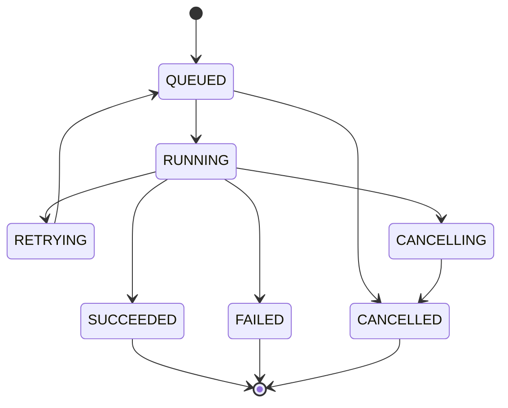
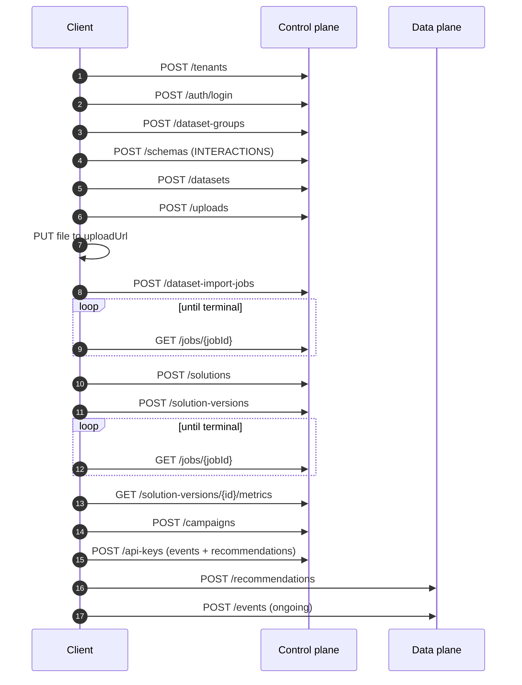

# GraphRec API Reference

**Version 1** · Multi-tenant recommendation platform · DGNN-SR

---

## 1. Overview

GraphRec exposes **two independent HTTPS surfaces**. They are separate hosts, separately deployed, and a client typically uses both.

| Surface | Base URL | Runs on | Purpose |
|---|---|---|---|
| **Control plane** | `https://api.graphrec.io/v1` | VPS1 | Everything: tenants, datasets, imports, solutions, campaigns, jobs, audit |
| **Data plane** | `https://rec.graphrec.io/v1` | VPS3 | `POST /recommendations` and `POST /events` only |

The split is deliberate: the data plane stays available when the control plane is down, and recommendation requests avoid an extra network hop. Both verify the same tokens — the data plane validates signatures locally with a public key and never calls the control plane to do it.

**Resource model.** GraphRec follows the AWS Personalize resource model: Dataset Groups contain Datasets, which are described by Schemas and populated by Import Jobs. Solutions define training configuration; each training run produces a Solution Version. Campaigns bind a Solution Version to live serving.

```
Tenant
└── Dataset Group
    ├── Dataset (INTERACTIONS | ITEMS | USERS) ── Schema
    │   └── Dataset Import Job
    ├── Solution ── Solution Version ─┐
    └── Campaign ─────────────────────┘
```

**Two documented deviations from AWS Personalize:**

1. **UUIDs, not ARNs.** ARNs encode account, region and partition. GraphRec is single-region and tenant scope comes from the token, so an ARN would carry no information a UUID does not. Resource identifiers are UUIDv7.
2. **No Event Tracker resource.** Personalize requires `CreateEventTracker` to obtain a tracking ID before `PutEvents`. GraphRec authenticates event submission with the same API key as everything else and scopes it by `datasetGroupId`, removing a resource whose only job was to carry a credential.

---

## 2. Conventions

| Aspect | Rule |
|---|---|
| Protocol | HTTPS only. Plain HTTP receives `308` to HTTPS |
| Version | Path-prefixed `/v1`. Breaking changes ship as `/v2` |
| Content type | `application/json; charset=utf-8` on request and response |
| Field naming | `camelCase` |
| Identifiers | UUIDv7, lowercase, hyphenated |
| Timestamps | RFC 3339 with explicit offset, always UTC — `2026-08-14T09:31:00Z` |
| Durations | Integer seconds unless the field name says otherwise |
| Empty values | Absent fields are omitted; `null` means "explicitly unset" |
| Unknown fields | Rejected with `422` — silent acceptance hides client bugs |
| Trailing slashes | Not accepted |
| HTTP methods | `GET` read · `POST` create or action · `PATCH` partial update · `DELETE` remove. `PUT` is not used |

### Resource naming

Every named resource is unique **within its tenant**, never globally. `name` matches `^[a-zA-Z0-9][a-zA-Z0-9_-]{0,62}$`.

---

## 3. Authentication

Two credential types. Both resolve to a tenant; **the tenant is never taken from a path, query or body parameter.**

| Type | For | Lifetime | Header |
|---|---|---|---|
| **Access token** | Humans, consoles | 15 minutes | `Authorization: Bearer <jwt>` |
| **API key** | Server-to-server integrations | Until revoked | `Authorization: Bearer <key>` |

### 3.1 Log in

```http
POST /v1/auth/login
Content-Type: application/json

{ "email": "ana@example.com", "password": "…" }
```

```json
{
  "accessToken": "eyJhbGciOiJFZERTQSIs…",
  "refreshToken": "rt_8f3a…",
  "tokenType": "Bearer",
  "expiresIn": 900,
  "tenantId": "01920e3c-…",
  "role": "ADMIN"
}
```

| Status | Meaning |
|---|---|
| `200` | Authenticated |
| `401` | Invalid credentials — **response is identical whether the email exists or not** |
| `403` | Account locked or disabled |
| `429` | Too many attempts |

A user belonging to several tenants receives a token for their default tenant and can re-scope with `POST /v1/auth/switch-tenant`.

### 3.2 Refresh

```http
POST /v1/auth/refresh
{ "refreshToken": "rt_8f3a…" }
```

Returns a new access token **and a new refresh token** — refresh tokens rotate on every use. Presenting a consumed refresh token revokes the whole chain and returns `401`; this is how token theft is detected.

### 3.3 Log out

```http
POST /v1/auth/logout
Authorization: Bearer <access token>
```

`204`. Revokes the refresh chain and adds the access token's `jti` to a denylist until it expires.

### 3.4 Current identity

```http
GET /v1/auth/me
```

```json
{
  "userId": "0192…", "email": "ana@example.com",
  "displayName": "Ana Ferreira", "role": "ADMIN",
  "tenantId": "0192…", "tenantName": "Northwind Retail",
  "permissions": ["datasets:write", "solutions:write", "campaigns:write"]
}
```

### 3.5 Token claims

```json
{
  "iss": "https://api.graphrec.io",
  "sub": "0192…",            // userId, or keyId for API keys
  "tid": "0192…",            // tenantId — the only authoritative tenant source
  "rol": "ADMIN",
  "scp": ["datasets:write", "recommendations:read"],
  "typ": "user",             // "user" | "apikey"
  "jti": "…", "iat": 1755168000, "exp": 1755168900
}
```

Signed with **EdDSA (Ed25519)**. The public key is served at `GET /v1/.well-known/jwks.json` so the data plane — and any client wishing to pre-validate — can verify without contacting the control plane.

### 3.6 API keys

Created by an `ADMIN` or `OWNER`. **The secret is returned exactly once, at creation and at rotation, and is never retrievable afterwards.**

```http
POST /v1/api-keys
{
  "name": "storefront-prod",
  "scopes": ["events:write", "recommendations:read"],
  "expiresAt": "2027-01-01T00:00:00Z"
}
```

```json
{
  "keyId": "0192…",
  "name": "storefront-prod",
  "prefix": "gr_live_7Kd2",
  "secret": "gr_live_7Kd2_9fB1xQ…",   // shown once — store it now
  "scopes": ["events:write", "recommendations:read"],
  "expiresAt": "2027-01-01T00:00:00Z",
  "createdAt": "2026-08-14T09:31:00Z"
}
```

| Endpoint | Action |
|---|---|
| `GET /v1/api-keys` | List — returns `prefix`, never `secret` |
| `GET /v1/api-keys/{keyId}` | Describe, including `lastUsedAt` |
| `POST /v1/api-keys/{keyId}/rotate` | New secret, old one valid for a `gracePeriodSeconds` (default 3600) |
| `DELETE /v1/api-keys/{keyId}` | Revoke immediately |

**Available scopes**

| Scope | Grants |
|---|---|
| `datasets:read` / `datasets:write` | Dataset groups, schemas, datasets, imports |
| `solutions:read` / `solutions:write` | Solutions and solution versions |
| `campaigns:read` / `campaigns:write` | Campaigns and deployments |
| `events:write` | `POST /events` on the data plane |
| `recommendations:read` | `POST /recommendations` on the data plane |
| `jobs:read` | Job status and history |
| `audit:read` | Audit log |

An API key can never hold a scope its creating role lacks.

---

## 4. Authorization

Four roles. Checks run server-side on every request; hiding a control in a UI is not authorization.

| Operation | OWNER | ADMIN | DEVELOPER | VIEWER |
|---|:--:|:--:|:--:|:--:|
| Read any resource | ● | ● | ● | ● |
| Manage dataset groups, schemas, datasets | ● | ● | ● | ○ |
| Run dataset imports | ● | ● | ● | ○ |
| Manage solutions, train versions | ● | ● | ● | ○ |
| Cancel jobs | ● | ● | ● | ○ |
| Create and update campaigns | ● | ● | ○ | ○ |
| Manage API keys | ● | ● | ○ | ○ |
| Invite and manage members | ● | ● | ○ | ○ |
| Change roles | ● | ○ | ○ | ○ |
| Update tenant settings | ● | ● | ○ | ○ |
| Read audit log | ● | ● | ○ | ○ |
| Delete the tenant | ● | ○ | ○ | ○ |

**The last `OWNER` cannot be demoted or removed** — the request returns `409 LAST_OWNER`.

---

## 5. Errors

Every error shares one envelope.

```json
{
  "error": {
    "code": "RESOURCE_NOT_FOUND",
    "message": "Dataset group not found.",
    "requestId": "req_01J9X2ZK4M8Q",
    "details": [
      { "field": "schema.fields[2].type", "issue": "must be one of STRING, INT, FLOAT, TIMESTAMP" }
    ]
  }
}
```

`requestId` appears on every response, error or not, in the `X-Request-Id` header. **Quote it in support requests** — it correlates to server logs without exposing anything sensitive.

### Status codes

| Code | Meaning |
|---|---|
| `200` | Success |
| `201` | Resource created |
| `202` | Accepted — asynchronous work started, poll the returned job |
| `204` | Success, no body |
| `400` | Malformed request — unparseable JSON, bad header |
| `401` | Missing, expired or invalid credentials |
| `403` | Authenticated, but the role or scope does not permit this |
| `404` | Not found **or owned by another tenant** — deliberately indistinguishable |
| `409` | State conflict — duplicate name, non-cancellable job, ineligible version |
| `422` | Validation failed — well-formed but semantically invalid |
| `429` | Rate limit or quota exceeded |
| `500` | Server error — safe to retry idempotent requests |
| `503` | Temporarily unavailable — honour `Retry-After` |

### Error codes

| Code | Status | When |
|---|:--:|---|
| `INVALID_REQUEST` | 400 | Body unparseable |
| `VALIDATION_FAILED` | 422 | Field-level failures in `details` |
| `UNAUTHENTICATED` | 401 | Absent or invalid credential |
| `TOKEN_EXPIRED` | 401 | Access token past `exp` |
| `INSUFFICIENT_SCOPE` | 403 | API key lacks the scope |
| `INSUFFICIENT_ROLE` | 403 | Role lacks the permission |
| `RESOURCE_NOT_FOUND` | 404 | Missing or foreign |
| `DUPLICATE_NAME` | 409 | Name already used in this tenant |
| `INVALID_STATE` | 409 | Operation illegal in the current lifecycle state |
| `LAST_OWNER` | 409 | Would leave the tenant without an owner |
| `RESOURCE_IN_USE` | 409 | Delete blocked by a dependant |
| `QUOTA_EXCEEDED` | 429 | Plan limit reached — `details` names the quota |
| `RATE_LIMITED` | 429 | Too many requests |
| `MODEL_NOT_READY` | 503 | Campaign has no loadable model |
| `SERVICE_UNAVAILABLE` | 503 | Dependency unavailable |
| `INTERNAL_ERROR` | 500 | Unhandled — always carries a `requestId` |

**Why foreign resources return `404` and not `403`:** a `403` confirms the resource exists, which is itself a cross-tenant information leak. A client cannot distinguish "never existed" from "belongs to someone else", by design.

---

## 6. Pagination

Cursor-based on every collection. Offsets are not supported — they skip and duplicate rows under concurrent writes.

```http
GET /v1/datasets?limit=50&cursor=eyJpZCI6IjAxOTIuLi4ifQ
```

```json
{
  "items": [ … ],
  "pagination": { "limit": 50, "nextCursor": "eyJpZCI6IjAxOTMuLi4ifQ", "hasMore": true }
}
```

`limit` defaults to 25, maximum 100. When `hasMore` is `false`, `nextCursor` is `null`. Treat the cursor as opaque — its encoding will change.

### Filtering and sorting

| Parameter | Example |
|---|---|
| Exact match | `?status=ACTIVE` |
| Multiple values | `?status=QUEUED&status=RUNNING` |
| Time range | `?createdAfter=2026-08-01T00:00:00Z&createdBefore=…` |
| Sort | `?sort=createdAt:desc` — default `createdAt:desc` everywhere |

Unsupported filter keys return `422` rather than being ignored.

---

## 7. Idempotency

All `POST` endpoints that create resources or jobs accept an idempotency key.

```http
POST /v1/dataset-import-jobs
Idempotency-Key: 7f3c9a1e-8b24-4d0e-9c11-6a2f5b8e3d47
```

The key is scoped to the tenant and retained for **24 hours**. Replaying it returns the original response with `Idempotency-Replayed: true`. Reusing the same key with a *different* body returns `409 INVALID_STATE`.

Use it for anything that costs money or GPU time — imports and training in particular. It converts an ambiguous network timeout into a safe retry.

---

## 8. Rate limits

Enforced per tenant, shared across both surfaces.

| Class | Default |
|---|---|
| Control plane, reads | 100 req/min |
| Control plane, writes | 30 req/min |
| Job creation | 10 req/min |
| `POST /events` | 1,000 req/min |
| `POST /recommendations` | 6,000 req/min |

Every response carries:

```http
X-RateLimit-Limit: 6000
X-RateLimit-Remaining: 5987
X-RateLimit-Reset: 1755168060
```

On `429`, `Retry-After` gives seconds to wait. **Back off exponentially with jitter** — retrying immediately on a limit response is what turns a slow minute into an outage.

Quota exhaustion is different from rate limiting: both return `429`, but `QUOTA_EXCEEDED` will not clear by waiting a few seconds.

---

## 9. Asynchronous operations

Imports and training return `202` immediately with a **Job**. The API never blocks on long-running work.



| Status | Terminal | Meaning |
|---|:--:|---|
| `QUEUED` | | Accepted, awaiting a worker |
| `RUNNING` | | In progress — see `progress` |
| `RETRYING` | | Transient failure, will requeue after backoff |
| `CANCELLING` | | Cancellation requested, stopping at the next safe boundary |
| `SUCCEEDED` | ● | Completed |
| `FAILED` | ● | Terminal failure — see `failureReason` |
| `CANCELLED` | ● | Stopped by request |

**Poll no faster than every 5 seconds.** Imports typically finish in seconds to minutes; training runs for minutes to hours.

---

## 10. Tenants

### Register

```http
POST /v1/tenants          # public — no authentication
{
  "tenantName": "Northwind Retail",
  "adminEmail": "ana@example.com",
  "adminDisplayName": "Ana Ferreira",
  "password": "…"
}
```

`201`. Creates the tenant in `PENDING` and its initial `OWNER`. A tenant must be `ACTIVE` before any resource can be created.

### Describe and update

| Endpoint | Notes |
|---|---|
| `GET /v1/tenants/current` | The caller's tenant. There is no endpoint that takes a tenant ID |
| `PATCH /v1/tenants/current` | `tenantName` only. `ADMIN`+ |
| `GET /v1/tenants/current/quota` | Limits and current usage |

```json
// GET /v1/tenants/current
{
  "tenantId": "0192…", "tenantName": "Northwind Retail",
  "status": "ACTIVE", "createdAt": "2026-08-14T09:31:00Z"
}
```

Tenant status: `PENDING` · `ACTIVE` · `SUSPENDED` · `DELETING` · `DELETED`. Every endpoint except `/auth/*` and `/tenants/current` returns `403` when the tenant is not `ACTIVE`.

```json
// GET /v1/tenants/current/quota
{
  "maxDatasets": 20, "datasetsUsed": 4,
  "maxConcurrentJobs": 2, "concurrentJobsUsed": 1,
  "maxInteractions": 10000000, "interactionsUsed": 2418003,
  "maxActiveCampaigns": 5, "activeCampaignsUsed": 2,
  "monthlyRecommendations": 5000000, "monthlyRecommendationsUsed": 1204418,
  "periodStart": "2026-08-01T00:00:00Z", "periodEnd": "2026-09-01T00:00:00Z"
}
```

---

## 11. Members

| Endpoint | Role | Description |
|---|---|---|
| `GET /v1/members` | any | List members |
| `POST /v1/members` | `ADMIN`+ | Invite by email |
| `GET /v1/members/{memberId}` | any | Describe |
| `PATCH /v1/members/{memberId}` | `ADMIN`+ (role change: `OWNER`) | Change role or status |
| `DELETE /v1/members/{memberId}` | `ADMIN`+ | Remove |
| `POST /v1/members/invitations/accept` | public | Accept an invitation |

```http
POST /v1/members
{ "email": "luis@example.com", "displayName": "Luís Marques", "role": "DEVELOPER" }
```

`201`, member status `INVITED`. The invitation token is delivered out of band and never returned in the response.

```http
POST /v1/members/invitations/accept     # public
{ "token": "inv_9fB1xQ…", "password": "…" }
```

Member status: `INVITED` · `ACTIVE` · `LOCKED` · `DISABLED`. Only `ACTIVE` members authenticate.

---

## 12. Dataset Groups

The namespace binding datasets, solutions and campaigns. *Personalize: `CreateDatasetGroup`.*

| Endpoint | Description |
|---|---|
| `POST /v1/dataset-groups` | Create |
| `GET /v1/dataset-groups` | List |
| `GET /v1/dataset-groups/{datasetGroupId}` | Describe |
| `DELETE /v1/dataset-groups/{datasetGroupId}` | Delete |

```http
POST /v1/dataset-groups
{ "name": "storefront-eu" }
```

```json
{
  "datasetGroupId": "0192…", "name": "storefront-eu",
  "status": "ACTIVE", "datasetCount": 0,
  "createdAt": "2026-08-14T09:31:00Z"
}
```

`DELETE` returns `409 RESOURCE_IN_USE` while any dataset, solution or campaign still references the group. Delete children first — cascading deletion of trained models is not something an API should do implicitly.

---

## 13. Dataset Schemas

Declares the columns an import must supply. *Personalize: `CreateSchema`.*

| Endpoint | Description |
|---|---|
| `POST /v1/schemas` | Create |
| `GET /v1/schemas` | List |
| `GET /v1/schemas/{schemaId}` | Describe |
| `DELETE /v1/schemas/{schemaId}` | Delete — `409` if a dataset uses it |

```http
POST /v1/schemas
{
  "name": "interactions-v1",
  "datasetType": "INTERACTIONS",
  "fields": [
    { "name": "userId",    "type": "STRING",    "required": true },
    { "name": "itemId",    "type": "STRING",    "required": true },
    { "name": "timestamp", "type": "TIMESTAMP", "required": true },
    { "name": "eventType", "type": "STRING",    "required": true,
      "allowedValues": ["view","click","cart","purchase","rating"] },
    { "name": "eventValue","type": "FLOAT",     "required": false }
  ]
}
```

**Field types:** `STRING` · `INT` · `FLOAT` · `BOOLEAN` · `TIMESTAMP` (RFC 3339 or Unix seconds) · `STRING_LIST`.

**Required fields per dataset type**

| Type | Must include |
|---|---|
| `INTERACTIONS` | `userId`, `itemId`, `timestamp`, `eventType` |
| `ITEMS` | `itemId` |
| `USERS` | `userId` |

Schemas are **immutable after creation**. Changing a schema would invalidate every model trained under it, so create a new one and reimport.

---

## 14. Datasets

A typed table within a dataset group. *Personalize: `CreateDataset`.*

| Endpoint | Description |
|---|---|
| `POST /v1/datasets` | Create |
| `GET /v1/datasets` | List — filter `?datasetGroupId=` `?datasetType=` |
| `GET /v1/datasets/{datasetId}` | Describe |
| `DELETE /v1/datasets/{datasetId}` | Delete |

```http
POST /v1/datasets
{
  "name": "interactions",
  "datasetGroupId": "0192…",
  "schemaId": "0192…",
  "datasetType": "INTERACTIONS"
}
```

```json
{
  "datasetId": "0192…", "name": "interactions",
  "datasetGroupId": "0192…", "schemaId": "0192…",
  "datasetType": "INTERACTIONS",
  "status": "ACTIVE", "rowCount": 0,
  "lastImportAt": null, "createdAt": "2026-08-14T09:31:00Z"
}
```

**One dataset per type per group.** A second `INTERACTIONS` dataset in the same group returns `409 DUPLICATE_NAME`.

---

## 15. Uploads

Data is uploaded directly to object storage using a short-lived presigned URL. It does not pass through the API.

```http
POST /v1/uploads
{ "filename": "interactions-2026-08.csv", "contentLength": 184320104 }
```

```json
{
  "uploadId": "0192…",
  "uploadUrl": "https://storage.graphrec.io/graphrec/tenants/0192…/uploads/0192…/interactions-2026-08.csv?X-Amz-…",
  "method": "PUT",
  "headers": { "Content-Type": "text/csv" },
  "sourceUri": "s3://graphrec/tenants/0192…/uploads/0192…/interactions-2026-08.csv",
  "expiresAt": "2026-08-14T09:46:00Z"
}
```

Then `PUT` the file to `uploadUrl` and pass `sourceUri` to an import job.

| Constraint | Value |
|---|---|
| URL lifetime | 15 minutes |
| Scope | Exactly one object key — the URL cannot write anywhere else |
| Max size | 5 GB per file |
| Formats | CSV, JSONL, Parquet — declared by extension, verified by content |

Uploads are retained 30 days then deleted. Import them before that; the imported rows persist regardless.

---

## 16. Dataset Import Jobs

Asynchronous ingestion. *Personalize: `CreateDatasetImportJob`.*

| Endpoint | Description |
|---|---|
| `POST /v1/dataset-import-jobs` | Start an import — `202` |
| `GET /v1/dataset-import-jobs` | List — filter `?datasetId=` `?status=` |
| `GET /v1/dataset-import-jobs/{importJobId}` | Describe with counts and errors |

```http
POST /v1/dataset-import-jobs
Idempotency-Key: 7f3c9a1e-…
{
  "datasetId": "0192…",
  "sourceUri": "s3://graphrec/tenants/0192…/uploads/0192…/interactions-2026-08.csv",
  "importMode": "INCREMENTAL"
}
```

`importMode`: `FULL_REPLACE` truncates the dataset first; `INCREMENTAL` appends and deduplicates. Default `INCREMENTAL`.

```json
// 202 Accepted
{
  "importJobId": "0192…", "jobId": "0192…",
  "datasetId": "0192…", "status": "QUEUED",
  "createdAt": "2026-08-14T09:31:00Z"
}
```

```json
// GET — completed with partial rejections
{
  "importJobId": "0192…", "jobId": "0192…",
  "datasetId": "0192…", "status": "SUCCEEDED",
  "importMode": "INCREMENTAL",
  "rowsRead": 1482301,
  "rowsAccepted": 1481944,
  "rowsRejected": 357,
  "rowsDuplicate": 1204,
  "errorSample": [
    { "line": 4471, "field": "timestamp", "issue": "unparseable: '2026-13-45'" },
    { "line": 9902, "field": "eventType", "issue": "not in allowedValues: 'wishlist'" }
  ],
  "startedAt": "2026-08-14T09:31:12Z",
  "completedAt": "2026-08-14T09:33:48Z"
}
```

**Partial success is normal.** The job succeeds if the rejection ratio stays under 5%; above that it fails with `FAILED` and imports nothing, on the reasoning that a mostly-invalid file usually indicates the wrong file rather than dirty data.

`errorSample` is capped at 100 entries — enough to diagnose, not enough to become a second dataset.

**Duplicates are counted, not rejected.** Rows matching an existing `(userId, itemId, timestamp, eventType)` are skipped, which makes re-importing the same file safe.

---

## 17. Solutions

A training *configuration*. Creating one trains nothing. *Personalize: `CreateSolution`.*

| Endpoint | Description |
|---|---|
| `POST /v1/solutions` | Create |
| `GET /v1/solutions` | List — filter `?datasetGroupId=` |
| `GET /v1/solutions/{solutionId}` | Describe |
| `DELETE /v1/solutions/{solutionId}` | Delete — `409` if any version serves a campaign |

```http
POST /v1/solutions
{
  "name": "storefront-dgnn-sr",
  "datasetGroupId": "0192…",
  "recipe": "dgnn-sr-v1",
  "hyperparameters": {
    "embeddingDim": 96,
    "numGnnLayers": 2,
    "sequenceLength": 20,
    "neighborSampleSize": 10,
    "learningRate": 0.001,
    "batchSize": 1024,
    "maxEpochs": 50,
    "negativeSamples": 4,
    "dropout": 0.2,
    "earlyStoppingPatience": 3
  }
}
```

### Recipes

| Recipe | Description |
|---|---|
| `dgnn-sr-v1` | Dynamic graph neural network for sequential recommendation. Fuses a graph pathway (long-term preference) with a self-attention sequence pathway (session behaviour) |
| `popularity-baseline` | Recent popularity. Trains in seconds; useful as an evaluation floor and cold-start lane |

### Hyperparameters — `dgnn-sr-v1`

| Name | Type | Default | Range | Effect |
|---|---|---|---|---|
| `embeddingDim` | int | 96 | 32–256 | Node embedding width. Drives model size and memory |
| `numGnnLayers` | int | 2 | 1–3 | Message-passing hops. 3 rarely helps and costs memory |
| `sequenceLength` | int | 20 | 5–100 | Interactions per user sequence |
| `neighborSampleSize` | int | 10 | 5–50 | Neighbours sampled per node |
| `learningRate` | float | 0.001 | 1e-5–1e-2 | AdamW learning rate |
| `batchSize` | int | 1024 | 128–4096 | Constrained by VRAM |
| `maxEpochs` | int | 50 | 1–200 | Upper bound; early stopping usually triggers first |
| `negativeSamples` | int | 4 | 1–20 | Negatives per positive |
| `dropout` | float | 0.2 | 0.0–0.5 | Regularisation |
| `earlyStoppingPatience` | int | 3 | 1–10 | Epochs without NDCG@10 improvement before stopping |

Out-of-range values return `422` with the permitted range in `details`.

---

## 18. Solution Versions

One immutable trained model plus its metrics. *Personalize: `CreateSolutionVersion`.*

| Endpoint | Description |
|---|---|
| `POST /v1/solution-versions` | Start training — `202` |
| `GET /v1/solution-versions` | List — filter `?solutionId=` `?status=` |
| `GET /v1/solution-versions/{solutionVersionId}` | Describe |
| `GET /v1/solution-versions/{solutionVersionId}/metrics` | Full metrics and training curve |

```http
POST /v1/solution-versions
Idempotency-Key: 3d8a…
{
  "solutionId": "0192…",
  "hyperparameterOverrides": { "maxEpochs": 30 },
  "trainingDataCutoff": "2026-08-14T00:00:00Z"
}
```

`trainingDataCutoff` fixes the snapshot boundary, making a run reproducible. Omitted, it defaults to now.

**Rejected with `422` when:** interactions are below the minimum (10,000), fewer than 100 users have ≥5 interactions, or the catalog has fewer than 50 items. **Rejected with `429 QUOTA_EXCEEDED`** when the tenant is at its concurrent-job limit.

```json
// GET — completed
{
  "solutionVersionId": "0192…", "solutionId": "0192…",
  "versionNumber": 7, "jobId": "0192…",
  "status": "ACTIVE", "recipe": "dgnn-sr-v1",
  "trainingDataCutoff": "2026-08-14T00:00:00Z",
  "datasetStats": { "users": 48213, "items": 12904, "interactions": 2418003 },
  "metrics": {
    "recall@10": 0.2431, "ndcg@10": 0.1874,
    "hitRate@10": 0.3902, "coverage@10": 0.6118,
    "baselineNdcg@10": 0.0921
  },
  "trainingDurationSeconds": 2184,
  "trainedAt": "2026-08-14T10:08:12Z"
}
```

### Lifecycle

| Status | Meaning |
|---|---|
| `TRAINING` | In progress |
| `EVALUATED` | Trained; metrics computed |
| `REGISTERED` | Artifact uploaded and digest verified |
| `APPROVED` | Eligible for a campaign |
| `DEPLOYING` | Being loaded by the inference server |
| `ACTIVE` | Serving at least one campaign |
| `FAILED` | Training failed — see `failureReason` |
| `REJECTED` | Below the metric floor; cannot be deployed |
| `FAILED_DEPLOYMENT` | Load failed. **The previous version continues serving** |
| `ROLLED_BACK` | Replaced by an operator |
| `ARCHIVED` | Retired; artifact deleted, metrics retained |

Only `APPROVED`, `ACTIVE` and `ROLLED_BACK` versions may be assigned to a campaign. Anything else returns `409 INVALID_STATE`.

```json
// GET /metrics
{
  "solutionVersionId": "0192…",
  "final": { "recall@10": 0.2431, "ndcg@10": 0.1874, "hitRate@10": 0.3902, "coverage@10": 0.6118 },
  "comparison": {
    "vsBaseline": { "ndcg@10": "+103.5%" },
    "vsPreviousVersion": { "versionNumber": 6, "ndcg@10": "+4.2%" }
  },
  "trainingCurve": [
    { "epoch": 1, "trainLoss": 0.6821, "valNdcg@10": 0.1102 },
    { "epoch": 2, "trainLoss": 0.5433, "valNdcg@10": 0.1418 }
  ],
  "stoppedEarlyAtEpoch": 24
}
```

---

## 19. Campaigns

Binds a solution version to live serving. **A campaign is what `POST /recommendations` targets.** *Personalize: `CreateCampaign`.*

| Endpoint | Description |
|---|---|
| `POST /v1/campaigns` | Create — `202` |
| `GET /v1/campaigns` | List — filter `?datasetGroupId=` `?status=` |
| `GET /v1/campaigns/{campaignId}` | Describe |
| `PATCH /v1/campaigns/{campaignId}` | Change model version or configuration — `202` |
| `DELETE /v1/campaigns/{campaignId}` | Delete |
| `GET /v1/campaigns/{campaignId}/deployments` | Deployment history |

```http
POST /v1/campaigns
{
  "name": "storefront-homepage",
  "solutionVersionId": "0192…",
  "minProvisionedTps": 10,
  "configuration": {
    "excludeUnavailableItems": true,
    "maxItemsPerCategory": 3,
    "diversityWeight": 0.2,
    "freshnessBoost": 0.1,
    "fallbackEnabled": true
  }
}
```

| Field | Default | Effect |
|---|---|---|
| `excludeUnavailableItems` | `true` | Filters inactive, deleted and out-of-stock items |
| `maxItemsPerCategory` | `null` | Caps items per category in the result |
| `diversityWeight` | `0.0` | 0–1. Maximal Marginal Relevance strength |
| `freshnessBoost` | `0.0` | 0–1. Favours recently added items |
| `fallbackEnabled` | `true` | Serve popularity results when personalisation is unavailable |

### Changing the served model

```http
PATCH /v1/campaigns/{campaignId}
{ "solutionVersionId": "0192…" }
```

`202`. Propagation takes up to 30 seconds. **Rollback uses the same call** with an earlier version ID — there is no separate rollback endpoint, because a rollback *is* an assignment.

**If the new version fails to load, the previous one keeps serving.** The campaign reports `status: ACTIVE` with `lastDeploymentStatus: FAILED` and a reason. Serving is never interrupted by a bad deployment.

```json
// GET
{
  "campaignId": "0192…", "name": "storefront-homepage",
  "datasetGroupId": "0192…",
  "solutionVersionId": "0192…", "solutionVersionNumber": 7,
  "status": "ACTIVE",
  "minProvisionedTps": 10,
  "configuration": { … },
  "lastDeploymentStatus": "SUCCEEDED",
  "lastDeploymentAt": "2026-08-14T10:11:03Z",
  "createdAt": "2026-08-01T12:00:00Z"
}
```

Campaign status: `CREATING` · `ACTIVE` · `UPDATING` · `INACTIVE` · `DELETING` · `FAILED`.

```json
// GET /deployments
{
  "items": [
    {
      "deploymentId": "0192…",
      "fromSolutionVersionId": "0192…", "fromVersionNumber": 6,
      "toSolutionVersionId": "0192…",   "toVersionNumber": 7,
      "status": "SUCCEEDED",
      "startedAt": "2026-08-14T10:10:44Z",
      "completedAt": "2026-08-14T10:11:03Z"
    }
  ]
}
```

---

## 20. Recommendations — data plane

**`https://rec.graphrec.io/v1`** · scope `recommendations:read`

```http
POST /v1/recommendations
Authorization: Bearer gr_live_7Kd2_…
Content-Type: application/json

{
  "campaignId": "0192…",
  "userId": "cust-88213",
  "numResults": 10,
  "context": { "deviceType": "mobile", "currentItemId": "SKU-4471" },
  "recentInteractions": [
    { "itemId": "SKU-1180", "eventType": "view",  "timestamp": "2026-08-14T09:28:41Z" },
    { "itemId": "SKU-4471", "eventType": "click", "timestamp": "2026-08-14T09:30:02Z" }
  ],
  "excludeItemIds": ["SKU-9002", "SKU-1180"],
  "filterValues": { "category": "outerwear" }
}
```

| Field | Required | Notes |
|---|:--:|---|
| `campaignId` | ● | Must be `ACTIVE` and owned by the caller's tenant |
| `userId` | ○ | Omit for anonymous. **One of `userId` or `sessionId` is required** |
| `sessionId` | ○ | Pseudonymous session for anonymous visitors |
| `numResults` | ○ | Default 10, max 100 |
| `context` | ○ | Free-form; keys used only if present in the ITEMS/USERS schema |
| `recentInteractions` | ○ | Up to 50. Applied immediately **without retraining** — this is the session pathway |
| `excludeItemIds` | ○ | Up to 200 |
| `filterValues` | ○ | Hard filter on item attributes |

```json
// 200
{
  "requestId": "req_01J9X2ZK4M8Q",
  "campaignId": "0192…",
  "solutionVersionId": "0192…",
  "solutionVersionNumber": 7,
  "strategy": "PERSONALIZED",
  "items": [
    { "itemId": "SKU-7712", "score": 0.8814, "rank": 1, "candidateSource": "GRAPH" },
    { "itemId": "SKU-2205", "score": 0.8402, "rank": 2, "candidateSource": "SEQUENCE" },
    { "itemId": "SKU-6631", "score": 0.7955, "rank": 3, "candidateSource": "GRAPH" }
  ],
  "latencyMs": 41
}
```

| `strategy` | Meaning |
|---|---|
| `PERSONALIZED` | Full DGNN-SR inference |
| `SESSION` | Session pathway dominant — user has little or no history |
| `COLD_START` | No usable signal; popularity and content lanes |
| `FALLBACK` | Model unavailable; popularity results served because `fallbackEnabled` is true |

**Always read `strategy` and `solutionVersionId`.** They tell you whether you received real personalisation and which model produced it — essential for attributing a metrics change to a deployment.

| Status | Cause |
|---|---|
| `200` | Results returned, possibly empty after filtering |
| `400` | Neither `userId` nor `sessionId` supplied |
| `401` | Invalid key |
| `403` | Key lacks `recommendations:read` |
| `404` | Campaign not found or another tenant's |
| `422` | `numResults` out of range, malformed interactions |
| `429` | Rate limit or monthly quota |
| `503` | `MODEL_NOT_READY` — campaign has no loadable model and fallback is disabled |

**Latency targets:** P50 < 40 ms · P95 < 150 ms · P99 < 300 ms. Set a client timeout of 500 ms and treat a timeout as a fallback condition — render a non-personalised shelf rather than an empty one.

---

## 21. Events — data plane

**`https://rec.graphrec.io/v1`** · scope `events:write` · *Personalize: `PutEvents`.*

Streams interactions as they happen. Events feed session context immediately and are persisted for the next training run.

```http
POST /v1/events
{
  "datasetGroupId": "0192…",
  "userId": "cust-88213",
  "sessionId": "sess-4f2a",
  "events": [
    {
      "eventId": "evt-9f31a",
      "itemId": "SKU-4471",
      "eventType": "click",
      "timestamp": "2026-08-14T09:30:02Z",
      "eventValue": null,
      "properties": { "position": 2, "surface": "homepage" }
    }
  ]
}
```

```json
// 202
{ "accepted": 1, "duplicate": 0, "rejected": 0, "requestId": "req_…" }
```

| Constraint | Value |
|---|---|
| Events per request | 1–100 |
| Idempotency | `eventId` unique per tenant. Repeats count as `duplicate`, not an error |
| Timestamp window | Not more than 24 h in the future, not more than 90 d in the past |
| Session effect | Immediate — reflected in the next recommendation |
| Training effect | At the next solution version |

**Two distinct paths for interaction data**, and the difference matters:

| | `POST /events` | Dataset Import Job |
|---|---|---|
| Latency | Immediate | Minutes |
| Use | Live traffic | Historical backfill |
| Session context | Updates it | Does not |
| Volume | Up to 100 per call | Up to 5 GB per file |

Use imports to seed history, then events to keep it current.

---

## 22. Jobs

Unified view over every asynchronous operation.

| Endpoint | Description |
|---|---|
| `GET /v1/jobs` | List — filter `?jobType=` `?status=` `?createdAfter=` |
| `GET /v1/jobs/{jobId}` | Describe with progress |
| `POST /v1/jobs/{jobId}/cancel` | Request cancellation |

`jobType`: `DATASET_IMPORT` · `SOLUTION_VERSION_TRAINING` · `CAMPAIGN_DEPLOYMENT`

```json
// GET — a training job in flight
{
  "jobId": "0192…", "jobType": "SOLUTION_VERSION_TRAINING",
  "status": "RUNNING", "attempt": 1, "maxAttempts": 3,
  "resourceType": "SOLUTION_VERSION", "resourceId": "0192…",
  "progress": {
    "stage": "TRAINING",
    "stageIndex": 5, "totalStages": 9,
    "epoch": 18, "totalEpochs": 30,
    "percent": 58
  },
  "createdAt": "2026-08-14T09:31:00Z",
  "startedAt": "2026-08-14T09:31:22Z",
  "estimatedCompletionAt": "2026-08-14T10:09:00Z"
}
```

**Training stages:** `SNAPSHOT` → `PREPROCESS` → `GRAPH_BUILD` → `SPLIT` → `TRAINING` → `EVALUATE` → `EXPORT` → `UPLOAD` → `REGISTER`

```http
POST /v1/jobs/{jobId}/cancel
{ "reason": "wrong dataset cutoff" }
```

`202` and status `CANCELLING`. Cancellation is cooperative — training stops at the next epoch boundary, usually within a minute. A terminal job returns `409 INVALID_STATE`.

```json
// A failed job
{
  "jobId": "0192…", "status": "FAILED",
  "attempt": 3, "maxAttempts": 3,
  "failureReason": "Insufficient interactions after preprocessing: 4,182 remain (minimum 10,000). Most users have fewer than 5 interactions.",
  "failedAt": "2026-08-14T09:34:11Z"
}
```

`failureReason` is sanitised — actionable, never containing stack traces, credentials or another tenant's data. **Only transient failures retry**; validation failures go straight to `FAILED` without consuming attempts.

---

## 23. Audit Log

`ADMIN`+ or scope `audit:read`. Append-only, tenant-scoped, redacted.

```http
GET /v1/audit-logs?action=CAMPAIGN_UPDATE&occurredAfter=2026-08-01T00:00:00Z
```

```json
{
  "items": [
    {
      "auditId": "0192…",
      "actorType": "USER", "actorId": "0192…", "actorEmail": "ana@example.com",
      "action": "CAMPAIGN_UPDATE",
      "resourceType": "CAMPAIGN", "resourceId": "0192…",
      "outcome": "SUCCEEDED",
      "occurredAt": "2026-08-14T10:10:44Z",
      "details": { "fromVersionNumber": 6, "toVersionNumber": 7 }
    }
  ]
}
```

**Actions:** `LOGIN` · `LOGIN_FAILED` · `LOGOUT` · `API_KEY_CREATE` · `API_KEY_ROTATE` · `API_KEY_REVOKE` · `MEMBER_INVITE` · `MEMBER_ROLE_CHANGE` · `MEMBER_REMOVE` · `DATASET_IMPORT` · `SOLUTION_VERSION_CREATE` · `CAMPAIGN_CREATE` · `CAMPAIGN_UPDATE` · `CAMPAIGN_DELETE` · `TENANT_UPDATE`

**Actor types:** `USER` · `API_KEY` · `SYSTEM`
**Outcomes:** `SUCCEEDED` · `FAILED` · `DENIED`

Never contains credential secrets, raw event payloads, or any reference to another tenant.

---

## 24. Health

Public, unauthenticated, on both surfaces.

| Endpoint | Purpose |
|---|---|
| `GET /healthz` | Liveness — `200` if the process is up |
| `GET /readyz` | Readiness — `200` only if dependencies are reachable |
| `GET /v1/.well-known/jwks.json` | Public keys for token verification |

```json
// GET /readyz — degraded
{
  "status": "degraded",
  "checks": {
    "database": "ok",
    "cache": "ok",
    "objectStorage": "unreachable"
  }
}
```

`readyz` returns `503` when any check fails. `degraded` means serving continues with reduced capability — on the data plane, cached models keep answering while object storage is unreachable.

---

## 25. Complete endpoint index

### Control plane — `https://api.graphrec.io/v1`

| Method | Path | Auth | Role |
|---|---|---|---|
| POST | `/auth/login` | — | — |
| POST | `/auth/refresh` | — | — |
| POST | `/auth/logout` | token | any |
| POST | `/auth/switch-tenant` | token | any |
| GET | `/auth/me` | token | any |
| GET | `/.well-known/jwks.json` | — | — |
| POST | `/tenants` | — | — |
| GET | `/tenants/current` | token | any |
| PATCH | `/tenants/current` | token | ADMIN |
| GET | `/tenants/current/quota` | token | any |
| GET | `/members` | token | any |
| POST | `/members` | token | ADMIN |
| GET | `/members/{memberId}` | token | any |
| PATCH | `/members/{memberId}` | token | ADMIN / OWNER |
| DELETE | `/members/{memberId}` | token | ADMIN |
| POST | `/members/invitations/accept` | — | — |
| POST | `/api-keys` | token | ADMIN |
| GET | `/api-keys` | token | ADMIN |
| GET | `/api-keys/{keyId}` | token | ADMIN |
| POST | `/api-keys/{keyId}/rotate` | token | ADMIN |
| DELETE | `/api-keys/{keyId}` | token | ADMIN |
| POST | `/dataset-groups` | both | DEVELOPER |
| GET | `/dataset-groups` | both | any |
| GET | `/dataset-groups/{id}` | both | any |
| DELETE | `/dataset-groups/{id}` | both | DEVELOPER |
| POST | `/schemas` | both | DEVELOPER |
| GET | `/schemas` | both | any |
| GET | `/schemas/{schemaId}` | both | any |
| DELETE | `/schemas/{schemaId}` | both | DEVELOPER |
| POST | `/datasets` | both | DEVELOPER |
| GET | `/datasets` | both | any |
| GET | `/datasets/{datasetId}` | both | any |
| DELETE | `/datasets/{datasetId}` | both | DEVELOPER |
| POST | `/uploads` | both | DEVELOPER |
| POST | `/dataset-import-jobs` | both | DEVELOPER |
| GET | `/dataset-import-jobs` | both | any |
| GET | `/dataset-import-jobs/{id}` | both | any |
| POST | `/solutions` | both | DEVELOPER |
| GET | `/solutions` | both | any |
| GET | `/solutions/{solutionId}` | both | any |
| DELETE | `/solutions/{solutionId}` | both | DEVELOPER |
| POST | `/solution-versions` | both | DEVELOPER |
| GET | `/solution-versions` | both | any |
| GET | `/solution-versions/{id}` | both | any |
| GET | `/solution-versions/{id}/metrics` | both | any |
| POST | `/campaigns` | both | ADMIN |
| GET | `/campaigns` | both | any |
| GET | `/campaigns/{campaignId}` | both | any |
| PATCH | `/campaigns/{campaignId}` | both | ADMIN |
| DELETE | `/campaigns/{campaignId}` | both | ADMIN |
| GET | `/campaigns/{campaignId}/deployments` | both | any |
| GET | `/jobs` | both | any |
| GET | `/jobs/{jobId}` | both | any |
| POST | `/jobs/{jobId}/cancel` | both | DEVELOPER |
| GET | `/audit-logs` | both | ADMIN |
| GET | `/healthz` · `/readyz` | — | — |

### Data plane — `https://rec.graphrec.io/v1`

| Method | Path | Auth | Scope |
|---|---|---|---|
| POST | `/recommendations` | API key | `recommendations:read` |
| POST | `/events` | API key | `events:write` |
| GET | `/healthz` · `/readyz` | — | — |

*"both" = access token or API key with the appropriate scope.*

---

## 26. Integration walkthrough

The shortest path from empty tenant to live recommendations.



**Minimum viable sequence:** register → log in → dataset group → schema → dataset → upload → import → solution → solution version → campaign → API key → recommend.

Steps 8 and 12 are asynchronous; everything else returns synchronously.

---

## 27. Client guidance

| Practice | Why |
|---|---|
| Send `Idempotency-Key` on every create | Turns an ambiguous timeout into a safe retry |
| Retry `429`, `500`, `503` with exponential backoff and jitter | Retrying immediately amplifies an incident |
| Never retry `400`, `401`, `403`, `404`, `409`, `422` | Deterministic — the same request always fails |
| Poll jobs no faster than every 5 s | Faster polling gains nothing and consumes rate limit |
| Cache the campaign ID, not the solution version | Versions change on every deployment; the campaign is stable |
| Set a 500 ms timeout on `/recommendations` | Render a non-personalised shelf rather than blocking a page |
| Check `strategy` in every response | Distinguishes real personalisation from a fallback |
| Store the API key secret at creation | It is unrecoverable afterwards |
| Log `requestId` on failures | The only identifier that correlates to server logs |
| Treat `404` as "not yours or not there" | The two are indistinguishable by design |

### Versioning policy

`/v1` is stable. Additive changes — new endpoints, new optional request fields, new response fields, new enum values — ship without a version bump. **Clients must ignore unknown response fields and tolerate unknown enum values.**

Breaking changes ship as `/v2`, with `/v1` supported for at least 12 months after `/v2` is generally available.
