# [INSTITUTE NAME]
## [UNIVERSITY NAME]

# **GraphRec**
## **A Multi-Tenant Recommendation Platform as a Service for E-Commerce Businesses**

### **Software Requirement and Specification Analysis**

**Course Name and Code:** [Course Name and Code]  
**Supervised by:** [Supervisor Name]  
**Supervisor Designation:** [Supervisor Designation]  
**Submitted by:** [Student Name]  
**Student ID:** [Student ID]  
**Submitted to:** [Submission Authority]  
**Submission Date:** [Submission Date]

---

# Letter of Transmittal

**Date:** [Submission Date]  
**To:** [Recipient Name and Designation]  
**[Institute Name], [University Name]**

**Subject: Submission of Software Requirement and Specification Analysis for GraphRec**

Sir/Madam,

I am submitting the Software Requirement and Specification Analysis for **GraphRec: A Multi-Tenant Recommendation Platform as a Service for E-Commerce Businesses**. The report defines the project purpose, stakeholders, actors, functional and quality requirements, scenario-based models, logical data model, architectural design, and preliminary test plan. The document has been prepared as an academic specification for a semester project and emphasizes tenant-specific recommendation behavior, secure tenant isolation, model lifecycle management, and feasible implementation scope.

I respectfully request your review and guidance.

Sincerely,  
**[Student Name]**  
**Student ID:** [Student ID]  
**[Institute Name], [University Name]**

**Supervisor's Signature:** ______________________________

---

# Acknowledgement

I express my sincere gratitude to **[Institute Name]**, **[University Name]**, for providing the academic environment and opportunity to undertake the GraphRec project. I am especially thankful to **[Supervisor Name]**, **[Supervisor Designation]**, for valuable guidance, constructive feedback, and continued academic support. I also acknowledge the reviewers, classmates, and peers whose discussions and observations contributed to the refinement of this specification. Their assistance helped shape a project scope that is technically meaningful, security-conscious, and achievable within a university semester.

---

# Abstract

E-commerce businesses increasingly depend on personalized product recommendations to improve product discovery, customer engagement, and conversion. Building such a capability independently, however, requires specialized data collection, model training, evaluation, serving, version management, and operational monitoring. GraphRec addresses this difficulty as a multi-tenant recommendation platform through which independent e-commerce businesses can manage their own product catalogs, submit customer-interaction events, train tenant-specific recommendation models, and request real-time Top-N recommendations.

The platform treats every business as an isolated tenant. Tenant identity is derived from authenticated credentials, and tenant-owned customers, products, events, training jobs, datasets, model versions, deployments, recommendation records, usage records, and audit records remain separated. GraphRec uses a semester-feasible DGSR-inspired approach as its primary personalized recommendation model. Offline processing prepares tenant-specific snapshots, constructs time-ordered customer-product interaction graphs, trains and evaluates the model, and registers immutable model versions. The real-time path accepts identified-customer or anonymous-session context, produces eligible candidates, applies DGSR relevance scoring, and returns deterministically ordered recommendations. Safe popularity-based or last-known-good results may be returned when personalized service is unavailable and fallback is permitted.

Tenant administrators can request training, view progress and quality metrics, activate an eligible model version, and roll back to a previous version. Tenant applications can submit recommendation impressions, clicks, and conversions as feedback. Usage limits, quotas, model status, service status, failures, and audit information are visible according to role. The design supports controlled capacity adjustment under increased request demand while preserving tenant and model-version consistency.

GraphRec is specified as a limited-capacity educational platform rather than a production-grade high-availability service. Its bounded model, restricted concurrency, clear offline-online boundary, and small number of active tenants make the project achievable by one student while still demonstrating recommendation quality, multi-tenancy, model lifecycle management, safe degradation, and operational observability.

---

# Table of Contents

1. [Introduction](#1-introduction)  
   1.1 Purpose  
   1.2 Motivation  
   1.3 Scope  
   1.4 Purpose of Document  
2. [Project Description](#2-project-description)  
   2.1 Stakeholder Identification  
   2.2 Actor Identification  
   2.3 Normal Requirements  
   2.4 Expected Requirements  
   2.5 Exciting Requirements  
   2.6 Business Rules  
   2.7 Project User Story  
3. [Quality Function Deployment](#3-quality-function-deployment)  
4. [Requirements Modeling](#4-requirements-modeling)  
   4.1 Scenario-Based Modeling  
   4.2 Use-Case Diagram Concepts  
   4.3 Level-0 Use-Case Diagram  
   4.4 Level-1 Use-Case Diagram  
   4.5 Module-Level Use-Case Diagrams and Scenarios  
   4.6 Activity Diagrams  
5. [Data-Based Modeling](#5-data-based-modeling)  
   5.1 Logical Entity-Relationship Modeling  
   5.2 Logical Entities  
   5.3 Relationship Summary  
   5.4 Logical ER Diagrams  
6. [Training and Inference Pipeline Architecture](#6-training-and-inference-pipeline-architecture)  
   6.1 Offline Model Training Pipeline  
   6.2 Online Model Inference Pipeline  
   6.3 Qdrant Vector Store Contract  
   6.4 Pipeline Comparison  
7. [Architectural Design](#7-architectural-design)  
   7.1 Architectural Context Diagram  
   7.2 Architectural Archetypes  
   7.3 Top-Level Components  
   7.4 Conceptual Deployment Diagram  
8. [Preliminary Test Plan](#8-preliminary-test-plan)  
   8.1 High-Level Testing Goals  
   8.2 Preliminary Test Cases  
9. [Conclusion](#9-conclusion)  
10. [References](#10-references)

---

# List of Tables

- **Table 1**: Assumptions
- **Table 2**: Constraints
- **Table 3**: Stakeholder Identification
- **Table 4**: Actor Identification
- **Table 5**: Normal Functional Requirements
- **Table 6**: Normal Non-Functional Requirements
- **Table 7**: Expected Functional Requirements
- **Table 8**: Expected Non-Functional Requirements
- **Table 9**: Exciting Functional Requirements
- **Table 10**: Exciting Non-Functional Requirements
- **Table 11**: Level 1.1 - Tenant Registration and Authentication Use-Case Summary
- **Table 12**: Level 1.2 - Product and Customer-Event Management Use-Case Summary
- **Table 13**: Level 1.3 - Model Training Management Use-Case Summary
- **Table 14**: Level 1.4 - Model-Version Management Use-Case Summary
- **Table 15**: Level 1.5 - Recommendation and Feedback Management Use-Case Summary
- **Table 16**: Level 1.6 - Usage, Quota, and Status Monitoring Use-Case Summary
- **Table 17**: Level 1 - Complete GraphRec Interaction Use-Case Summary
- **Table 18**: Level 1.1 - Tenant Registration and Authentication Use-Case Summary
- **Table 19**: Level 1.2 - Product and Customer-Event Management Use-Case Summary
- **Table 20**: Level 1.3 - Model Training Management Use-Case Summary
- **Table 21**: Level 1.4 - Model-Version Management Use-Case Summary
- **Table 22**: Level 1.5 - Recommendation and Feedback Management Use-Case Summary
- **Table 23**: Level 1.6 - Usage, Quota, and Status Monitoring Use-Case Summary
- **Table 24**: Pricing Plan Logical Entity Attributes
- **Table 25**: Tenant Logical Entity Attributes
- **Table 26**: Tenant User Logical Entity Attributes
- **Table 27**: API Credential Logical Entity Attributes
- **Table 28**: Customer Logical Entity Attributes
- **Table 29**: Product Logical Entity Attributes
- **Table 30**: Interaction Event Logical Entity Attributes
- **Table 31**: Training Job Logical Entity Attributes
- **Table 32**: Dataset Snapshot Logical Entity Attributes
- **Table 33**: Model Version Logical Entity Attributes
- **Table 34**: Model Deployment Logical Entity Attributes
- **Table 35**: Recommendation Request Logical Entity Attributes
- **Table 36**: Recommendation Result Logical Entity Attributes
- **Table 37**: Recommendation Feedback Logical Entity Attributes
- **Table 38**: Usage Record Logical Entity Attributes
- **Table 39**: Audit Record Logical Entity Attributes
- **Table 40**: Relationship Summary
- **Table 41**: Offline Training versus Online Inference Pipeline Comparison

---

# List of Figures

- **Figure 1**: GraphRec Level-0 Use-Case Diagram
- **Figure 2**: GraphRec Level-1 Use-Case Diagram
- **Figure 3**: Tenant Registration and Authentication Use-Case Diagram
- **Figure 4**: Product and Customer-Event Management Use-Case Diagram
- **Figure 5**: Model Training Management Use-Case Diagram
- **Figure 6**: Model-Version Management Use-Case Diagram
- **Figure 7**: Recommendation and Feedback Management Use-Case Diagram
- **Figure 8**: Usage, Quota, and Status Monitoring Use-Case Diagram
- **Figure 9**: GraphRec Activity Diagram - Level 1
- **Figure 10**: Tenant Registration and Authentication Activity Diagram
- **Figure 11**: Product and Customer-Event Management Activity Diagram
- **Figure 12**: Model Training Management Activity Diagram
- **Figure 13**: Model-Version Management Activity Diagram
- **Figure 14**: Recommendation and Feedback Management Activity Diagram
- **Figure 15**: Usage, Quota, and Status Monitoring Activity Diagram
- **Figure 16**: Tenant, Identity, Catalog, and Interaction Logical ERD
- **Figure 17**: Training, Model, Recommendation, Usage, and Audit Logical ERD
- **Figure 18**: GraphRec System Architecture & Data Layer Overview
- **Figure 19**: Offline Training Pipeline Detailed Sequence Diagram
- **Figure 20**: Offline Training Job State Lifecycle Diagram
- **Figure 21**: Pinned Inference Pod Initialization Pattern
- **Figure 22**: Four-Stage Online Recommendation Serving Funnel

---

# 1. Introduction

## 1.1 Purpose

GraphRec provides reusable recommendation capabilities to independent e-commerce businesses. It enables each tenant to register, manage integration credentials, synchronize products, collect customer interactions, train and evaluate a tenant-specific DGSR model, control model versions, receive real-time Top-N recommendations, submit feedback, and observe usage and service status. The central purpose is to reduce the cost and complexity of building separate recommendation infrastructure for every business while preserving strict separation of tenant data and behavior.

## 1.2 Motivation

Product catalogs often contain more items than a customer can conveniently explore. Relevant recommendations reduce search effort and help a business present useful products at the correct moment. Developing a dependable recommendation service is difficult because it combines data quality, temporal modeling, model evaluation, low-latency serving, failure handling, security, and operational control.

A reusable platform allows several businesses to benefit from one coherent service while retaining tenant-specific data, models, rules, quotas, and results. Tenant isolation is essential because customer behavior and commercial data are confidential and because one tenant's model or load must not influence another tenant's outputs. The semester implementation must therefore demonstrate the important behavior without attempting unlimited scale or enterprise operational complexity. GraphRec uses bounded data volumes, one principal learned model family, controlled training concurrency, and a clear separation between offline preparation and online recommendation serving.

## 1.3 Scope

### In Scope

GraphRec includes tenant registration and authentication; tenant-user and API-credential management; product creation, update, synchronization, and disablement; customer-interaction submission; training requests; tenant-specific DGSR model training and evaluation; training-status and result viewing; model-version viewing; model activation, archive, and rollback; identified-customer and session-aware Top-N recommendation requests; recommendation feedback; usage and quota viewing; model and service status; tenant and platform administration; audit history; and monitoring.

### Out of Scope

The semester project excludes real-time online model training, real payment processing, multi-region operation, unlimited tenant scaling, enterprise disaster recovery, enterprise-grade high availability, complex production infrastructure, arbitrary tenant-supplied model code, and multiple unrelated primary learned recommendation-model families.

### Assumptions

| ID | Assumption |
|---|---|
| ASM-01 | The demonstration begins with two tenants and supports no more than four simultaneously active tenants. |
| ASM-02 | Product catalogs and event volumes remain educational in scale. |
| ASM-03 | Model training is offline, batch-oriented, and limited to one resource-intensive training job at a time across the demonstration platform. |
| ASM-04 | Every active tenant retains at least one ready recommendation-service instance. |
| ASM-05 | Model quality is evaluated offline; observed clicks and conversions are informational and do not automatically activate a model. |
| ASM-06 | A demonstrable P95 recommendation-response objective below 300 ms applies only at measured supported load and is not a contractual service guarantee. |

### Constraints

| ID | Constraint |
|---|---|
| CON-01 | DGSR shall remain the primary learned personalized recommendation approach. |
| CON-02 | The system shall use a shared logical data model with tenant ownership and enforced tenant-level access controls. |
| CON-03 | The project shall use at most three small processing nodes in the optional distributed demonstration. |
| CON-04 | Recommendation requests shall remain synchronous; long-running preparation and training shall occur separately. |
| CON-05 | The platform shall be presented as a limited-capacity educational system, not as a production-ready high-availability service. |

## 1.4 Purpose of Document

This report defines GraphRec's stakeholders, direct actors, Normal requirements, Expected requirements, Exciting requirements, business rules, simplified Quality Function Deployment, use cases, activity diagrams, logical entities, logical Entity-Relationship Diagrams, technology-neutral architecture, and preliminary test plan. It provides a common academic reference for development, review, testing, and project evaluation.

---

# 2. Project Description

GraphRec is a shared recommendation platform serving multiple independent e-commerce tenants. Tenant and identity management controls accounts, roles, and credentials. Product management maintains the active catalog. Interaction-event management accepts and validates customer behavior such as views, clicks, cart actions, purchases, and ratings. Training management creates immutable tenant-specific dataset snapshots, trains the DGSR model, evaluates quality, and records model versions. Model-version management supports eligibility review, activation, archive, and rollback. Recommendation management produces tenant-specific results for identified users or anonymous sessions and records feedback. Usage and quota management measures plan consumption, while administrative monitoring exposes model, service, failure, and audit status.

GraphRec separates offline and online responsibilities. Offline work prepares data, trains and evaluates models, and constructs versioned recommendation artifacts. Online work performs only bounded request validation, tenant-specific recommendation preparation, eligibility enforcement, ordering, and response delivery. This separation keeps real-time requests responsive without introducing online training.

### Provisional Demonstration Plan Limits

The following values are project defaults for testing and demonstration, not commercial commitments.

| Limit | Free | Basic | Pro |
|---|---:|---:|---:|
| Accepted events per month | 50,000 | 500,000 | 2,000,000 |
| Recommendation requests per month | 20,000 | 250,000 | 1,000,000 |
| Requests per minute | 60 | 300 | 1,000 |
| Concurrent recommendation requests | 4 | 12 | 30 |
| Training jobs per month | 1 | 4 | 12 |
| Active model versions | 2 | 5 | 10 |
| Maximum recommendation-service instances | 1 | 2 | 3 |

## 2.1 Stakeholder Identification

| Stakeholder | Description | Main interests | Responsibilities |
|---|---|---|---|
| Tenant Business Owner | Business decision-maker for a tenant using GraphRec. | Recommendation value, predictable limits, customer experience, and business continuity. | Approves adoption, selects service plan, reviews outcomes, and assigns tenant administrators. |
| Tenant Administrator | Authorized user who configures and operates the tenant account. | Easy administration, training visibility, model quality, safe activation, rollback, usage, and status. | Manages tenant users, requests training, reviews models, activates or rolls back versions, and monitors tenant operations. |
| Tenant Developer | Technical user integrating the tenant's e-commerce application. | Clear integration, stable credentials, reliable submissions, useful errors, and dependable recommendation responses. | Manages integration credentials, synchronizes products, submits events and feedback, and handles service responses. |
| E-Commerce Customer | Shopper who receives recommendations through the tenant's application. | Relevant, available, diverse, and non-repetitive product suggestions. | Interacts with the tenant application and generates behavioral feedback indirectly. |
| Platform Administrator | Operator responsible for the shared GraphRec platform. | Tenant safety, fair resource use, service health, failure visibility, and auditability. | Manages tenant states, plans, quotas, platform status, failures, and authorized administrative actions. |

## 2.2 Actor Identification

| Actor | Input supplied to GraphRec | Output received or viewed |
|---|---|---|
| Tenant Administrator | Registration and authentication information, tenant configuration, training requests, model activation or rollback requests. | Training status and results, model versions and quality, active-model status, usage, quotas, service status, and tenant monitoring information. |
| Tenant Developer | Product data, synchronization requests, credential requests, customer events, feedback, and integration actions. | Credential status, validation errors, submission confirmations, event-processing status, and recommendation responses. |
| Tenant E-Commerce Application | Product data, interaction events, identified-user or session recommendation requests, context, exclusions, and feedback. | Recommendation results, validation responses, confirmations, errors, and limit-related responses. |
| Platform Administrator | Tenant-management commands, plan and quota configuration, and platform administrative actions. | Platform and tenant status, usage, failure information, audit records, and system-level monitoring information. |

The E-Commerce Customer is an important stakeholder because recommendations affect the shopping experience. The customer normally communicates with the tenant's e-commerce application rather than directly with GraphRec; therefore, the customer is not modeled as a direct GraphRec actor.

## 2.3 Normal Requirements

Normal requirements are explicitly requested capabilities.

### Normal Functional Requirements

| ID | Requirement | Main stakeholder |
|---|---|---|
| NR-F-01 | GraphRec shall allow a business representative to register a tenant and initial administrator account. | Tenant Administrator |
| NR-F-02 | GraphRec shall authenticate tenant users and provide role-appropriate access. | Tenant Administrator |
| NR-F-03 | GraphRec shall allow authorized users to create, rotate, view the status of, and revoke API credentials. | Tenant Developer |
| NR-F-04 | GraphRec shall allow a tenant to add, update, list, and disable products. | Tenant Developer |
| NR-F-05 | GraphRec shall accept a bounded product synchronization request and report accepted and rejected items. | Tenant Developer |
| NR-F-06 | GraphRec shall accept single and batch customer-interaction submissions with a tenant-local event identifier. | Tenant E-Commerce Application |
| NR-F-07 | GraphRec shall allow an authorized tenant administrator to request tenant-specific model training. | Tenant Administrator |
| NR-F-08 | GraphRec shall display training state, progress, failure information, and final result. | Tenant Administrator |
| NR-F-09 | GraphRec shall display the tenant's model versions, status, creation time, and quality summary. | Tenant Administrator |
| NR-F-10 | GraphRec shall allow an authorized administrator to activate an eligible model version. | Tenant Administrator |
| NR-F-11 | GraphRec shall allow an authorized administrator to roll back to an allowed historical model version. | Tenant Administrator |
| NR-F-12 | GraphRec shall accept a Top-N recommendation request for an identified customer. | Tenant E-Commerce Application |
| NR-F-13 | GraphRec shall accept a recommendation request based on anonymous session context. | Tenant E-Commerce Application |
| NR-F-14 | GraphRec shall accept recommendation impression, click, and conversion feedback. | Tenant E-Commerce Application |
| NR-F-15 | GraphRec shall display tenant usage, plan limits, remaining quota where calculable, and reset period. | Tenant Administrator |
| NR-F-16 | GraphRec shall display active-model and recommendation-service status to authorized tenant users. | Tenant Administrator |

### Normal Non-Functional Requirements

| ID | Requirement | Main stakeholder |
|---|---|---|
| NR-NF-01 | GraphRec shall prevent a tenant from reading or changing another tenant's resources. | Tenant Business Owner |
| NR-NF-02 | GraphRec shall derive tenant identity from authenticated credentials rather than trusting a tenant identifier supplied by a public request. | Platform Administrator |
| NR-NF-03 | GraphRec shall provide clear success, validation, conflict, limit, and temporary-unavailability responses. | Tenant Developer |
| NR-NF-04 | GraphRec shall target P95 recommendation response below 300 ms at supported demonstration load. | E-Commerce Customer |
| NR-NF-05 | GraphRec shall ensure that repeated submission of the same tenant event identifier has one durable effect. | Tenant Developer |
| NR-NF-06 | GraphRec shall return a traceable error reference for failed requests without exposing credentials or another tenant's information. | Tenant Developer |
| NR-NF-07 | GraphRec shall support straightforward server-to-server integration using documented requests and responses. | Tenant Developer |
| NR-NF-08 | GraphRec shall keep at least one ready recommendation capability for each active tenant under normal supported conditions. | Tenant Business Owner |

## 2.4 Expected Requirements

Expected requirements are capabilities stakeholders assume a reliable recommendation platform will provide.

### Expected Functional Requirements

| ID | Requirement | Main stakeholder |
|---|---|---|
| ER-F-01 | GraphRec shall construct every training dataset from one tenant's validated data only. | Tenant Business Owner |
| ER-F-02 | GraphRec shall create tenant-specific DGSR model parameters and artifacts. | Tenant Administrator |
| ER-F-03 | GraphRec shall evaluate trained models using next-item accuracy, ranking quality, coverage, and available diversity measures. | Tenant Administrator |
| ER-F-04 | GraphRec shall detect duplicate product, event, training, and feedback submissions according to their idempotency identifiers. | Tenant Developer |
| ER-F-05 | GraphRec shall return the serving model version and recommendation strategy with each recommendation response. | Tenant Developer |
| ER-F-06 | GraphRec shall keep the previously active model available when activation of a new version fails. | Tenant Administrator |
| ER-F-07 | GraphRec shall validate rollback targets before changing the active version. | Tenant Administrator |
| ER-F-08 | GraphRec shall record accepted events, recommendation requests, training activity, stored products, and model-artifact usage. | Platform Administrator |
| ER-F-09 | GraphRec shall enforce plan and tenant-specific usage limits before accepting bounded operations. | Platform Administrator |
| ER-F-10 | GraphRec shall provide a tenant-safe fallback recommendation when personalized service is unavailable and fallback is permitted. | E-Commerce Customer |
| ER-F-11 | GraphRec shall record an audit history for credential changes, activation, rollback, quota changes, and administrative actions. | Platform Administrator |
| ER-F-12 | GraphRec shall expose model, training, recommendation, usage, and service status according to authorization. | Tenant Administrator |

### Expected Non-Functional Requirements

| ID | Requirement | Main stakeholder |
|---|---|---|
| ER-NF-01 | GraphRec shall preserve accepted asynchronous work through durable state and controlled reprocessing. | Platform Administrator |
| ER-NF-02 | GraphRec shall enforce tenant ownership consistently across identities, data, models, recommendation records, and usage records. | Tenant Business Owner |
| ER-NF-03 | GraphRec shall validate model identity, version, integrity, and compatibility before a model becomes ready. | Platform Administrator |
| ER-NF-04 | GraphRec shall record terminal failure reasons and make them visible to authorized users. | Tenant Administrator |
| ER-NF-05 | GraphRec shall retry only transient failures within a bounded policy and shall stop retrying deterministic invalid requests. | Platform Administrator |
| ER-NF-06 | GraphRec shall return stable ordering for identical model, catalog, context, and policy inputs. | E-Commerce Customer |
| ER-NF-07 | GraphRec shall prevent one tenant's workload from consuming unbounded shared processing capacity. | Platform Administrator |
| ER-NF-08 | GraphRec shall use a modular design that separates administration, long-running processing, training, recommendation serving, data management, and monitoring responsibilities. | Platform Administrator |
| ER-NF-09 | GraphRec shall expose sufficient metrics and status information to explain request failures, training failures, model changes, capacity changes, and quota rejection. | Platform Administrator |

## 2.5 Exciting Requirements

### Exciting Functional Requirements

| ID | Requirement | Main stakeholder |
|---|---|---|
| XR-F-01 | GraphRec shall combine recent anonymous or identified session events with persistent customer history when preparing recommendations. | E-Commerce Customer |
| XR-F-02 | GraphRec shall allow an authorized tenant to schedule periodic retraining. | Tenant Administrator |
| XR-F-03 | GraphRec shall allow retraining eligibility to be triggered by a configured number of newly accepted events. | Tenant Administrator |
| XR-F-04 | GraphRec shall support bounded diversity, category, brand, freshness, or seasonality rules in final recommendation ordering. | Tenant Business Owner |
| XR-F-05 | GraphRec shall allow rollback to an eligible retained historical model version. | Tenant Administrator |
| XR-F-06 | GraphRec shall support plan-based limits for events, recommendations, training, retained versions, and serving capacity. | Tenant Business Owner |
| XR-F-07 | GraphRec shall provide summarized usage trends by period and usage type. | Tenant Administrator |
| XR-F-08 | GraphRec shall adjust a tenant's recommendation-serving capacity within configured limits when measured demand changes. | Platform Administrator |
| XR-F-09 | GraphRec shall provide cold-start recommendations using recent popularity, category information, content information, or session context when personalization is insufficient. | E-Commerce Customer |
| XR-F-10 | GraphRec shall compare a newly trained DGSR version with baseline and active-version quality before activation. | Tenant Administrator |

### Exciting Non-Functional Requirements

| ID | Requirement | Main stakeholder |
|---|---|---|
| XR-NF-01 | Capacity adjustment shall preserve tenant and active-model-version consistency. | Platform Administrator |
| XR-NF-02 | Diversity and freshness adjustments shall be bounded and versioned so that relevance remains explainable. | Tenant Business Owner |
| XR-NF-03 | Scheduled and event-triggered retraining shall obey tenant cooldown, plan quota, and one-active-training rules. | Platform Administrator |

## 2.6 Business Rules

| ID | Business rule |
|---|---|
| BRULE-01 | Tenant identity must be obtained from authenticated credentials. |
| BRULE-02 | A tenant may access only resources owned by that tenant. |
| BRULE-03 | Customer identifiers must be unique within a tenant. |
| BRULE-04 | Product identifiers must be unique within a tenant. |
| BRULE-05 | Event identifiers must be unique within a tenant. |
| BRULE-06 | Only one active training request may exist for a tenant at a time. |
| BRULE-07 | A tenant may activate only a model version owned by that tenant. |
| BRULE-08 | Only one model version may be active for a tenant's deployed recommendation model at a time. |
| BRULE-09 | Disabled, deleted, unavailable, or otherwise ineligible products must not be returned. |
| BRULE-10 | Usage limits depend on the tenant's assigned plan and approved overrides. |
| BRULE-11 | Recommendation feedback must reference a valid recommendation request or result owned by the same tenant. |
| BRULE-12 | Model training must use only the requesting tenant's data and must preserve the snapshot cutoff. |

## 2.7 Project User Story

A business joins GraphRec and creates its tenant account. A Tenant Administrator configures authorized users and assigns suitable integration permissions. A Tenant Developer creates an API credential and connects the Tenant E-Commerce Application. The application synchronizes the product catalog and begins submitting customer views, clicks, cart actions, purchases, and ratings. GraphRec validates each event, prevents duplicate effects, and displays submission status.

After sufficient interaction history exists, the Tenant Administrator requests DGSR model training. GraphRec validates the request, prepares the tenant-specific snapshot, trains and evaluates the model, and displays progress. When training succeeds, the administrator reviews quality measures and the new model version. The administrator activates an eligible version; if activation fails, the previous version remains available. The tenant application then requests recommendations for identified customers or anonymous sessions and displays the returned products to customers. Customer interactions occur in the tenant application, which submits impressions, clicks, and conversions as feedback. Administrators review usage, quota, active-model status, training history, and service status, while the Platform Administrator monitors shared capacity, failures, audit records, and tenant isolation.

---

# 3. Quality Function Deployment

## 3.1 Stakeholder Needs

> The importance values are initial analyst-assigned values for project planning and are not survey results.

| Need ID | Stakeholder need | Main stakeholder | Importance |
|---|---|---|---:|
| SN-01 | Easy integration with an e-commerce application | Tenant Developer | 5 |
| SN-02 | Relevant tenant-specific recommendations | E-Commerce Customer | 5 |
| SN-03 | Fast recommendation responses | E-Commerce Customer | 5 |
| SN-04 | Secure tenant information | Tenant Business Owner | 5 |
| SN-05 | Reliable product and event submission | Tenant Developer | 5 |
| SN-06 | Easy model training and status viewing | Tenant Administrator | 4 |
| SN-07 | Safe model activation and rollback | Tenant Administrator | 5 |
| SN-08 | Clear usage and quota information | Tenant Business Owner | 4 |
| SN-09 | Clear model and service status | Tenant Administrator | 4 |
| SN-10 | Feasible semester implementation | Platform Administrator | 5 |

## 3.2 Quality and Engineering Responses

| Response ID | Quality or engineering response | Measurement | Initial target |
|---|---|---|---|
| QR-01 | Integration simplicity | Required fields, documented request types, integration test completion | Core integration completed through product, event, recommendation, and feedback flows |
| QR-02 | Recommendation relevance | Hit@10, NDCG@10, retrieval Recall@K, comparison with baseline | Finite metrics; retrieval and ranking gates passed before eligibility |
| QR-03 | Recommendation response time | P50, P95, P99 response time under supported load | P95 below 300 ms as a demonstration objective |
| QR-04 | Tenant-isolation correctness | Cross-tenant read, write, model, recommendation, and feedback tests | Zero cross-tenant results in the automated suite |
| QR-05 | Duplicate-event prevention | Replayed event and usage test outcomes | One durable effect per tenant-scoped idempotency identifier |
| QR-06 | Training-status visibility | Percentage of training states and failure reasons exposed | All defined states and terminal reasons visible to authorized users |
| QR-07 | Model-activation reliability | Successful rollout, failed rollout, and rollback tests | Failed activation leaves the previous version available |
| QR-08 | Usage-measurement accuracy | Reconciliation between raw actions and displayed totals | No unexplained difference after scheduled reconciliation |
| QR-09 | Service-status visibility | Coverage of active version, readiness, capacity, errors, and fallback rate | Provisional target to be validated during testing |
| QR-10 | Project implementation complexity | Completion against twelve-week milestones and scope controls | Core tenant, event, model, serving, and isolation path completed within the semester |

## 3.3 QFD Summary

Recommendation relevance, response time, tenant security, reliable ingestion, safe activation, integration simplicity, and semester feasibility receive the highest importance. Early development should therefore prioritize tenant identity, data isolation, idempotent product and event submission, and a complete baseline recommendation path. Model evaluation and activation safety follow before optional diversity or automatic capacity features. This order ensures that advanced behavior is added only after integration correctness, tenant protection, and dependable real-time response are demonstrable.

---
# 4. Requirements Modeling

## 4.1 Scenario-Based Modeling

Scenario-based modeling describes GraphRec from the viewpoint of external participants. Use-case diagrams identify the actors that exchange information with GraphRec and the goals they achieve. Activity diagrams expand those goals into chronological actor-system interactions, including visible validation, decisions, alternative outcomes, errors, cancellation, and final results. They intentionally avoid internal implementation details.

## 4.2 Use-Case Diagram Concepts

### Actors

Actors are external participants that supply information, request services, receive results, or view information produced by GraphRec.

### Associations

Associations connect actors to the use cases in which they participate.

### System Boundary

The system boundary separates GraphRec services from external actors and their own applications.

### Modules

Modules group related actor goals such as identity management, catalog integration, training, model-version management, recommendation delivery, and monitoring.

## 4.3 Level-0 Use-Case Diagram

**Level:** 0  
**Name:** GraphRec Recommendation Platform  
**Actors:** Tenant Administrator, Tenant Developer, Tenant E-Commerce Application, Platform Administrator

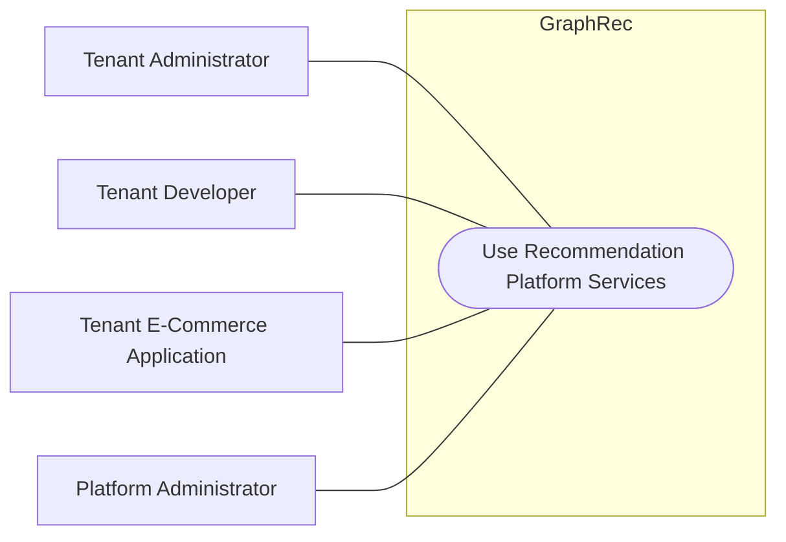
```mermaid
flowchart LR
    TA[Tenant Administrator]
    TD[Tenant Developer]
    APP[Tenant E-Commerce Application]
    PA[Platform Administrator]

    subgraph GR[GraphRec]
        UC0([Use Recommendation Platform Services])
    end

    TA --- UC0
    TD --- UC0
    APP --- UC0
    PA --- UC0
```

*Figure-1: GraphRec Level-0 Use-Case Diagram*

## 4.4 Level-1 Use-Case Diagram

**Level:** 1  
**Name:** GraphRec Recommendation Platform Services  
**Actors:** Tenant Administrator, Tenant Developer, Tenant E-Commerce Application, Platform Administrator

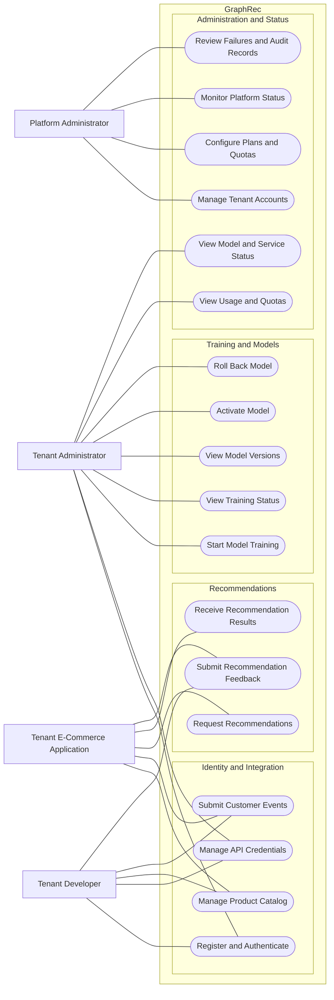
```mermaid
flowchart LR
    TA[Tenant Administrator]
    TD[Tenant Developer]
    APP[Tenant E-Commerce Application]
    PA[Platform Administrator]

    subgraph GR[GraphRec]
        direction TB
        subgraph I[Identity and Integration]
            U1([Register and Authenticate])
            U2([Manage API Credentials])
            U3([Manage Product Catalog])
            U4([Submit Customer Events])
        end
        subgraph M[Training and Models]
            U5([Start Model Training])
            U6([View Training Status])
            U7([View Model Versions])
            U8([Activate Model])
            U9([Roll Back Model])
        end
        subgraph R[Recommendations]
            U10([Request Recommendations])
            U11([Receive Recommendation Results])
            U12([Submit Recommendation Feedback])
        end
        subgraph O[Administration and Status]
            U13([View Usage and Quotas])
            U14([View Model and Service Status])
            U15([Manage Tenant Accounts])
            U16([Configure Plans and Quotas])
            U17([Monitor Platform Status])
            U18([Review Failures and Audit Records])
        end
    end

    TA --- U1
    TA --- U2
    TA --- U5
    TA --- U6
    TA --- U7
    TA --- U8
    TA --- U9
    TA --- U13
    TA --- U14

    TD --- U1
    TD --- U2
    TD --- U3
    TD --- U4
    TD --- U12

    APP --- U3
    APP --- U4
    APP --- U10
    APP --- U11
    APP --- U12

    PA --- U15
    PA --- U16
    PA --- U17
    PA --- U18
```

*Figure-2: GraphRec Level-1 Use-Case Diagram*

## 4.5 Module-Level Use-Case Diagrams and Scenarios

### 4.5.1 Level 1.1 - Tenant Registration and Authentication

**Actors:** Tenant Administrator, Tenant Developer  
**Use Cases:** Register Tenant, Sign In, Recover Account, Manage API Credentials

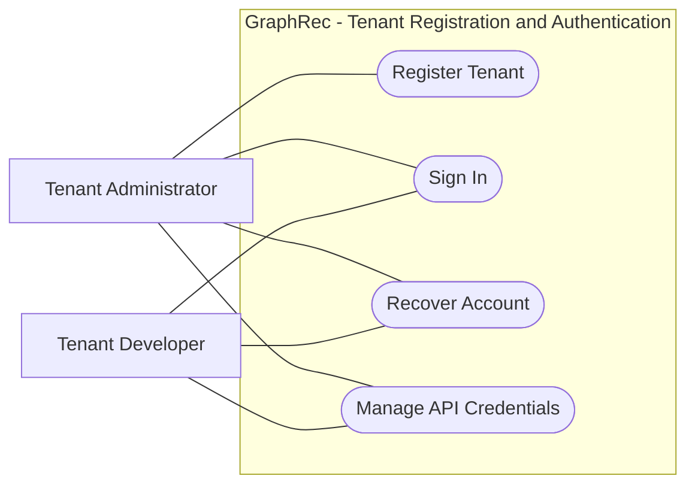
```mermaid
flowchart LR
    TA[Tenant Administrator]
    TD[Tenant Developer]

    subgraph GR[GraphRec - Tenant Registration and Authentication]
        U101([Register Tenant])
        U102([Sign In])
        U103([Recover Account])
        U104([Manage API Credentials])
    end

    TA --- U101
    TA --- U102
    TA --- U103
    TA --- U104
    TD --- U102
    TD --- U103
    TD --- U104
```

*Figure-3: Tenant Registration and Authentication Use-Case Diagram*

| Use case | Actor | Preconditions | Input supplied | Output received | Alternative outcome |
|---|---|---|---|---|---|
| UC-01 Register Tenant | Tenant Administrator | Registration is available | Business name, administrator identity, contact information | Tenant registration and initial account status | Duplicate or invalid registration is rejected with correction guidance |
| UC-02 Sign In | Tenant Administrator; Tenant Developer | Active account exists | Authentication information | Authenticated session and authorized capabilities | Invalid, inactive, or rate-limited attempt is rejected |
| UC-03 Recover Account | Tenant Administrator; Tenant Developer | Recoverable account exists | Account identifier and recovery proof | Recovery confirmation and next action | Unknown, expired, or invalid request is rejected without disclosing private account details |
| UC-04 Manage API Credentials | Tenant Administrator; Tenant Developer | Actor is authenticated and authorized | Credential name, permissions, expiry, rotate or revoke request | One-time credential secret or updated credential status | Insufficient permission, duplicate name, or invalid state is reported |

### 4.5.2 Level 1.2 - Product and Customer-Event Management

**Actors:** Tenant Developer, Tenant E-Commerce Application  
**Use Cases:** Add Product, Update Product, Synchronize Product Data, Disable Product, Submit Customer Event, Submit Event Batch, View Submission Result

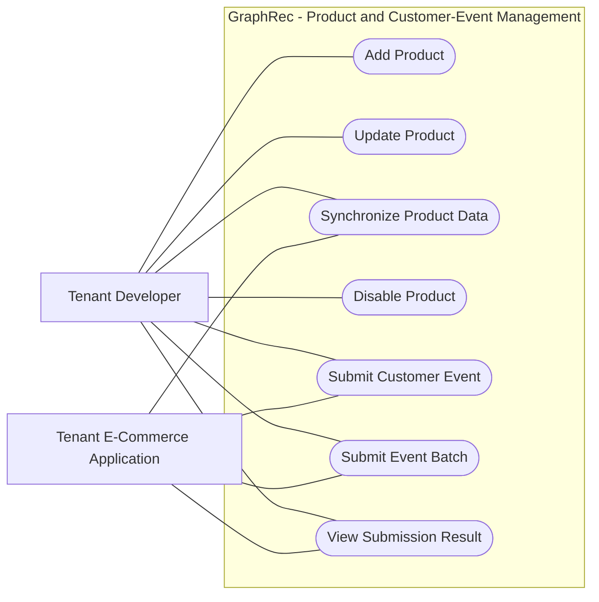
```mermaid
flowchart LR
    TD[Tenant Developer]
    APP[Tenant E-Commerce Application]

    subgraph GR[GraphRec - Product and Customer-Event Management]
        U201([Add Product])
        U202([Update Product])
        U203([Synchronize Product Data])
        U204([Disable Product])
        U205([Submit Customer Event])
        U206([Submit Event Batch])
        U207([View Submission Result])
    end

    TD --- U201
    TD --- U202
    TD --- U203
    TD --- U204
    TD --- U205
    TD --- U206
    TD --- U207
    APP --- U203
    APP --- U205
    APP --- U206
    APP --- U207
```

*Figure-4: Product and Customer-Event Management Use-Case Diagram*

| Use case | Actor | Preconditions | Input supplied | Output received | Alternative outcome |
|---|---|---|---|---|---|
| UC-05 Add Product | Tenant Developer | Valid catalog credential exists | Tenant-local product identifier and product information | Created product and validation status | Duplicate identifier, invalid data, or quota excess is reported |
| UC-06 Update Product | Tenant Developer | Product exists in the tenant | Changed product information | Updated product state | Missing product or conflicting update is reported |
| UC-07 Synchronize Product Data | Tenant Developer; Tenant E-Commerce Application | Integration credential is active | Bounded product collection and synchronization identifier | Accepted, updated, skipped, and failed counts | Oversized or invalid submission is rejected or partially reported |
| UC-08 Disable Product | Tenant Developer | Product exists and actor is authorized | Product identifier and reason | Disabled status | Missing, foreign, or already unavailable product produces a safe status |
| UC-09 Submit Customer Event | Tenant Developer; Tenant E-Commerce Application | Referenced product and credential are valid | Event identifier, customer identifier, product identifier, event type, time, optional context | Acceptance or duplicate confirmation | Invalid reference, unsupported type, or quota excess is reported |
| UC-10 Submit Event Batch | Tenant Developer; Tenant E-Commerce Application | Integration is active | Bounded event collection and batch identifier | Batch identifier and initial counts | Payload, schema, or limit failure is reported |
| UC-11 View Submission Result | Tenant Developer; Tenant E-Commerce Application | Submission belongs to the tenant | Submission or batch identifier | Processing status, counts, and safe errors | Missing or foreign identifier returns no resource details |

### 4.5.3 Level 1.3 - Model Training Management

**Actor:** Tenant Administrator  
**Use Cases:** Start Model Training, View Training Status, Cancel Training, View Training Result

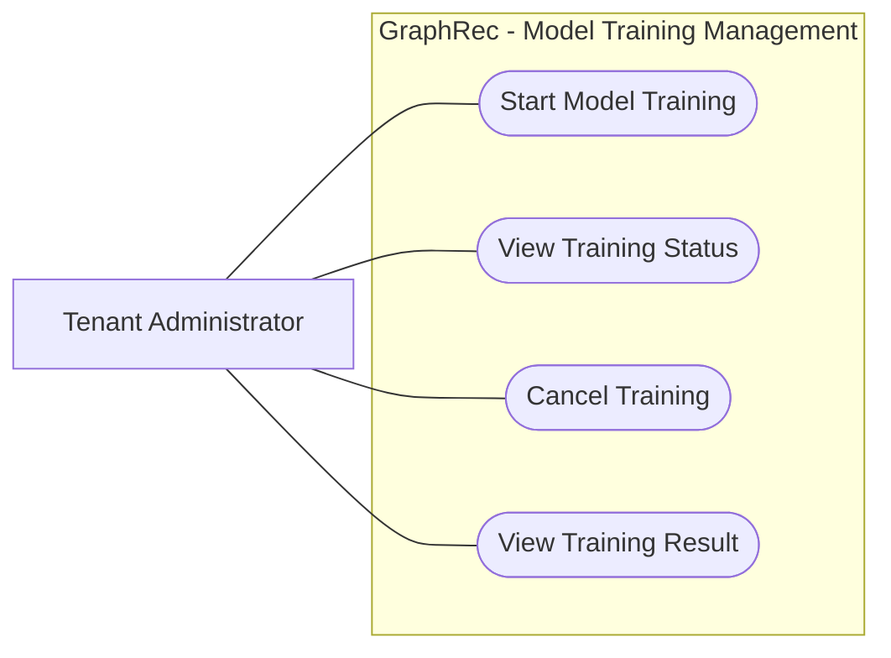
```mermaid
flowchart LR
    TA[Tenant Administrator]

    subgraph GR[GraphRec - Model Training Management]
        U301([Start Model Training])
        U302([View Training Status])
        U303([Cancel Training])
        U304([View Training Result])
    end

    TA --- U301
    TA --- U302
    TA --- U303
    TA --- U304
```

*Figure-5: Model Training Management Use-Case Diagram*

| Use case | Actor | Preconditions | Input supplied | Output received | Alternative outcome |
|---|---|---|---|---|---|
| UC-12 Start Model Training | Tenant Administrator | Sufficient data, quota, permission, and no active tenant job | Model type, bounded configuration, request identifier | Accepted job identifier and initial state | Insufficient data, cooldown, duplicate active job, or quota excess is reported |
| UC-13 View Training Status | Tenant Administrator | Training job belongs to tenant | Job identifier or filter | Current stage, progress, timestamps, and safe failure information | Missing or foreign job is not disclosed |
| UC-14 Cancel Training | Tenant Administrator | Job is in a cancellable state | Job identifier and reason | Cancellation-requested or cancelled status | Terminal or non-cancellable job returns a state conflict |
| UC-15 View Training Result | Tenant Administrator | Job is terminal | Job identifier | Completion result, quality measures, and produced version when successful | Failure or cancellation result includes a safe reason and no version |

### 4.5.4 Level 1.4 - Model-Version Management

**Actor:** Tenant Administrator  
**Use Cases:** View Model Versions, View Model Quality, Activate Model, Roll Back Model, Archive Model Version

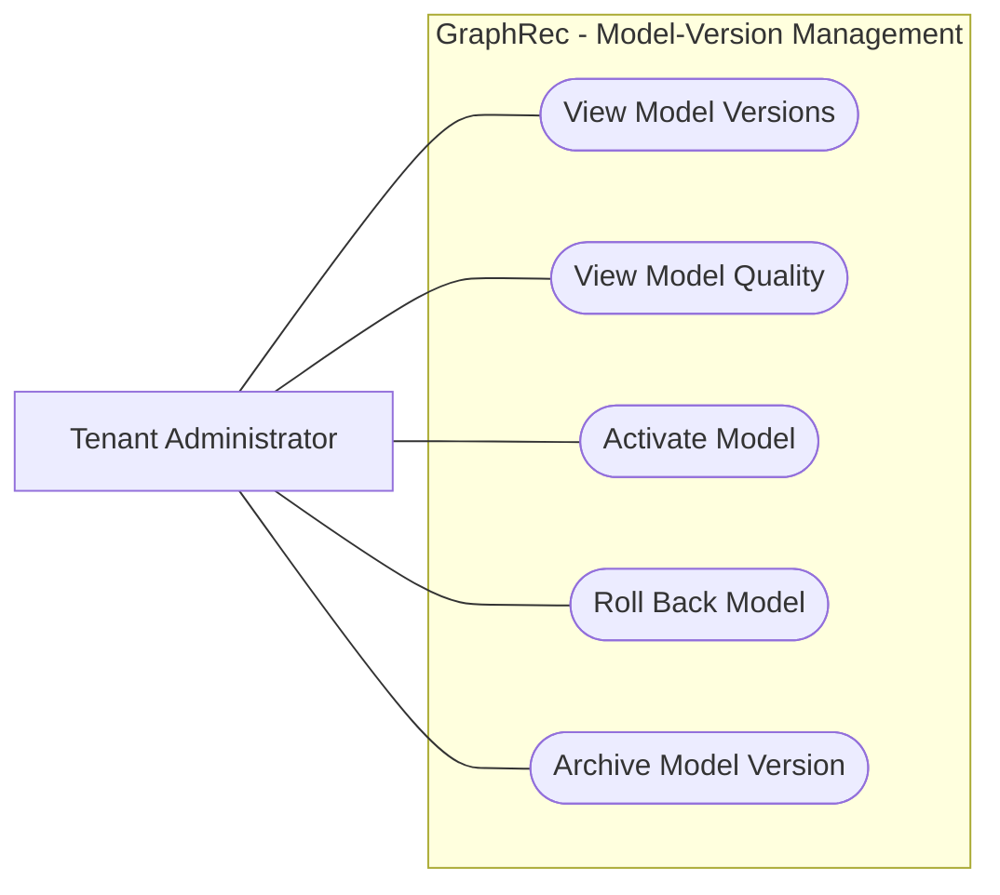
```mermaid
flowchart LR
    TA[Tenant Administrator]

    subgraph GR[GraphRec - Model-Version Management]
        U401([View Model Versions])
        U402([View Model Quality])
        U403([Activate Model])
        U404([Roll Back Model])
        U405([Archive Model Version])
    end

    TA --- U401
    TA --- U402
    TA --- U403
    TA --- U404
    TA --- U405
```

*Figure-6: Model-Version Management Use-Case Diagram*

| Use case | Actor | Preconditions | Input supplied | Output received | Alternative outcome |
|---|---|---|---|---|---|
| UC-16 View Model Versions | Tenant Administrator | Actor is authorized | Model filter or page request | Tenant-owned versions, lifecycle states, and active indicator | No versions returns an empty result |
| UC-17 View Model Quality | Tenant Administrator | Version belongs to tenant | Model-version identifier | Evaluation measures and comparison information | Missing metrics or foreign version is safely reported |
| UC-18 Activate Model | Tenant Administrator | Version is eligible and tenant-owned | Version identifier, reason, confirmation | Activation request and final active-version status | Ineligible or failed activation preserves the previous active version |
| UC-19 Roll Back Model | Tenant Administrator | Retained eligible target exists | Target version and reason | Rollback request and resulting active version | Invalid target or failed rollback preserves the current safe version |
| UC-20 Archive Model Version | Tenant Administrator | Version is inactive and not required for rollback | Version identifier and reason | Archived status | Active or protected version cannot be archived |

### 4.5.5 Level 1.5 - Recommendation and Feedback Management

**Actor:** Tenant E-Commerce Application  
**Related Stakeholder:** E-Commerce Customer  
**Use Cases:** Request Recommendations, Receive Recommendation Results, Submit Recommendation Feedback

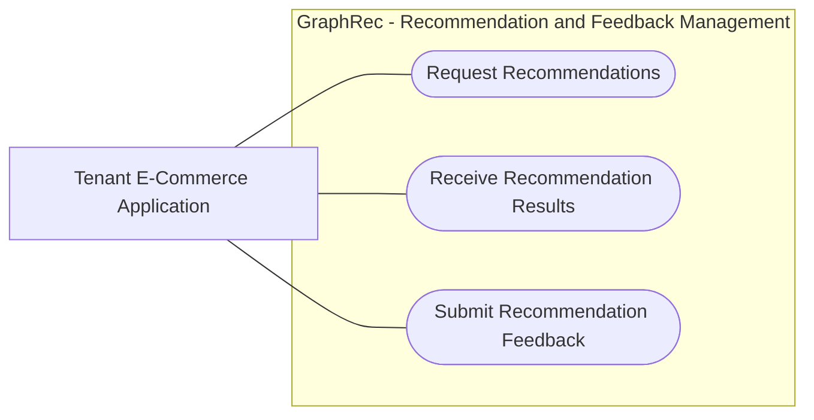
```mermaid
flowchart LR
    APP[Tenant E-Commerce Application]

    subgraph GR[GraphRec - Recommendation and Feedback Management]
        U501([Request Recommendations])
        U502([Receive Recommendation Results])
        U503([Submit Recommendation Feedback])
    end

    APP --- U501
    APP --- U502
    APP --- U503
```

*Figure-7: Recommendation and Feedback Management Use-Case Diagram*

| Use case | Actor | Preconditions | Input supplied | Output received | Alternative outcome |
|---|---|---|---|---|---|
| UC-21 Request Recommendations | Tenant E-Commerce Application | Valid credential and an available tenant recommendation service or fallback | Request identifier, customer or session context, recent events, result count, exclusions, optional eligibility hints | Accepted synchronous request | Invalid request, quota excess, or unavailable service returns a clear error |
| UC-22 Receive Recommendation Results | Tenant E-Commerce Application | Request passed validation | None beyond the active request | Ordered tenant products, model version, strategy, and fallback indicator | Safe fallback may be returned; otherwise unavailability is reported |
| UC-23 Submit Recommendation Feedback | Tenant E-Commerce Application | Referenced recommendation belongs to tenant | Feedback event identifier, request or result reference, product, position, type, time, optional value | Acceptance or duplicate confirmation | Invalid, foreign, or inconsistent reference is rejected |

The E-Commerce Customer benefits from the recommendations but normally interacts with the tenant's own application rather than directly with GraphRec.

### 4.5.6 Level 1.6 - Usage, Quota, and Status Monitoring

**Actors:** Tenant Administrator, Platform Administrator  
**Use Cases:** View Usage and Quotas, View Model Status, View Service Status, Manage Tenant Accounts, Configure Plans and Quotas, View Tenant Usage, Monitor Platform Status, Review Failures and Audit Records

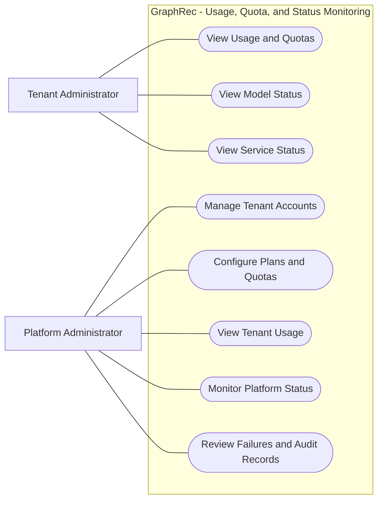
```mermaid
flowchart LR
    TA[Tenant Administrator]
    PA[Platform Administrator]

    subgraph GR[GraphRec - Usage, Quota, and Status Monitoring]
        U601([View Usage and Quotas])
        U602([View Model Status])
        U603([View Service Status])
        U604([Manage Tenant Accounts])
        U605([Configure Plans and Quotas])
        U606([View Tenant Usage])
        U607([Monitor Platform Status])
        U608([Review Failures and Audit Records])
    end

    TA --- U601
    TA --- U602
    TA --- U603
    PA --- U604
    PA --- U605
    PA --- U606
    PA --- U607
    PA --- U608
```

*Figure-8: Usage, Quota, and Status Monitoring Use-Case Diagram*

| Use case | Actor | Preconditions | Input supplied | Output received | Alternative outcome |
|---|---|---|---|---|---|
| UC-24 View Usage and Quotas | Tenant Administrator | Authenticated tenant account | Period and usage filter | Current usage, limits, remaining allowance, and reset information | Temporarily unavailable measurements return a safe status |
| UC-25 View Model Status | Tenant Administrator | Tenant owns model records | Model or version filter | Active, desired, eligible, retired, or failed status | No model returns an explicit empty state |
| UC-26 View Service Status | Tenant Administrator | Tenant service exists or is being prepared | Optional time range | Availability, active version, ready capacity, recent errors, and fallback rate | Missing service or measurement delay is reported |
| UC-27 Manage Tenant Accounts | Platform Administrator | Platform permission exists | Tenant status action and reason | Updated tenant status and audit confirmation | Invalid transition or protected action is rejected |
| UC-28 Configure Plans and Quotas | Platform Administrator | Plan-management permission exists | Plan limits, tenant assignment, or approved override | Updated configuration and effective period | Invalid or conflicting limits are rejected |
| UC-29 View Tenant Usage | Platform Administrator | Authorized platform scope | Tenant, period, and usage filters | Tenant usage summary without private event payloads | Unauthorized scope or missing tenant is rejected |
| UC-30 Monitor Platform Status | Platform Administrator | Monitoring access exists | Time range and status filter | Shared service health, workload, capacity, and failure summary | Measurement gaps are identified rather than hidden |
| UC-31 Review Failures and Audit Records | Platform Administrator | Audit permission exists | Tenant, action, severity, or time filter | Redacted failures and immutable action history | Sensitive details remain hidden or access is denied |

## 4.6 Activity Diagrams

### 4.6.1 Level 1 - Complete GraphRec Interaction

**Level:** 1  
**Name:** Complete GraphRec Interaction  
**Reference:** Use-Case Diagram Level 1  
**Actors:** Tenant Administrator, Tenant Developer, Tenant E-Commerce Application, Platform Administrator  
**Source Use Cases:** Register and Authenticate; Manage Integration and Data; Manage Training and Models; Request Recommendations and Submit Feedback; View or Manage Usage and Status

| Use case group | Actor | Input to GraphRec | Output received from GraphRec |
|---|---|---|---|
| Register and Authenticate | Tenant Administrator; Tenant Developer | Registration or authentication information | Account, session, or corrective error |
| Manage Integration and Data | Tenant Developer; Tenant E-Commerce Application | Credentials, products, and events | Credential state and submission result |
| Manage Training and Models | Tenant Administrator | Training, activation, or rollback request | Status, model quality, and active version |
| Request Recommendations and Submit Feedback | Tenant E-Commerce Application | Customer or session context and feedback | Recommendations and submission confirmation |
| View or Manage Usage and Status | Tenant Administrator; Platform Administrator | Filters or authorized administrative action | Usage, status, failure, audit, or update result |

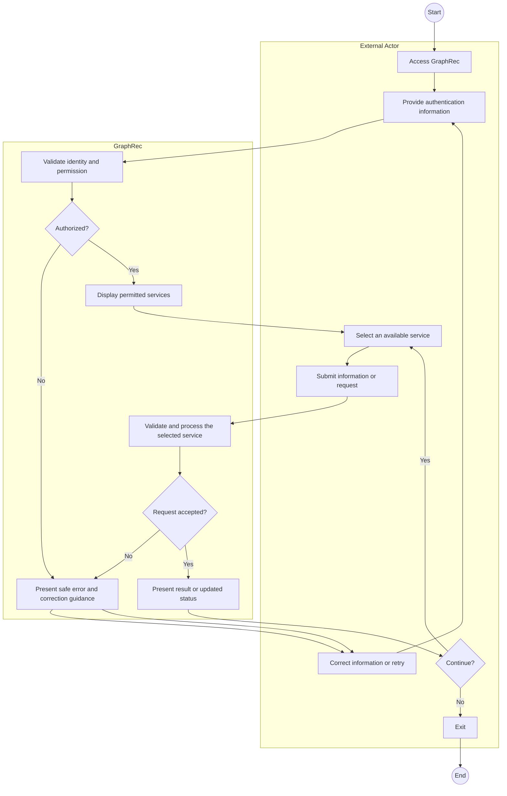
```mermaid
flowchart TD
    S((Start))
    E((End))

    subgraph ACTOR[External Actor]
        A1[Access GraphRec]
        A2[Provide authentication information]
        A3[Select an available service]
        A4[Submit information or request]
        A5{Continue?}
        A6[Correct information or retry]
        A7[Exit]
    end

    subgraph SYSTEM[GraphRec]
        G1[Validate identity and permission]
        G2{Authorized?}
        G3[Display permitted services]
        G4[Validate and process the selected service]
        G5{Request accepted?}
        G6[Present result or updated status]
        G7[Present safe error and correction guidance]
    end

    S --> A1 --> A2 --> G1 --> G2
    G2 -- No --> G7 --> A6
    A6 --> A2
    G2 -- Yes --> G3 --> A3 --> A4 --> G4 --> G5
    G5 -- No --> G7 --> A6
    G5 -- Yes --> G6 --> A5
    A5 -- Yes --> A3
    A5 -- No --> A7 --> E
```

*Figure-9: GraphRec Activity Diagram - Level 1*

### 4.6.2 Level 1.1 - Tenant Registration and Authentication

**Level:** 1.1  
**Name:** Tenant Registration and Authentication  
**Reference:** Use-Case Diagram Level 1.1  
**Actors:** Tenant Administrator, Tenant Developer  
**Source Use Cases:** Register Tenant; Sign In; Recover Account; Manage API Credentials

| Use case | Actor | Input to GraphRec | Output received from GraphRec |
|---|---|---|---|
| Register Tenant | Tenant Administrator | Business and initial administrator information | Tenant and account status |
| Sign In | Tenant Administrator; Tenant Developer | Authentication information | Authenticated session or error |
| Recover Account | Tenant Administrator; Tenant Developer | Account identity and recovery proof | Recovery status |
| Manage API Credentials | Tenant Administrator; Tenant Developer | Create, rotate, or revoke request | One-time secret or credential state |

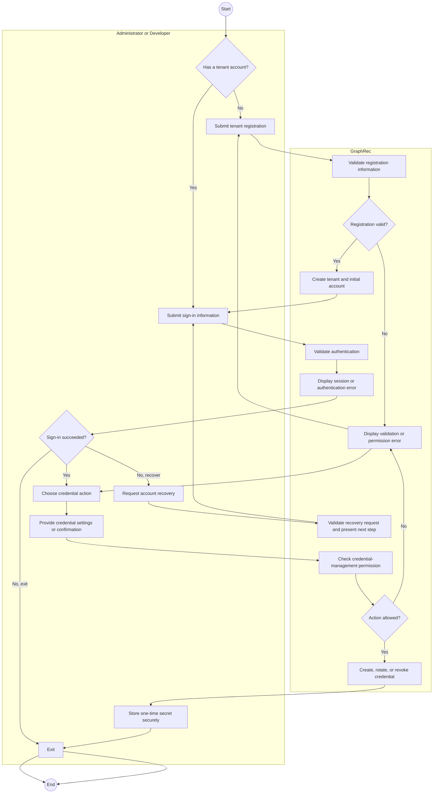
```mermaid
flowchart TD
    S((Start))
    E((End))

    subgraph ACTOR[Administrator or Developer]
        A1{Has a tenant account?}
        A2[Submit tenant registration]
        A3[Submit sign-in information]
        A4{Sign-in succeeded?}
        A5[Request account recovery]
        A6[Choose credential action]
        A7[Provide credential settings or confirmation]
        A8[Store one-time secret securely]
        A9[Exit]
    end

    subgraph SYSTEM[GraphRec]
        G1[Validate registration information]
        G2{Registration valid?}
        G3[Create tenant and initial account]
        G4[Validate authentication]
        G5[Display session or authentication error]
        G6[Validate recovery request and present next step]
        G7[Check credential-management permission]
        G8{Action allowed?}
        G9[Create, rotate, or revoke credential]
        G10[Display validation or permission error]
    end

    S --> A1
    A1 -- No --> A2 --> G1 --> G2
    G2 -- No --> G10 --> A2
    G2 -- Yes --> G3 --> A3
    A1 -- Yes --> A3
    A3 --> G4 --> G5 --> A4
    A4 -- No, recover --> A5 --> G6 --> A3
    A4 -- No, exit --> A9 --> E
    A4 -- Yes --> A6 --> A7 --> G7 --> G8
    G8 -- No --> G10 --> A6
    G8 -- Yes --> G9 --> A8 --> A9 --> E
```

*Figure-10: Tenant Registration and Authentication Activity Diagram*

### 4.6.3 Level 1.2 - Product and Customer-Event Management

**Level:** 1.2  
**Name:** Product and Customer-Event Management  
**Reference:** Use-Case Diagram Level 1.2  
**Actors:** Tenant Developer, Tenant E-Commerce Application  
**Source Use Cases:** Add Product; Update Product; Synchronize Product Data; Disable Product; Submit Customer Event; Submit Event Batch; View Submission Result

| Use case | Actor | Input to GraphRec | Output received from GraphRec |
|---|---|---|---|
| Add, Update, Synchronize, or Disable Product | Tenant Developer; Tenant E-Commerce Application | Product identifier and catalog information | Product or synchronization status |
| Submit Customer Event or Event Batch | Tenant Developer; Tenant E-Commerce Application | Event identifiers, customer/product references, types, times, and context | Acceptance, duplicate, batch, or error status |
| View Submission Result | Tenant Developer; Tenant E-Commerce Application | Submission identifier | Counts, progress, and safe failures |

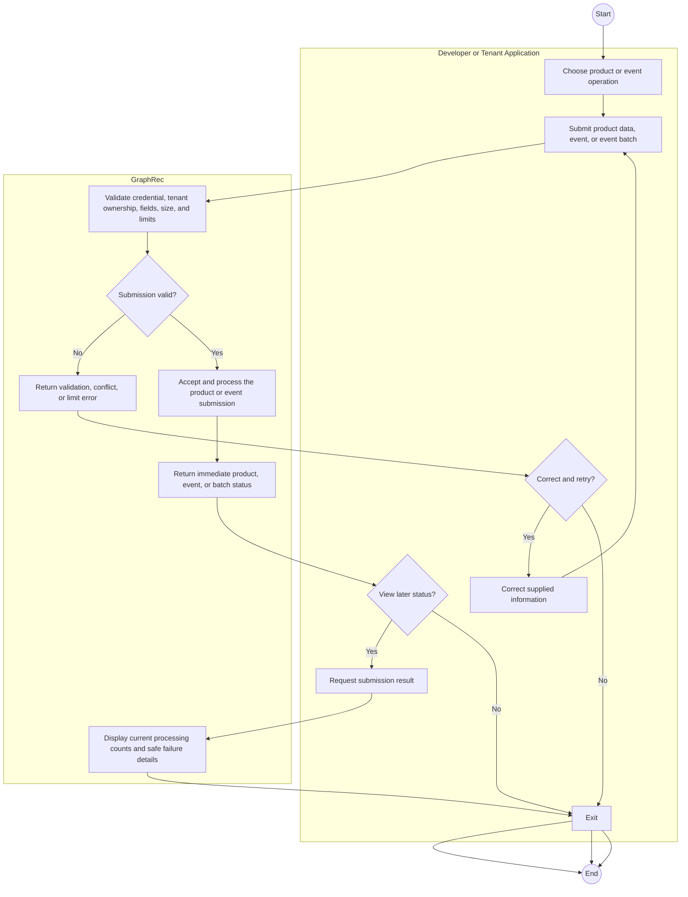
```mermaid
flowchart TD
    S((Start))
    E((End))

    subgraph ACTOR[Developer or Tenant Application]
        A1[Choose product or event operation]
        A2[Submit product data, event, or event batch]
        A3{Correct and retry?}
        A4[Correct supplied information]
        A5{View later status?}
        A6[Request submission result]
        A7[Exit]
    end

    subgraph SYSTEM[GraphRec]
        G1[Validate credential, tenant ownership, fields, size, and limits]
        G2{Submission valid?}
        G3[Accept and process the product or event submission]
        G4[Return immediate product, event, or batch status]
        G5[Return validation, conflict, or limit error]
        G6[Display current processing counts and safe failure details]
    end

    S --> A1 --> A2 --> G1 --> G2
    G2 -- No --> G5 --> A3
    A3 -- Yes --> A4 --> A2
    A3 -- No --> A7 --> E
    G2 -- Yes --> G3 --> G4 --> A5
    A5 -- Yes --> A6 --> G6 --> A7 --> E
    A5 -- No --> A7 --> E
```

*Figure-11: Product and Customer-Event Management Activity Diagram*

### 4.6.4 Level 1.3 - Model Training Management

**Level:** 1.3  
**Name:** Model Training Management  
**Reference:** Use-Case Diagram Level 1.3  
**Actor:** Tenant Administrator  
**Source Use Cases:** Start Model Training; View Training Status; Cancel Training; View Training Result

| Use case | Actor | Input to GraphRec | Output received from GraphRec |
|---|---|---|---|
| Start Model Training | Tenant Administrator | Model type and bounded configuration | Accepted job or rejection reason |
| View Training Status | Tenant Administrator | Job identifier | Current state and progress |
| Cancel Training | Tenant Administrator | Job identifier and reason | Cancellation status |
| View Training Result | Tenant Administrator | Terminal job identifier | Metrics and version, or failure/cancellation reason |

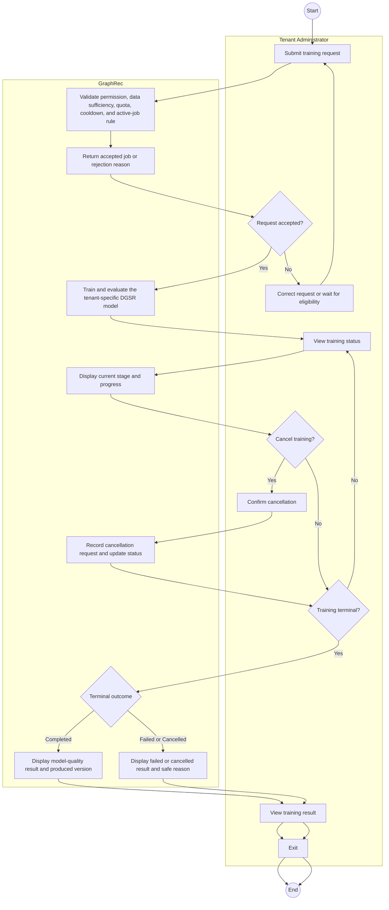
```mermaid
flowchart TD
    S((Start))
    E((End))

    subgraph ACTOR[Tenant Administrator]
        A1[Submit training request]
        A2{Request accepted?}
        A3[Correct request or wait for eligibility]
        A4[View training status]
        A5{Cancel training?}
        A6[Confirm cancellation]
        A7{Training terminal?}
        A8[View training result]
        A9[Exit]
    end

    subgraph SYSTEM[GraphRec]
        G1[Validate permission, data sufficiency, quota, cooldown, and active-job rule]
        G2[Return accepted job or rejection reason]
        G3[Train and evaluate the tenant-specific DGSR model]
        G4[Display current stage and progress]
        G5[Record cancellation request and update status]
        G6{Terminal outcome}
        G7[Display model-quality result and produced version]
        G8[Display failed or cancelled result and safe reason]
    end

    S --> A1 --> G1 --> G2 --> A2
    A2 -- No --> A3 --> A1
    A2 -- Yes --> G3
    G3 --> A4 --> G4 --> A5
    A5 -- Yes --> A6 --> G5 --> A7
    A5 -- No --> A7
    A7 -- No --> A4
    A7 -- Yes --> G6
    G6 -- Completed --> G7 --> A8 --> A9 --> E
    G6 -- Failed or Cancelled --> G8 --> A8 --> A9 --> E
```

*Figure-12: Model Training Management Activity Diagram*

### 4.6.5 Level 1.4 - Model-Version Management

**Level:** 1.4  
**Name:** Model-Version Management  
**Reference:** Use-Case Diagram Level 1.4  
**Actor:** Tenant Administrator  
**Source Use Cases:** View Model Versions; View Model Quality; Activate Model; Roll Back Model; Archive Model Version

| Use case | Actor | Input to GraphRec | Output received from GraphRec |
|---|---|---|---|
| View Model Versions and Quality | Tenant Administrator | Model filters or version identifier | Lifecycle state, active indicator, and quality measures |
| Activate Model | Tenant Administrator | Eligible version, reason, and confirmation | Activation outcome and active-model status |
| Roll Back Model | Tenant Administrator | Retained target and reason | Rollback outcome and active-model status |
| Archive Model Version | Tenant Administrator | Inactive version and reason | Archived status or protected-version error |

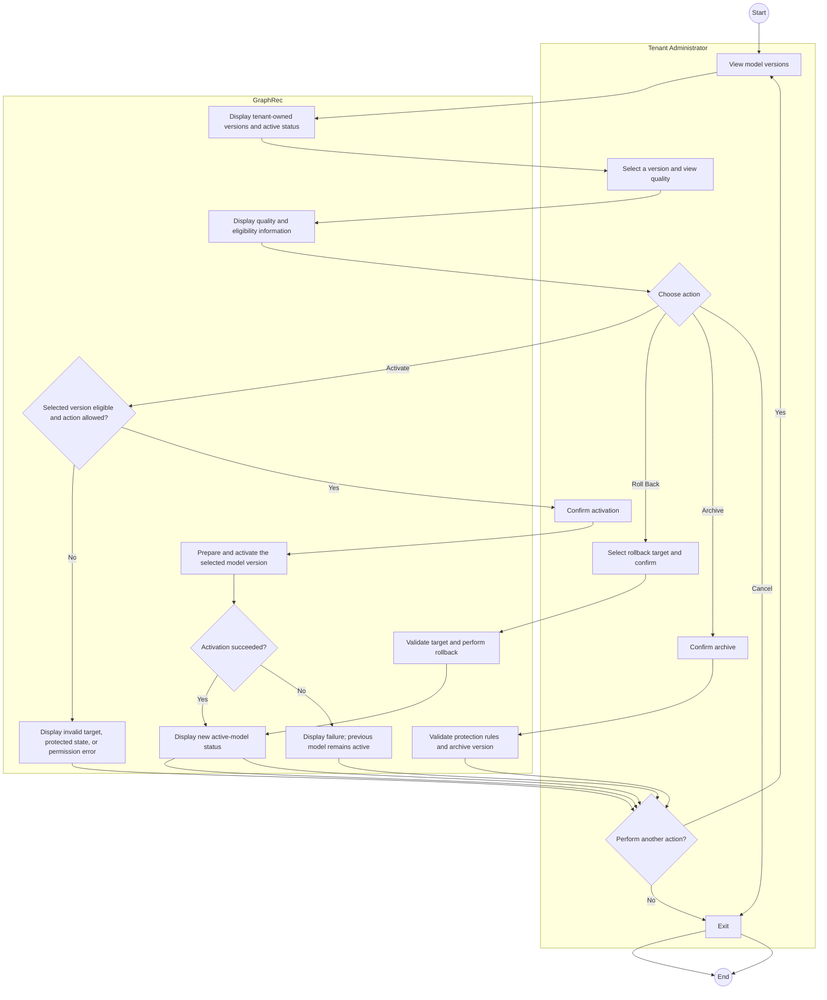
```mermaid
flowchart TD
    S((Start))
    E((End))

    subgraph ACTOR[Tenant Administrator]
        A1[View model versions]
        A2[Select a version and view quality]
        A3{Choose action}
        A4[Confirm activation]
        A5[Select rollback target and confirm]
        A6[Confirm archive]
        A7{Perform another action?}
        A8[Exit]
    end

    subgraph SYSTEM[GraphRec]
        G1[Display tenant-owned versions and active status]
        G2[Display quality and eligibility information]
        G3{Selected version eligible and action allowed?}
        G4[Prepare and activate the selected model version]
        G5{Activation succeeded?}
        G6[Display new active-model status]
        G7[Display failure; previous model remains active]
        G8[Validate target and perform rollback]
        G9[Validate protection rules and archive version]
        G10[Display invalid target, protected state, or permission error]
    end

    S --> A1 --> G1 --> A2 --> G2 --> A3
    A3 -- Activate --> G3
    G3 -- No --> G10 --> A7
    G3 -- Yes --> A4 --> G4 --> G5
    G5 -- Yes --> G6 --> A7
    G5 -- No --> G7 --> A7
    A3 -- Roll Back --> A5 --> G8 --> G6 --> A7
    A3 -- Archive --> A6 --> G9 --> A7
    A3 -- Cancel --> A8 --> E
    A7 -- Yes --> A1
    A7 -- No --> A8 --> E
```

*Figure-13: Model-Version Management Activity Diagram*

### 4.6.6 Level 1.5 - Recommendation and Feedback Management

**Level:** 1.5  
**Name:** Recommendation and Feedback Management  
**Reference:** Use-Case Diagram Level 1.5  
**Actor:** Tenant E-Commerce Application  
**Related Stakeholder:** E-Commerce Customer  
**Source Use Cases:** Request Recommendations; Receive Recommendation Results; Submit Recommendation Feedback

| Use case | Actor | Input to GraphRec | Output received from GraphRec |
|---|---|---|---|
| Request Recommendations | Tenant E-Commerce Application | Customer or session context, recent events, count, exclusions, and fallback permission | Validation or recommendation response |
| Receive Recommendation Results | Tenant E-Commerce Application | Accepted request | Ranked products, model version, strategy, and fallback indicator |
| Submit Recommendation Feedback | Tenant E-Commerce Application | Recommendation reference, product, position, feedback type, and event identifier | Acceptance, duplicate confirmation, or error |

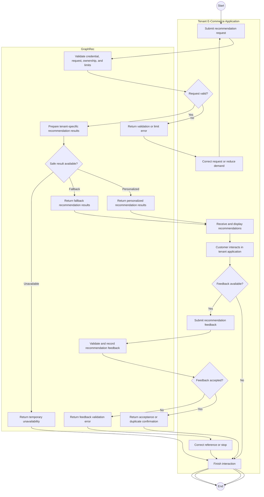
```mermaid
flowchart TD
    S((Start))
    E((End))

    subgraph ACTOR[Tenant E-Commerce Application]
        A1[Submit recommendation request]
        A2{Request valid?}
        A3[Correct request or reduce demand]
        A4[Receive and display recommendations]
        A5[Customer interacts in tenant application]
        A6{Feedback available?}
        A7[Submit recommendation feedback]
        A8{Feedback accepted?}
        A9[Correct reference or stop]
        A10[Finish interaction]
    end

    subgraph SYSTEM[GraphRec]
        G1[Validate credential, request, ownership, and limits]
        G2[Return validation or limit error]
        G3[Prepare tenant-specific recommendation results]
        G4{Safe result available?}
        G5[Return personalized recommendation results]
        G6[Return fallback recommendation results]
        G7[Return temporary unavailability]
        G8[Validate and record recommendation feedback]
        G9[Return acceptance or duplicate confirmation]
        G10[Return feedback validation error]
    end

    S --> A1 --> G1 --> A2
    A2 -- No --> G2 --> A3 --> A1
    A2 -- Yes --> G3 --> G4
    G4 -- Personalized --> G5 --> A4
    G4 -- Fallback --> G6 --> A4
    G4 -- Unavailable --> G7 --> A10 --> E
    A4 --> A5 --> A6
    A6 -- No --> A10 --> E
    A6 -- Yes --> A7 --> G8 --> A8
    A8 -- Yes --> G9 --> A10 --> E
    A8 -- No --> G10 --> A9 --> A10 --> E
```

*Figure-14: Recommendation and Feedback Management Activity Diagram*

### 4.6.7 Level 1.6 - Usage, Quota, and Status Monitoring

**Level:** 1.6  
**Name:** Usage, Quota, and Status Monitoring  
**Reference:** Use-Case Diagram Level 1.6  
**Actors:** Tenant Administrator, Platform Administrator  
**Source Use Cases:** View Usage and Quotas; View Model Status; View Service Status; Manage Tenant Accounts; Configure Plans and Quotas; View Tenant Usage; Monitor Platform Status; Review Failures and Audit Records

| Use case group | Actor | Input to GraphRec | Output received from GraphRec |
|---|---|---|---|
| View tenant usage, model, and service status | Tenant Administrator | Period, model, or status filter | Tenant-scoped usage, quota, model, and service information |
| Manage tenants and plans | Platform Administrator | Tenant action, plan configuration, quota override, and reason | Confirmation, effective configuration, or conflict |
| Monitor platform and review records | Platform Administrator | Time, tenant, severity, or action filter | Shared status, failures, and redacted audit history |

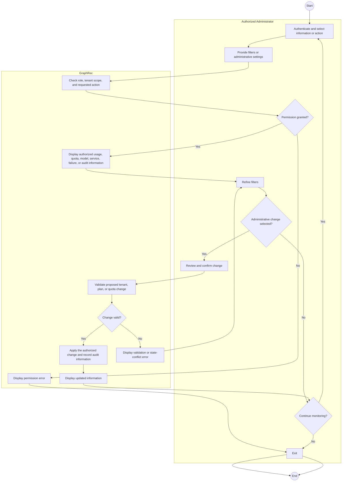
```mermaid
flowchart TD
    S((Start))
    E((End))

    subgraph ACTOR[Authorized Administrator]
        A1[Authenticate and select information or action]
        A2[Provide filters or administrative settings]
        A3{Permission granted?}
        A4[Refine filters]
        A5{Administrative change selected?}
        A6[Review and confirm change]
        A7{Continue monitoring?}
        A8[Exit]
    end

    subgraph SYSTEM[GraphRec]
        G1[Check role, tenant scope, and requested action]
        G2[Display permission error]
        G3[Display authorized usage, quota, model, service, failure, or audit information]
        G4[Validate proposed tenant, plan, or quota change]
        G5{Change valid?}
        G6[Apply the authorized change and record audit information]
        G7[Display updated information]
        G8[Display validation or state-conflict error]
    end

    S --> A1 --> A2 --> G1 --> A3
    A3 -- No --> G2 --> A8 --> E
    A3 -- Yes --> G3 --> A4 --> A5
    A5 -- No --> A7
    A5 -- Yes --> A6 --> G4 --> G5
    G5 -- No --> G8 --> A4
    G5 -- Yes --> G6 --> G7 --> A7
    A7 -- Yes --> A1
    A7 -- No --> A8 --> E
```

*Figure-15: Usage, Quota, and Status Monitoring Activity Diagram*

---
# 5. Data-Based Modeling

## 5.1 Logical Entity-Relationship Modeling

The Logical Entity-Relationship Model defines the information GraphRec must preserve independently of any implementation product. It identifies entities, attributes, primary and foreign keys, alternate keys, relationships, cardinality, optionality, and integrity constraints. The structure reduces avoidable duplication and preserves tenant ownership across identity, catalog, interaction, training, model, recommendation, usage, and audit information.

## 5.2 Logical Entities

### 5.2.1 Pricing Plan

**Purpose:** Defines reusable service limits assigned to tenants.

| Attribute | Logical type | Key | Required | Description |
|---|---|---|---|---|
| plan_id | Identifier | PK | Yes | Unique plan identifier |
| plan_code | Text | UK | Yes | Stable unique plan code |
| plan_name | Text |  | Yes | Display name |
| description | Long Text |  | No | Plan summary |
| event_limit | Integer |  | Yes | Accepted-event allowance per period |
| recommendation_limit | Integer |  | Yes | Recommendation allowance per period |
| training_limit | Integer |  | Yes | Training-job allowance per period |
| service_limits | Structured Data |  | Yes | Additional bounded quotas and service levels |
| is_active | Boolean |  | Yes | Whether new assignments are allowed |

**Keys, constraints, and relationships:** `plan_id` is the primary key and `plan_code` is unique. Limits shall be non-negative. One Pricing Plan may be assigned to zero or many Tenants; each Tenant belongs to exactly one current Pricing Plan.

### 5.2.2 Tenant

**Purpose:** Represents one independent e-commerce business using GraphRec.

| Attribute | Logical type | Key | Required | Description |
|---|---|---|---|---|
| tenant_id | Identifier | PK | Yes | Unique tenant identifier |
| plan_id | Identifier | FK | Yes | Assigned Pricing Plan |
| tenant_code | Text | UK | Yes | Stable unique platform code |
| tenant_name | Text |  | Yes | Business name |
| status | Enumeration |  | Yes | Pending, active, suspended, deleting, or deleted |
| created_at | DateTime |  | Yes | Registration time |
| updated_at | DateTime |  | Yes | Last tenant-state change |
| settings | Structured Data |  | No | Approved tenant-level configuration |

**Keys, constraints, and relationships:** `tenant_id` is the primary key and `tenant_code` is unique across GraphRec. A Tenant must reference one active Pricing Plan when activated. A Tenant owns its users, credentials, customers, products, events, training jobs, snapshots, models, recommendations, usage, and audit records. Tenant deletion follows a controlled lifecycle rather than immediate removal.

### 5.2.3 Tenant User

**Purpose:** Represents an administrator or developer authorized to manage one tenant.

| Attribute | Logical type | Key | Required | Description |
|---|---|---|---|---|
| tenant_user_id | Identifier | PK | Yes | Unique tenant-user identifier |
| tenant_id | Identifier | FK | Yes | Owning Tenant |
| email | Text | UK | Yes | Tenant-local sign-in identity |
| display_name | Text |  | Yes | User-visible name |
| credential_digest | Text |  | Yes | Protected authentication verifier |
| role | Enumeration |  | Yes | Tenant administrator or tenant developer |
| status | Enumeration |  | Yes | Invited, active, locked, or disabled |
| created_at | DateTime |  | Yes | Account creation time |
| last_authenticated_at | DateTime |  | No | Most recent successful authentication time |

**Keys, constraints, and relationships:** `tenant_user_id` is the primary key. The combination `(tenant_id, email)` is a unique alternate key. A Tenant User belongs to exactly one Tenant and may initiate many training, model-management, credential-management, and audit-recorded actions. A user cannot receive a role outside the permitted tenant role set.

### 5.2.4 API Credential

**Purpose:** Represents a revocable credential used by a tenant integration.

| Attribute | Logical type | Key | Required | Description |
|---|---|---|---|---|
| api_credential_id | Identifier | PK | Yes | Unique credential identifier |
| tenant_id | Identifier | FK | Yes | Owning Tenant |
| credential_name | Text | UK | Yes | Tenant-local descriptive name |
| visible_prefix | Text | UK | Yes | Non-secret lookup and identification prefix |
| secret_digest | Text |  | Yes | Protected verifier; the full secret is not retained |
| permissions | Structured Data |  | Yes | Allowed integration operations |
| expires_at | DateTime |  | No | Optional expiry time |
| revoked_at | DateTime |  | No | Revocation time |
| created_at | DateTime |  | Yes | Creation time |
| last_used_at | DateTime |  | No | Most recent accepted use |

**Keys, constraints, and relationships:** `api_credential_id` is the primary key. `(tenant_id, credential_name)` and `visible_prefix` are unique alternate keys. An API Credential belongs to one Tenant. Expired or revoked credentials cannot authorize requests. Secret material is displayed only at creation or rotation.

### 5.2.5 Customer

**Purpose:** Represents a tenant-local e-commerce customer or pseudonymous user whose behavior supports recommendations.

| Attribute | Logical type | Key | Required | Description |
|---|---|---|---|---|
| customer_id | Identifier | PK | Yes | Internal customer identifier |
| tenant_id | Identifier | FK | Yes | Owning Tenant |
| external_customer_id | Text | UK | Yes | Identifier supplied by the tenant application |
| attributes | Structured Data |  | No | Minimized approved customer features |
| status | Enumeration |  | Yes | Active, anonymized, or deleted |
| created_at | DateTime |  | Yes | First known time |
| updated_at | DateTime |  | Yes | Last profile change |

**Keys, constraints, and relationships:** `customer_id` is the primary key and `(tenant_id, external_customer_id)` is unique. A Customer belongs to one Tenant, may generate zero or many Interaction Events, and may be associated with zero or many Recommendation Requests. Direct personal data is minimized; anonymization may preserve non-identifying aggregate behavior where permitted.

### 5.2.6 Product

**Purpose:** Represents one item in a tenant's recommendation catalog.

| Attribute | Logical type | Key | Required | Description |
|---|---|---|---|---|
| product_id | Identifier | PK | Yes | Internal product identifier |
| tenant_id | Identifier | FK | Yes | Owning Tenant |
| external_product_id | Text | UK | Yes | Tenant-local catalog identifier |
| title | Text |  | Yes | Product display title |
| category | Text |  | No | Primary category or grouping |
| brand | Text |  | No | Product brand |
| price | Decimal |  | No | Current non-negative price |
| attributes | Structured Data |  | No | Approved metadata used for filtering or cold start |
| is_active | Boolean |  | Yes | Whether the product may be considered |
| availability_status | Enumeration |  | Yes | Available, unavailable, out of stock, or discontinued |
| updated_at | DateTime |  | Yes | Last catalog update |

**Keys, constraints, and relationships:** `product_id` is the primary key and `(tenant_id, external_product_id)` is unique. A Product belongs to one Tenant and may appear in many events and recommendation results. Price, when present, shall be non-negative. Inactive, unavailable, deleted, or otherwise ineligible products shall not be returned.

### 5.2.7 Interaction Event

**Purpose:** Records a customer-product interaction used for usage, training, and evaluation.

| Attribute | Logical type | Key | Required | Description |
|---|---|---|---|---|
| interaction_event_id | Identifier | PK | Yes | Internal event identifier |
| tenant_id | Identifier | FK | Yes | Owning Tenant |
| customer_id | Identifier | FK | Yes | Customer that produced the event |
| product_id | Identifier | FK | Yes | Product affected by the event |
| external_event_id | Text | UK | Yes | Tenant-supplied idempotency identifier |
| event_type | Enumeration |  | Yes | View, click, cart action, purchase, rating, or allowed type |
| event_value | Decimal |  | No | Optional rating, quantity, or business value |
| occurred_at | DateTime |  | Yes | Time the action occurred |
| received_at | DateTime |  | Yes | Time GraphRec accepted it |
| context | Structured Data |  | No | Bounded page, session, or approved contextual data |

**Keys, constraints, and relationships:** `interaction_event_id` is the primary key and `(tenant_id, external_event_id)` is unique. The referenced Customer and Product must belong to the same Tenant as the event. Events are append-oriented; duplicate submission produces one durable effect. Event time cannot be omitted, and event type and optional value must satisfy type-specific rules.

### 5.2.8 Training Job

**Purpose:** Represents one tenant request to prepare, train, evaluate, and register a recommendation model.

| Attribute | Logical type | Key | Required | Description |
|---|---|---|---|---|
| training_job_id | Identifier | PK | Yes | Unique job identifier |
| tenant_id | Identifier | FK | Yes | Owning Tenant |
| requested_by_user_id | Identifier | FK | Yes | Tenant User that requested training |
| requested_model_type | Enumeration |  | Yes | Approved model or baseline type |
| configuration | Structured Data |  | Yes | Bounded training configuration |
| status | Enumeration |  | Yes | Queued through terminal training state |
| requested_at | DateTime |  | Yes | Request time |
| started_at | DateTime |  | No | Processing start time |
| completed_at | DateTime |  | No | Terminal time |
| cancellation_requested_at | DateTime |  | No | Optional cancellation request time |
| failure_reason | Long Text |  | No | Sanitized terminal failure information |

**Keys, constraints, and relationships:** `training_job_id` is the primary key. A Training Job belongs to one Tenant and one requesting Tenant User. At most one non-terminal training job may exist for a Tenant. A job creates exactly one Dataset Snapshot after preparation and may produce zero or one Model Version. Terminal timestamps and reasons shall be consistent with the final status.

### 5.2.9 Dataset Snapshot

**Purpose:** Defines the immutable, tenant-specific training data and cutoff used by one job.

| Attribute | Logical type | Key | Required | Description |
|---|---|---|---|---|
| dataset_snapshot_id | Identifier | PK | Yes | Unique snapshot identifier |
| tenant_id | Identifier | FK | Yes | Owning Tenant |
| training_job_id | Identifier | FK, UK | Yes | Training Job that created the snapshot |
| cutoff_at | DateTime |  | Yes | Latest event time eligible for the snapshot |
| query_definition | Structured Data |  | Yes | Reproducible selection and filtering rules |
| customer_count | Integer |  | Yes | Included customer count |
| product_count | Integer |  | Yes | Included product count |
| event_count | Integer |  | Yes | Included interaction count |
| content_reference | Text |  | Yes | Controlled reference to snapshot content |
| content_digest | Text | UK | Yes | Integrity and reproducibility digest |
| created_at | DateTime |  | Yes | Snapshot completion time |

**Keys, constraints, and relationships:** `dataset_snapshot_id` is the primary key; `training_job_id` is unique because one job creates one snapshot. Counts shall be non-negative. The snapshot contains data from one Tenant only and must exclude events beyond `cutoff_at`. A snapshot may support zero or one registered Model Version in the semester scope.

### 5.2.10 Model Version

**Purpose:** Represents one immutable trained or baseline model release and its evaluation summary.

| Attribute | Logical type | Key | Required | Description |
|---|---|---|---|---|
| model_version_id | Identifier | PK | Yes | Unique version identifier |
| tenant_id | Identifier | FK | Yes | Owning Tenant |
| training_job_id | Identifier | FK, UK | Yes | Producing Training Job |
| dataset_snapshot_id | Identifier | FK, UK | Yes | Source Dataset Snapshot |
| version_number | Integer | UK | Yes | Tenant-model sequence number |
| model_type | Enumeration |  | Yes | DGSR or approved baseline |
| lifecycle_status | Enumeration |  | Yes | Registered, eligible, active, retired, rejected, archived, or failed deployment |
| artifact_reference | Text |  | Yes | Controlled model-bundle reference |
| artifact_digest | Text | UK | Yes | Model-bundle integrity digest |
| feature_contract | Structured Data |  | Yes | Versioned input and preprocessing contract |
| evaluation_summary | Structured Data |  | Yes | Quality, coverage, diversity, and stability measures |
| created_at | DateTime |  | Yes | Registration time |
| activated_at | DateTime |  | No | First successful activation time |

**Keys, constraints, and relationships:** `model_version_id` is the primary key. `(tenant_id, version_number)` is unique within the modeled recommendation family, and the producing job and snapshot are unique in the semester scope. The job, snapshot, artifact identity, and version must belong to the same Tenant. A version is immutable after registration except for lifecycle status and activation metadata. A rejected or archived version cannot be activated.

### 5.2.11 Model Deployment

**Purpose:** Represents the current desired and available recommendation-service state for one tenant.

| Attribute | Logical type | Key | Required | Description |
|---|---|---|---|---|
| model_deployment_id | Identifier | PK | Yes | Unique deployment identifier |
| tenant_id | Identifier | FK, UK | Yes | Tenant with this current deployment |
| desired_model_version_id | Identifier | FK | No | Version requested for activation |
| active_model_version_id | Identifier | FK | No | Stable version currently reported as active |
| status | Enumeration |  | Yes | Pending, progressing, available, degraded, rolling back, or stopped |
| desired_capacity | Integer |  | Yes | Requested service instances within plan limits |
| ready_capacity | Integer |  | Yes | Instances ready to serve |
| last_transition_at | DateTime |  | Yes | Most recent lifecycle transition |
| failure_reason | Long Text |  | No | Sanitized rollout or capacity failure |

**Keys, constraints, and relationships:** `model_deployment_id` is the primary key and `tenant_id` is unique, allowing zero or one current deployment per Tenant. Desired and active versions, when present, must belong to that Tenant. Capacity values shall be non-negative. Failed activation shall not replace the previously active version. One Model Version may serve many Recommendation Requests over time.

### 5.2.12 Recommendation Request

**Purpose:** Records one synchronous request for tenant-specific ranked products.

| Attribute | Logical type | Key | Required | Description |
|---|---|---|---|---|
| recommendation_request_id | Identifier | PK | Yes | Internal request identifier |
| tenant_id | Identifier | FK | Yes | Owning Tenant |
| external_request_id | Text | UK | Yes | Tenant-supplied idempotency identifier |
| customer_id | Identifier | FK | No | Known Customer, if identified |
| model_version_id | Identifier | FK | No | Version that served the request |
| session_reference | Text |  | No | Pseudonymous session reference |
| requested_count | Integer |  | Yes | Maximum requested result count |
| context | Structured Data |  | No | Recent events, page context, exclusions, and eligibility hints |
| strategy | Enumeration |  | No | Personalized, session, fallback, or unavailable strategy |
| status | Enumeration |  | Yes | Accepted, completed, rejected, or failed |
| requested_at | DateTime |  | Yes | Request time |
| completed_at | DateTime |  | No | Response completion time |

**Keys, constraints, and relationships:** `recommendation_request_id` is the primary key and `(tenant_id, external_request_id)` is unique. At least one of Customer or session context shall be present. Customer and served Model Version, when present, must belong to the same Tenant. Requested count must be positive and within the configured maximum. One completed request produces one or more Recommendation Results unless it ends unavailable or rejected.

### 5.2.13 Recommendation Result

**Purpose:** Represents one product and position returned for a recommendation request.

| Attribute | Logical type | Key | Required | Description |
|---|---|---|---|---|
| recommendation_result_id | Identifier | PK | Yes | Unique result identifier |
| tenant_id | Identifier | FK | Yes | Owning Tenant |
| recommendation_request_id | Identifier | FK | Yes | Parent Recommendation Request |
| product_id | Identifier | FK | Yes | Recommended Product |
| rank_position | Integer | UK | Yes | One-based position within the request |
| model_score | Decimal |  | No | Raw model relevance where applicable |
| final_order_score | Decimal |  | No | Final bounded ordering score |
| candidate_source | Enumeration |  | Yes | Personalized, neighbor, popular, category, content, or tenant rule |
| strategy | Enumeration |  | Yes | Personalized or fallback lane |
| created_at | DateTime |  | Yes | Result creation time |

**Keys, constraints, and relationships:** `recommendation_result_id` is the primary key and `(recommendation_request_id, rank_position)` is unique. Rank must be positive. The request and product must belong to the same Tenant, and a product may appear only once per request. A Recommendation Result may receive zero or many Recommendation Feedback records.

### 5.2.14 Recommendation Feedback

**Purpose:** Records an impression, click, conversion, or other approved response to a recommendation result.

| Attribute | Logical type | Key | Required | Description |
|---|---|---|---|---|
| recommendation_feedback_id | Identifier | PK | Yes | Unique feedback identifier |
| tenant_id | Identifier | FK | Yes | Owning Tenant |
| recommendation_result_id | Identifier | FK | Yes | Result receiving feedback |
| external_feedback_id | Text | UK | Yes | Tenant-supplied idempotency identifier |
| feedback_type | Enumeration |  | Yes | Impression, click, conversion, or allowed type |
| position_observed | Integer |  | No | Displayed position when supplied |
| feedback_value | Decimal |  | No | Optional quantity or conversion value |
| occurred_at | DateTime |  | Yes | Time of feedback action |
| received_at | DateTime |  | Yes | Time GraphRec accepted it |
| context | Structured Data |  | No | Bounded approved feedback context |

**Keys, constraints, and relationships:** `recommendation_feedback_id` is the primary key and `(tenant_id, external_feedback_id)` is unique. The referenced result and its request and product must belong to the same Tenant. Position, when present, shall be positive and consistent with the displayed result. Duplicate feedback has one durable effect.

### 5.2.15 Usage Record

**Purpose:** Stores a tenant's measured usage for one period and usage type.

| Attribute | Logical type | Key | Required | Description |
|---|---|---|---|---|
| usage_record_id | Identifier | PK | Yes | Unique usage record identifier |
| tenant_id | Identifier | FK | Yes | Owning Tenant |
| usage_period_start | Date | UK | Yes | Beginning of the measured period |
| usage_period_end | Date |  | Yes | End of the measured period |
| usage_type | Enumeration | UK | Yes | Events, recommendations, training, products, storage, or service capacity |
| measured_quantity | Decimal |  | Yes | Non-negative reconciled quantity |
| limit_quantity | Decimal |  | No | Effective plan or override limit |
| last_reconciled_at | DateTime |  | Yes | Most recent reconciliation time |
| details | Structured Data |  | No | Bounded breakdown without private event content |

**Keys, constraints, and relationships:** `usage_record_id` is the primary key and `(tenant_id, usage_period_start, usage_type)` is unique. Quantities shall be non-negative and period end shall not precede period start. One Tenant has many Usage Records, each derived from idempotently measured actions and reconciled observations.

### 5.2.16 Audit Record

**Purpose:** Preserves an append-only history of security-sensitive and administrative actions.

| Attribute | Logical type | Key | Required | Description |
|---|---|---|---|---|
| audit_record_id | Identifier | PK | Yes | Unique audit identifier |
| tenant_id | Identifier | FK | No | Related Tenant; absent only for platform-wide action |
| actor_type | Enumeration |  | Yes | Tenant user, tenant application, platform administrator, or system process |
| actor_reference | Identifier |  | No | Internal actor identifier where applicable |
| action_type | Enumeration |  | Yes | Credential, training, activation, rollback, quota, tenant, access, or security action |
| resource_type | Text |  | Yes | Type of affected resource |
| resource_reference | Identifier |  | No | Affected resource identifier |
| outcome | Enumeration |  | Yes | Succeeded, failed, denied, or cancelled |
| occurred_at | DateTime |  | Yes | Action time |
| correlation_reference | Identifier |  | No | Reference joining related actions without exposing secrets |
| redacted_details | Structured Data |  | No | Sanitized before and after information |

**Keys, constraints, and relationships:** `audit_record_id` is the primary key. Audit Records are append-only and must not contain credential secrets, raw personal event payloads, or another tenant's information in tenant-facing views. A Tenant may have many Audit Records; platform-wide records may have no tenant reference and require platform authorization.

## 5.3 Relationship Summary

| Parent entity | Relationship | Child entity | Cardinality | Explanation |
|---|---|---|---|---|
| Pricing Plan | is assigned to | Tenant | One to zero or many | A plan may serve many tenants; each tenant has one current plan |
| Tenant | owns | Tenant User | One to zero or many | Tenant users administer or integrate one tenant |
| Tenant | owns | API Credential | One to zero or many | Each credential resolves to one tenant |
| Tenant | owns | Customer | One to zero or many | Customer identifiers are tenant-local |
| Tenant | owns | Product | One to zero or many | Product identifiers are tenant-local |
| Customer | generates | Interaction Event | One to zero or many | Each event references one customer |
| Product | receives | Interaction Event | One to zero or many | Each event references one product |
| Tenant | requests | Training Job | One to zero or many | Jobs are isolated and quota-controlled per tenant |
| Training Job | creates | Dataset Snapshot | One to exactly one | Accepted training uses one immutable tenant snapshot |
| Training Job | produces | Model Version | One to zero or one | Failed or cancelled jobs produce no version |
| Dataset Snapshot | supports | Model Version | One to zero or one | The semester model uses one snapshot per produced version |
| Tenant | owns | Model Version | One to zero or many | Versions and artifacts remain tenant-specific |
| Tenant | has current | Model Deployment | One to zero or one | A tenant may have no deployed model before activation |
| Model Version | is active in | Model Deployment | One to zero or many over time | A version may be activated, retired, or restored |
| Customer | initiates | Recommendation Request | One to zero or many | Anonymous session requests may omit the customer |
| Model Version | serves | Recommendation Request | One to zero or many | Completed personalized responses identify the serving version |
| Recommendation Request | produces | Recommendation Result | One to one or many | Successful result sets contain ranked products |
| Product | appears in | Recommendation Result | One to zero or many | A product may be recommended in many requests |
| Recommendation Result | receives | Recommendation Feedback | One to zero or many | A result may receive impression, click, and conversion feedback |
| Tenant | has | Usage Record | One to zero or many | Usage is unique by tenant, period, and type |
| Tenant | has | Audit Record | One to zero or many | Tenant-scoped actions are recorded and redacted |

### Tenant-Integrity Rules

1. Every tenant-owned entity shall reference exactly one Tenant.
2. Customer, Product, Event, request, and feedback external identifiers shall be unique within their Tenant.
3. Every cross-entity reference shall preserve Tenant equality, even when internal identifiers are globally unique.
4. An Interaction Event's Customer and Product shall belong to the event's Tenant.
5. A Dataset Snapshot shall contain data from one Tenant and shall respect its cutoff.
6. A Model Version shall belong to the same Tenant as its Training Job and Dataset Snapshot.
7. A Model Deployment may activate only a Model Version owned by the same Tenant.
8. A Recommendation Request's Customer and Model Version, when present, shall belong to the request's Tenant.
9. A Recommendation Result's Product shall belong to the request's Tenant.
10. Recommendation Feedback shall reference a result owned by the same Tenant.
11. Usage Records shall be unique by Tenant, period, and usage type.
12. Tenant-facing audit queries shall never reveal another Tenant's existence or data.

## 5.4 Logical ER Diagrams

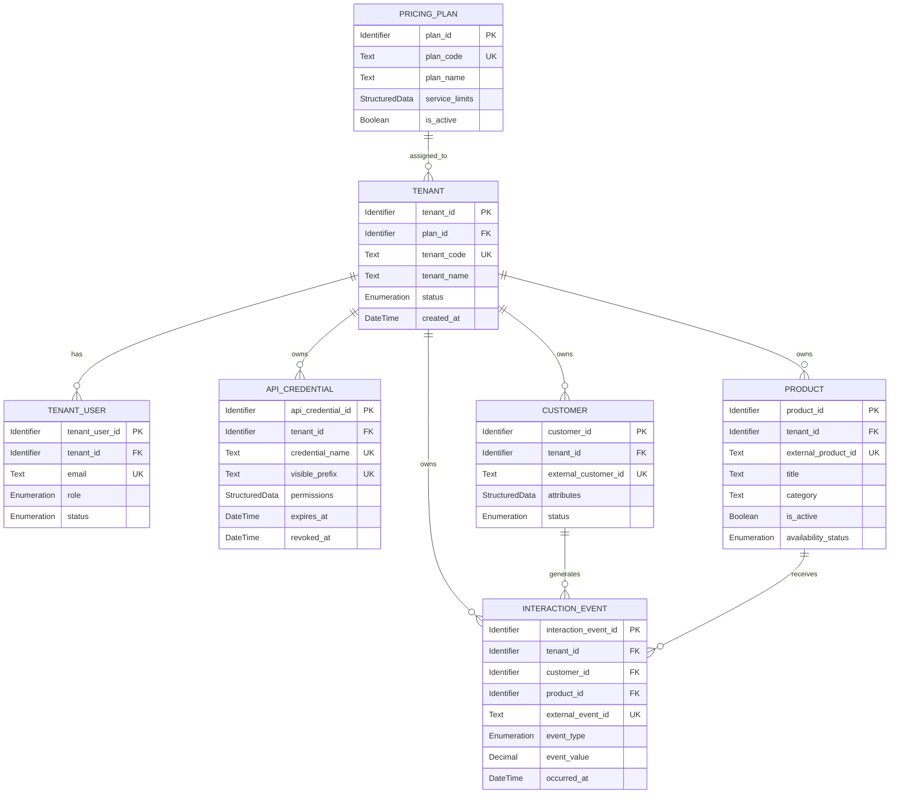
```mermaid
erDiagram
    PRICING_PLAN ||--o{ TENANT : assigned_to
    TENANT ||--o{ TENANT_USER : has
    TENANT ||--o{ API_CREDENTIAL : owns
    TENANT ||--o{ CUSTOMER : owns
    TENANT ||--o{ PRODUCT : owns
    TENANT ||--o{ INTERACTION_EVENT : owns
    CUSTOMER ||--o{ INTERACTION_EVENT : generates
    PRODUCT ||--o{ INTERACTION_EVENT : receives

    PRICING_PLAN {
        Identifier plan_id PK
        Text plan_code UK
        Text plan_name
        StructuredData service_limits
        Boolean is_active
    }
    TENANT {
        Identifier tenant_id PK
        Identifier plan_id FK
        Text tenant_code UK
        Text tenant_name
        Enumeration status
        DateTime created_at
    }
    TENANT_USER {
        Identifier tenant_user_id PK
        Identifier tenant_id FK
        Text email UK
        Enumeration role
        Enumeration status
    }
    API_CREDENTIAL {
        Identifier api_credential_id PK
        Identifier tenant_id FK
        Text credential_name UK
        Text visible_prefix UK
        StructuredData permissions
        DateTime expires_at
        DateTime revoked_at
    }
    CUSTOMER {
        Identifier customer_id PK
        Identifier tenant_id FK
        Text external_customer_id UK
        StructuredData attributes
        Enumeration status
    }
    PRODUCT {
        Identifier product_id PK
        Identifier tenant_id FK
        Text external_product_id UK
        Text title
        Text category
        Boolean is_active
        Enumeration availability_status
    }
    INTERACTION_EVENT {
        Identifier interaction_event_id PK
        Identifier tenant_id FK
        Identifier customer_id FK
        Identifier product_id FK
        Text external_event_id UK
        Enumeration event_type
        Decimal event_value
        DateTime occurred_at
    }
```

*Figure-16: Tenant, Identity, Catalog, and Interaction Logical ERD*

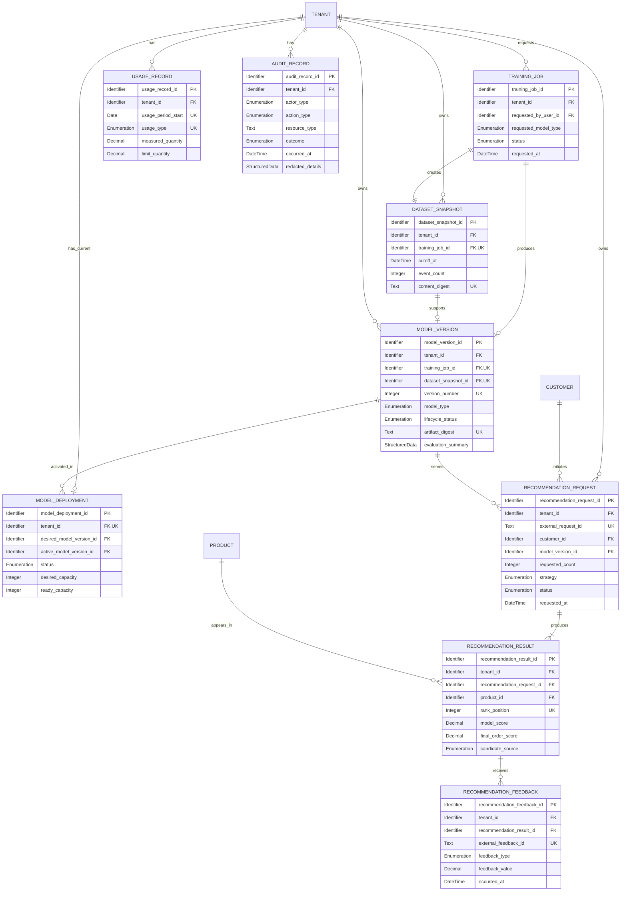
```mermaid
erDiagram
    TENANT ||--o{ TRAINING_JOB : requests
    TENANT ||--o{ DATASET_SNAPSHOT : owns
    TRAINING_JOB ||--|| DATASET_SNAPSHOT : creates
    TRAINING_JOB ||--o| MODEL_VERSION : produces
    DATASET_SNAPSHOT ||--o| MODEL_VERSION : supports
    TENANT ||--o{ MODEL_VERSION : owns
    TENANT ||--o| MODEL_DEPLOYMENT : has_current
    MODEL_VERSION ||--o{ MODEL_DEPLOYMENT : activated_in
    TENANT ||--o{ RECOMMENDATION_REQUEST : owns
    CUSTOMER ||--o{ RECOMMENDATION_REQUEST : initiates
    MODEL_VERSION ||--o{ RECOMMENDATION_REQUEST : serves
    RECOMMENDATION_REQUEST ||--|{ RECOMMENDATION_RESULT : produces
    PRODUCT ||--o{ RECOMMENDATION_RESULT : appears_in
    RECOMMENDATION_RESULT ||--o{ RECOMMENDATION_FEEDBACK : receives
    TENANT ||--o{ USAGE_RECORD : has
    TENANT ||--o{ AUDIT_RECORD : has

    TRAINING_JOB {
        Identifier training_job_id PK
        Identifier tenant_id FK
        Identifier requested_by_user_id FK
        Enumeration requested_model_type
        Enumeration status
        DateTime requested_at
    }
    DATASET_SNAPSHOT {
        Identifier dataset_snapshot_id PK
        Identifier tenant_id FK
        Identifier training_job_id FK,UK
        DateTime cutoff_at
        Integer event_count
        Text content_digest UK
    }
    MODEL_VERSION {
        Identifier model_version_id PK
        Identifier tenant_id FK
        Identifier training_job_id FK,UK
        Identifier dataset_snapshot_id FK,UK
        Integer version_number UK
        Enumeration model_type
        Enumeration lifecycle_status
        Text artifact_digest UK
        StructuredData evaluation_summary
    }
    MODEL_DEPLOYMENT {
        Identifier model_deployment_id PK
        Identifier tenant_id FK,UK
        Identifier desired_model_version_id FK
        Identifier active_model_version_id FK
        Enumeration status
        Integer desired_capacity
        Integer ready_capacity
    }
    RECOMMENDATION_REQUEST {
        Identifier recommendation_request_id PK
        Identifier tenant_id FK
        Text external_request_id UK
        Identifier customer_id FK
        Identifier model_version_id FK
        Integer requested_count
        Enumeration strategy
        Enumeration status
        DateTime requested_at
    }
    RECOMMENDATION_RESULT {
        Identifier recommendation_result_id PK
        Identifier tenant_id FK
        Identifier recommendation_request_id FK
        Identifier product_id FK
        Integer rank_position UK
        Decimal model_score
        Decimal final_order_score
        Enumeration candidate_source
    }
    RECOMMENDATION_FEEDBACK {
        Identifier recommendation_feedback_id PK
        Identifier tenant_id FK
        Identifier recommendation_result_id FK
        Text external_feedback_id UK
        Enumeration feedback_type
        Decimal feedback_value
        DateTime occurred_at
    }
    USAGE_RECORD {
        Identifier usage_record_id PK
        Identifier tenant_id FK
        Date usage_period_start UK
        Enumeration usage_type UK
        Decimal measured_quantity
        Decimal limit_quantity
    }
    AUDIT_RECORD {
        Identifier audit_record_id PK
        Identifier tenant_id FK
        Enumeration actor_type
        Enumeration action_type
        Text resource_type
        Enumeration outcome
        DateTime occurred_at
        StructuredData redacted_details
    }
```

*Figure-17: Training, Model, Recommendation, Usage, and Audit Logical ERD*

---
# 6. Training and Inference Pipeline Architecture

## Executive Overview


*Figure 18: GraphRec System Architecture & Data Layer Overview*

GraphRec is a multi-tenant recommendation platform that implements a strict separation between **Offline Batch Training** and **Online Synchronous Inference**. The core recommendation engine is based on a **simplified DGSR (Dynamic Graph Neural Network for Sequential Recommendation)** architecture implemented with PyTorch Geometric (PyG).

Item embeddings produced during training are indexed into **Qdrant** (a dedicated vector database), replacing the former in-memory exact-scan approach. The online inference pod queries Qdrant via ANN (Approximate Nearest Neighbour) search for Stage 1 candidate retrieval, achieving sub-millisecond retrieval even for large catalogs.

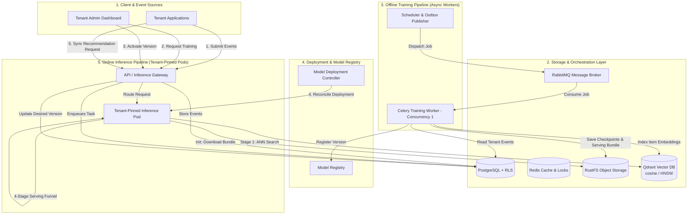
```mermaid
graph TB
    subgraph "1. Client & Event Sources"
        App[Tenant Applications]
        Admin[Tenant Admin Dashboard]
    end

    subgraph "2. Storage & Orchestration Layer"
        PG[(PostgreSQL + RLS)]
        Redis[(Redis Cache & Locks)]
        MQ[RabbitMQ Message Broker]
        RustFS[(RustFS Object Storage)]
        Qdrant[(Qdrant Vector DB\ncosine / HNSW)]
    end

    subgraph "3. Offline Training Pipeline (Async Workers)"
        Scheduler[Scheduler & Outbox Publisher]
        Worker[Celery Training Worker - Concurrency 1]
    end

    subgraph "4. Deployment & Model Registry"
        Registry[Model Registry]
        Controller[Model Deployment Controller]
    end

    subgraph "5. Online Inference Pipeline (Tenant-Pinned Pods)"
        GW[API / Inference Gateway]
        InfPod[Tenant-Pinned Inference Pod]
    end

    %% Flow connections
    App -->|1. Submit Events| GW
    GW -->|Store Events| PG
    Admin -->|2. Request Training| GW
    GW -->|Enqueues Task| PG
    Scheduler -->|Dispatch Job| MQ
    MQ -->|Consume Job| Worker
    Worker -->|Read Tenant Events| PG
    Worker -->|Save Checkpoints & Serving Bundle| RustFS
    Worker -->|Index Item Embeddings| Qdrant
    Worker -->|Register Version| Registry
    Admin -->|3. Activate Version| GW
    GW -->|Update Desired Version| PG
    Controller -->|4. Reconcile Deployment| InfPod
    InfPod -->|Init: Download Bundle| RustFS
    App -->|5. Sync Recommendation Request| GW
    GW -->|Route Request| InfPod
    InfPod -->|Stage 1: ANN Search| Qdrant
    InfPod -->|4-Stage Serving Funnel| InfPod
```

---

## 6.1 Offline Model Training Pipeline

The offline training pipeline operates asynchronously via Celery workers, adhering to strict multi-tenant isolation, plan-fair scheduling, single-job global concurrency, and reproducible dataset snapshotting. Upon completion, item embeddings are indexed into a tenant-scoped Qdrant collection.

### 6.1.1 Detailed Training Sequence Diagram


*Figure 19: Offline Training Pipeline Detailed Sequence Diagram*

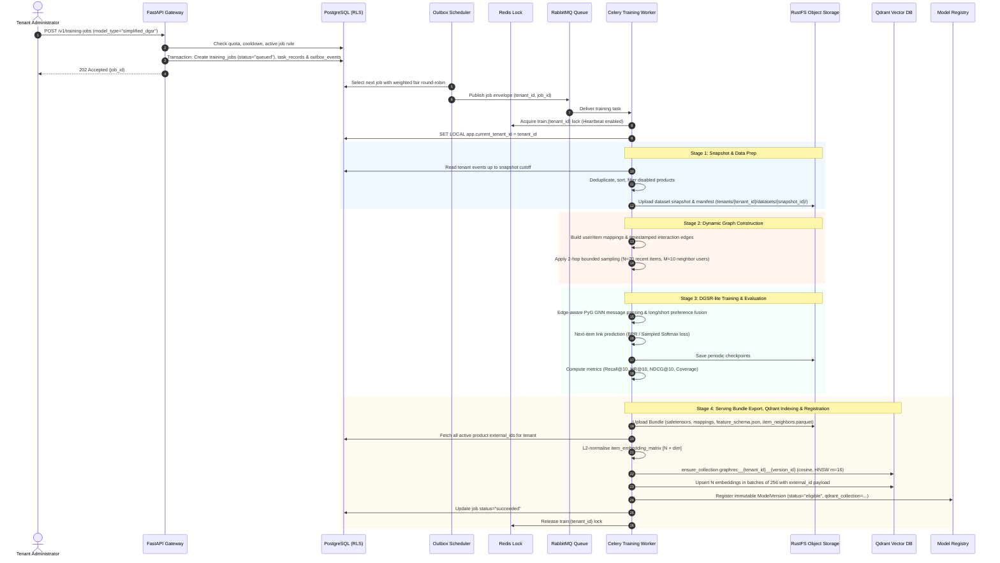
```mermaid
sequenceDiagram
    autonumber
    actor Admin as Tenant Administrator
    participant API as FastAPI Gateway
    participant DB as PostgreSQL (RLS)
    participant Scheduler as Outbox Scheduler
    participant Redis as Redis Lock
    participant MQ as RabbitMQ Queue
    participant Worker as Celery Training Worker
    participant RustFS as RustFS Object Storage
    participant Qdrant as Qdrant Vector DB
    participant Reg as Model Registry

    Admin->>API: POST /v1/training-jobs (model_type="simplified_dgsr")
    API->>DB: Check quota, cooldown, active job rule
    API->>DB: Transaction: Create training_jobs (status="queued"), task_records & outbox_events
    API-->>Admin: 202 Accepted (job_id)

    Scheduler->>DB: Select next job with weighted fair round-robin
    Scheduler->>MQ: Publish job envelope (tenant_id, job_id)
    MQ->>Worker: Deliver training task

    Worker->>Redis: Acquire train:{tenant_id} lock (Heartbeat enabled)
    Worker->>DB: SET LOCAL app.current_tenant_id = tenant_id

    rect rgb(240, 248, 255)
        note over Worker, RustFS: Stage 1: Snapshot & Data Prep
        Worker->>DB: Read tenant events up to snapshot cutoff
        Worker->>Worker: Deduplicate, sort, filter disabled products
        Worker->>RustFS: Upload dataset snapshot & manifest (tenants/{tenant_id}/datasets/{snapshot_id}/)
    end

    rect rgb(255, 245, 238)
        note over Worker, RustFS: Stage 2: Dynamic Graph Construction
        Worker->>Worker: Build user/item mappings & timestamped interaction edges
        Worker->>Worker: Apply 2-hop bounded sampling (N=20 recent items, M=10 neighbor users)
    end

    rect rgb(245, 255, 250)
        note over Worker, RustFS: Stage 3: DGSR-lite Training & Evaluation
        Worker->>Worker: Edge-aware PyG GNN message passing & long/short preference fusion
        Worker->>Worker: Next-item link prediction (BPR / Sampled Softmax loss)
        Worker->>RustFS: Save periodic checkpoints
        Worker->>Worker: Compute metrics (Recall@10, HR@10, NDCG@10, Coverage)
    end

    rect rgb(255, 250, 240)
        note over Worker, Qdrant: Stage 4: Serving Bundle Export, Qdrant Indexing & Registration
        Worker->>RustFS: Upload Bundle (safetensors, mappings, feature_schema.json, item_neighbors.parquet)
        Worker->>DB: Fetch all active product external_ids for tenant
        Worker->>Worker: L2-normalise item_embedding_matrix [N × dim]
        Worker->>Qdrant: ensure_collection graphrec__{tenant_id}__{version_id} (cosine, HNSW m=16)
        Worker->>Qdrant: Upsert N embeddings in batches of 256 with external_id payload
        Worker->>Reg: Register immutable ModelVersion (status="eligible", qdrant_collection=...)
        Worker->>DB: Update job status="succeeded"
        Worker->>Redis: Release train:{tenant_id} lock
    end
```

### 6.1.2 Training Job State Lifecycle


*Figure 20: Offline Training Job State Lifecycle Diagram*

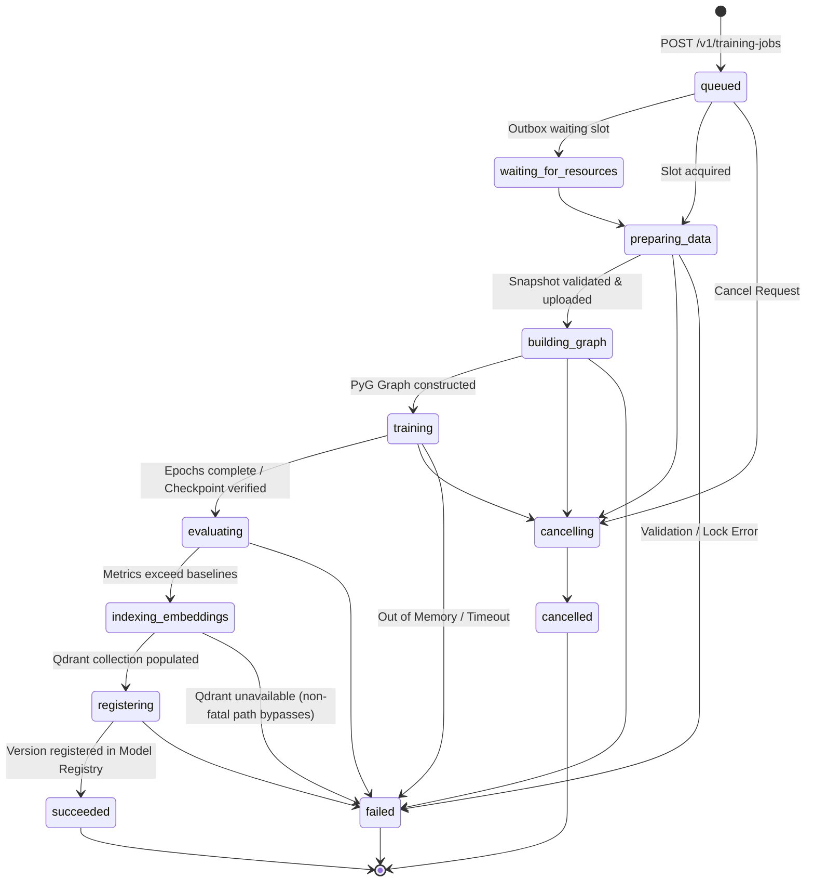
```mermaid
stateDiagram-v2
    [*] --> queued: POST /v1/training-jobs
    queued --> waiting_for_resources: Outbox waiting slot
    queued --> preparing_data: Slot acquired
    waiting_for_resources --> preparing_data

    preparing_data --> building_graph: Snapshot validated & uploaded
    building_graph --> training: PyG Graph constructed
    training --> evaluating: Epochs complete / Checkpoint verified
    evaluating --> indexing_embeddings: Metrics exceed baselines
    indexing_embeddings --> registering: Qdrant collection populated

    registering --> succeeded: Version registered in Model Registry
    succeeded --> [*]

    %% Failure and Cancellation paths
    queued --> cancelling: Cancel Request
    preparing_data --> cancelling
    building_graph --> cancelling
    training --> cancelling
    cancelling --> cancelled
    cancelled --> [*]

    preparing_data --> failed: Validation / Lock Error
    building_graph --> failed
    training --> failed: Out of Memory / Timeout
    evaluating --> failed
    indexing_embeddings --> failed: Qdrant unavailable (non-fatal path bypasses)
    registering --> failed
    failed --> [*]
```

> **Note:** Qdrant indexing failure is treated as **non-fatal** at the API stub layer — the job is marked `succeeded` and the system falls back to the popularity strategy at inference time. In the full Celery worker implementation, indexing failure would transition the job to `failed` for retry.

### 6.1.3 Offline Serving Bundle Structure

When training completes successfully, an immutable bundle is stored in RustFS under `tenants/{tenant_id}/models/{model_id}/{version}/` **and** item embeddings are indexed into Qdrant:

**RustFS bundle** (`tenants/{tenant_id}/models/{model_id}/{version}/`):

| File Artifact | Description & Usage |
|---|---|
| `manifest.json` | Model identity, SHA-256 checksums, tenant ID, Git SHA, feature schema version, `qdrant_collection` name. |
| `weights.safetensors` | PyTorch state dictionary for the full DGSR-lite GNN model (includes embedding tables). |
| `item_embeddings.safetensors` | Pre-extracted L2-normalised item embedding matrix — used by the init container for checksum verification and as source of truth for Qdrant re-indexing. |
| `item_neighbors.parquet` | Bounded precomputed nearest-item lookup list for item-to-item retrieval (non-Qdrant fallback source). |
| `user_mapping.parquet` / `item_mapping.parquet` | Bidirectional ID conversion tables between external UUIDs and tenant-local dense indices. |
| `feature_schema.json` | Normalisation parameters, categorical vocabularies, missing value defaults. |
| `popular_and_category_lists.json` | Popularity-ranked fallback candidates for cold start or Qdrant unavailability. |
| `ordering_policy.json` | Versioned business re-ranking bounds (diversity MMR caps, category max). |

**Qdrant collection** (`graphrec__{tenant_id}__{version_id}`):

| Field | Value |
|---|---|
| Distance metric | Cosine similarity |
| Index type | HNSW (`m=16`, `ef_construct=100`) |
| Vector dimension | `qdrant_embedding_dim` (default 128) |
| Point payload | `external_id`, `tenant_id`, `version_id` |
| Isolation | Collection name + `tenant_id` payload filter on every query |
| Lifecycle | Created on training completion; deleted when model version is archived |

---

## 6.2 Online Model Inference Pipeline

The online recommendation pipeline delivers synchronous Top-N recommendations with a target P95 latency under 300 ms. Each active tenant runs a dedicated, pinned Kubernetes Deployment. Stage 1 candidate retrieval is powered by Qdrant ANN search.

### 6.2.1 Pinned Inference Pod Initialization


*Figure 21: Pinned Inference Pod Initialization Pattern*

```mermaid
sequenceDiagram
    autonumber
    participant K8s as Kubernetes API
    participant Ctrl as Model Deployment Controller
    participant Init as Pod Init Container
    participant RustFS as RustFS Storage
    participant Qdrant as Qdrant Vector DB
    participant Pod as Inference FastAPI Process

    Ctrl->>K8s: Reconcile: Update Deployment spec (GRAPHREC_TENANT_ID, MODEL_VERSION_ID)
    K8s->>Init: Spawn Init Container
    Init->>RustFS: Download bundle from tenants/{tenant_id}/models/{model_id}/{version}/
    Init->>Init: Verify SHA-256 checksums & tenant ownership manifest
    Init->>Init: Verify qdrant_collection field matches active version
    Init->>Pod: Mount read-only emptyDir volume containing verified artifacts
    Pod->>Pod: Load weights.safetensors & mappings into memory
    Pod->>Qdrant: Verify collection graphrec__{tenant_id}__{version_id} exists & point count > 0
    Pod->>Pod: Execute end-to-end warm-up inference request (includes Qdrant query)
    Pod-->>K8s: Readiness probe SUCCESS -> Pod added to Service endpoints
```

### 6.2.2 Four-Stage Online Serving Funnel


*Figure 22: Four-Stage Online Recommendation Serving Funnel*

```mermaid
flowchart TD
    Req[Synchronous POST /v1/recommendations] --> RateCheck{Redis Admission & Rate Limit}
    RateCheck -- Limit Exceeded --> R429[429 Too Many Requests]
    RateCheck -- Capacity Exhausted --> R503[503 Service Unavailable / Fallback]
    RateCheck -- Allowed --> Stage1

    subgraph "Stage 1: Multi-Source Candidate Retrieval"
        Stage1[Assemble User/Session Query Vector]
        Stage1 --> C1["dgsr_personalized: Qdrant ANN Search\ncosine Top-K · collection graphrec__{tenant}__{version}\ntenant_id payload filter + exclude_ids must_not"]
        Stage1 --> C2[dgsr_recent_neighbors: Nearest items of recent user clicks]
        Stage1 --> C3[popularity_category: Recent Tenant Popular / Category Top]
        Stage1 --> C4[content_cold_start: Metadata similarity for unmapped items]
        C1 & C2 & C3 & C4 --> Union["Candidate Union & Deduplication\nBudget: ~100-300 candidates"]
    end

    Union --> Stage2

    subgraph "Stage 2: Deterministic Eligibility Filtering"
        Stage2[Apply Hard Filters against PostgreSQL]
        Stage2 --> F1[Filter disabled / deleted / out-of-stock catalog items]
        Stage2 --> F2[Filter caller-supplied exclusions & recently purchased items]
        Stage2 --> F3[Tenant boundary isolation check]
    end

    Stage2 --> Stage3

    subgraph "Stage 3: Batched DGSR Scoring"
        Stage3[Batch-score mapped survivor items]
        Stage3 --> Score[PyG GNN Forward Pass: Fused User/Session Vector x Item Embeddings]
        Stage3 --> ColdLane[Unmapped cold items routed to conservative Cold-Start Lane]
    end

    Score & ColdLane --> Stage4

    subgraph "Stage 4: Deterministic Ordering & Re-Ranking"
        Stage4[Re-Ranking Policy]
        Stage4 --> O1[Stable tie-breaking via Product ID]
        Stage4 --> O2[Max items per category / brand constraint]
        Stage4 --> O3[Maximal Marginal Relevance Diversity & Freshness Boost]
    end

    Stage4 --> Resp["Return Top-N JSON Response\n+ model_version_id, strategy, qdrant_collection"]
    Resp --> AsyncFeedback[Async Feedback Event: Impression/Click sent to RabbitMQ]
```

### 6.2.3 Fallback & Degradation Chain

When Qdrant is unavailable or the collection is empty, the inference route degrades gracefully through a multi-tier fallback:

```
Qdrant ANN Search          ← primary (personalized strategy)
        │ failure / empty
        ▼
item_neighbors.parquet     ← precomputed from serving bundle (in-pod)
        │ empty
        ▼
popular_and_category_lists ← popularity baseline from serving bundle
        │ empty
        ▼
Last-Known-Good Cache      ← Redis cached Top-N from last successful request
        │ miss
        ▼
Empty response + 200       ← safe no-op; client handles gracefully
```

The `fallback_used` and `fallback_tier` fields in the `RecommendationResponse` schema expose which tier was activated, enabling observability dashboards to alert on degraded retrieval.

---

## 6.3 Qdrant Vector Store Contract

### 6.3.1 Collection Naming & Isolation

Every trained model version produces exactly one Qdrant collection:

```
graphrec__{tenant_id_hex}__{version_id_hex}
```

Example: `graphrec__a1b2c3d4e5f6....__00112233...`

UUID hyphens are stripped so the name is a valid Qdrant collection identifier. This means:
- **Tenant isolation** — a cross-tenant query would target a collection that doesn't exist for that tenant
- **Version isolation** — activating a rollback simply changes which collection the inference pod queries
- **Clean archival** — `archive_model_version` calls `delete_collection()` automatically

### 6.3.2 Indexing Pipeline (Training Side)

```
1. Fetch active product external_ids from PostgreSQL (RLS-scoped)
2. Generate / load item embedding matrix  [N × dim]  float32
3. L2-normalise rows  →  cosine sim = dot product  (numerically stable)
4. Call ensure_collection()   →  create if not exists (HNSW, cosine, dim=128)
5. Upsert in batches of 256:
       PointStruct(
           id       = sequential int,
           vector   = normalised float32 list,
           payload  = { external_id, tenant_id, version_id }
       )
6. Return indexed count to caller (logged in training job record)
```

### 6.3.3 Retrieval Pipeline (Inference Side)

```
1. Assemble query vector  [1 × dim]  from GNN user/session state
2. Build Qdrant filter:
       must      → FieldCondition(tenant_id == current tenant)
       must_not  → FieldCondition(external_id in exclude_ids)   [if provided]
3. client.search(collection, query_vector, filter, limit=top_k)
4. Extract external_id from each hit's payload  →  ranked candidate list
5. Cross-reference with PostgreSQL active products  (Stage 2 filter)
6. Return top_n survivors in cosine rank order
```

### 6.3.4 Qdrant Configuration Reference

| Setting | Env Var | Default | Description |
|---|---|---|---|
| `qdrant_url` | `QDRANT_URL` | `http://localhost:6334` | gRPC endpoint (prefer_grpc=True) |
| `qdrant_collection_prefix` | `QDRANT_COLLECTION_PREFIX` | `graphrec` | Collection name prefix |
| `qdrant_embedding_dim` | `QDRANT_EMBEDDING_DIM` | `128` | Item embedding dimension |
| `qdrant_top_k` | `QDRANT_TOP_K` | `100` | Candidates retrieved per ANN query |

HNSW index parameters (fixed at collection creation):

| Parameter | Value | Rationale |
|---|---|---|
| `m` | `16` | 16 bi-directional links per node — accuracy/memory balance for medium catalogs |
| `ef_construct` | `100` | Build-time search depth — Qdrant recommended default for <1M vectors |
| Distance | Cosine | L2-normalised vectors make cosine equivalent to dot product |

---

## 6.4 Pipeline Comparison

| Dimension | Offline Training Pipeline | Online Inference Pipeline |
|---|---|---|
| **Execution Mode** | Asynchronous batch job via Celery worker | Synchronous HTTP POST (`/v1/recommendations`) |
| **Concurrency & Latency Target** | Global concurrency = 1 across cluster; takes minutes | Latency P95 < 300 ms; bounded wait queue per pod |
| **Tenancy & Isolation** | Executed under RLS context; global training lock `train:{tenant_id}` | Dedicated tenant-pinned Pod/Deployment (`GRAPHREC_TENANT_ID`) |
| **PostgreSQL Access** | Read tenant events & products; write job status | Stage 2 eligibility filter only (active product cross-reference) |
| **RustFS Access** | Write dataset snapshot, checkpoints, serving bundle | Read-only init container download of serving bundle |
| **Qdrant Access** | Write — create collection, upsert item embeddings | Read — ANN search with tenant_id filter, top_k results |
| **Model Operations** | GNN training, BPR loss, offline evaluation metrics | 4-Stage funnel: Retrieval → Filtering → Scoring → Ordering |
| **Autoscaling Mechanics** | Deficit round-robin scheduling by subscription tier | Kubernetes HPA scaling on pod CPU / in-flight requests |
| **Fallback Mechanism** | Retries with backoff; poison messages → Dead-Letter Queue | Qdrant → item_neighbors → popularity → last-known-good cache |


---

# 7. Architectural Design

GraphRec uses a logical, layered architecture that separates user-facing integration, tenant business rules, long-running processing, recommendation preparation, durable information, and operational monitoring. The architecture preserves a clear offline-online boundary: snapshot preparation, training, evaluation, and model registration occur outside the synchronous recommendation path, while real-time requests use one immutable active tenant model and bounded recommendation rules.

## 7.1 Architectural Context Diagram

```mermaid
flowchart LR
    TA[Tenant Administrator]
    TD[Tenant Developer]
    APP[Tenant E-Commerce Application]
    PA[Platform Administrator]

    subgraph GR[GraphRec]
        CORE[Multi-Tenant Recommendation Platform]
    end

    TA -->|Accounts, training, model-management requests| CORE
    CORE -->|Training, model, usage, quota, and service status| TA

    TD -->|Credentials, products, events, feedback| CORE
    CORE -->|Validation, submission, and integration results| TD

    APP -->|Products, events, recommendation requests, feedback| CORE
    CORE -->|Recommendations, confirmations, errors, limit responses| APP

    PA -->|Tenant, plan, quota, and platform actions| CORE
    CORE -->|Platform status, tenant usage, failures, and audit information| PA
```

*Figure-18: GraphRec Architectural Context Diagram*

## 7.2 Architectural Archetypes

### Presentation and Integration Layer

Provides the tenant administration interface, tenant integration interface, platform administration interface, and monitoring interface. It validates externally supplied information and presents role-appropriate results.

### Business Logic Layer

Applies tenant management, authentication and authorization, product management, event management, training management, model-version management, recommendation management, usage, quota, and audit rules.

### Processing Layer

Performs background event handling, immutable dataset preparation, DGSR and baseline training, model evaluation, usage aggregation, retention, and controlled recovery of long-running work.

### Recommendation Layer

Performs bounded candidate selection, mandatory product-eligibility filtering, DGSR scoring, deterministic ordering, and safe fallback generation. The active tenant and model version remain fixed for each served request.

### Data Layer

Maintains tenant identity, catalog, customer events, training jobs, snapshots, model metadata, recommendation history, usage, audit history, and immutable model artifacts.

### Monitoring Layer

Observes service status, request behavior, usage, quota violations, failures, model quality, active versions, and serving capacity without exposing high-cardinality customer or product identifiers.

```mermaid
flowchart TB
    P[Presentation and Integration Layer]
    B[Business Logic Layer]
    X[Processing Layer]
    R[Recommendation Layer]
    D[Data Layer]
    M[Monitoring Layer]

    P --> B
    B --> X
    B --> R
    X --> D
    R --> D
    P -. status and usage .-> M
    B -. actions and failures .-> M
    X -. progress and quality .-> M
    R -. latency and strategy .-> M
    D -. capacity and integrity .-> M
```

*Figure-19: GraphRec Architectural Archetypes*

## 7.3 Top-Level Components

| Component | Main responsibility |
|---|---|
| Tenant Management | Registers tenants, controls tenant lifecycle, and applies plan assignment |
| Authentication and Authorization | Resolves tenant identity from credentials and enforces roles and permissions |
| Product Management | Creates, updates, synchronizes, lists, and disables tenant products |
| Event Management | Validates, deduplicates, accepts, and reports customer-interaction submissions |
| Training Management | Validates training requests, tracks progress, supports cancellation, and records results |
| Model Registry | Stores immutable model versions, quality summaries, lifecycle states, and rollback history |
| Recommendation Service | Validates requests and produces real-time tenant-specific Top-N results |
| Usage and Quota Management | Measures usage, applies plan limits, and presents reconciled totals |
| Administration and Monitoring | Presents tenant and platform status, failures, and redacted audit history |
| Background Processing | Executes durable long-running event, snapshot, evaluation, usage, and cleanup work |
| Model Training | Builds bounded tenant graphs, trains DGSR and baselines, and evaluates quality |
| Model Storage | Preserves immutable snapshots, model bundles, checksums, and manifests |
| Data Management | Preserves relational tenant, catalog, event, training, recommendation, usage, and audit information |

```mermaid
flowchart LR
    subgraph ACCESS[External Access]
        TAI[Tenant Administration Interface]
        TII[Tenant Integration Interface]
        PAI[Platform Administration Interface]
    end

    subgraph CORE[Core Business Components]
        TM[Tenant Management]
        AA[Authentication and Authorization]
        PM[Product Management]
        EM[Event Management]
        TR[Training Management]
        MR[Model Registry]
        RS[Recommendation Service]
        UQ[Usage and Quota Management]
        AM[Administration and Monitoring]
    end

    subgraph SUPPORT[Processing and Information Components]
        BP[Background Processing]
        MT[Model Training]
        MS[Model Storage]
        DM[Data Management]
    end

    TAI --> AA
    TII --> AA
    PAI --> AA
    AA --> TM
    AA --> PM
    AA --> EM
    AA --> TR
    AA --> MR
    AA --> RS
    AA --> UQ
    AA --> AM
    PM --> DM
    EM --> DM
    TR --> BP
    BP --> MT
    MT --> MS
    MT --> MR
    MR --> MS
    MR --> DM
    RS --> MS
    RS --> DM
    UQ --> DM
    AM --> DM
```

*Figure-20: GraphRec Top-Level Components*

## 7.4 Conceptual Deployment Diagram

GraphRec may run as several logical deployment units while remaining one coherent platform. User and administrator devices access administration functions. A tenant e-commerce server submits integration data and requests recommendations. The application server handles synchronous public requests and tenant routing. Background-processing and model-training servers perform long-running work. Recommendation servers load one tenant and active model version for bounded real-time serving. Data-storage, model-storage, and monitoring servers preserve durable information and operational visibility. Additional recommendation-service instances may be introduced for a tenant when measured demand increases, subject to tenant and global limits.

```mermaid
flowchart TB
    USER[User or Administrator Device]
    SHOP[Tenant E-Commerce Server]

    subgraph PLATFORM[GraphRec Deployment]
        APP[GraphRec Application Server]
        BG[Background-Processing Server]
        TRAIN[Model-Training Server]
        REC1[Recommendation Server - Tenant A]
        REC2[Recommendation Server - Tenant B]
        DATA[Data-Storage Server]
        MODEL[Model-Storage Server]
        MON[Monitoring Server]
    end

    USER --> APP
    SHOP --> APP
    APP --> DATA
    APP --> BG
    APP --> REC1
    APP --> REC2
    BG --> DATA
    BG --> TRAIN
    TRAIN --> DATA
    TRAIN --> MODEL
    REC1 --> MODEL
    REC2 --> MODEL
    REC1 --> DATA
    REC2 --> DATA
    APP -. operational signals .-> MON
    BG -. operational signals .-> MON
    TRAIN -. operational signals .-> MON
    REC1 -. operational signals .-> MON
    REC2 -. operational signals .-> MON
```

*Figure-21: GraphRec Conceptual Deployment Diagram*

### Architectural Quality Decisions

- **Tenant safety:** Tenant identity is obtained from authenticated credentials, not from an arbitrary public tenant selector. Every tenant-owned operation is checked against the authenticated tenant context.
- **Offline-online separation:** Expensive graph preparation, training, evaluation, and artifact creation remain offline; recommendation requests remain synchronous and bounded.
- **Model consistency:** Each ready recommendation-service instance is associated with one tenant and one immutable model version. A failed activation leaves the previous version available.
- **Reliable long-running work:** Accepted background work has durable state, idempotent stages, controlled retries, terminal failure records, and auditability.
- **Graceful degradation:** GraphRec may return a version-compatible last-known-good or tenant-popular result when permitted. It shall never substitute another tenant's model or products.
- **Fairness and capacity:** Training and serving are bounded by plan and global limits. Demand-based capacity changes are based on measured workload rather than registered-user count.
- **Observability:** Request rate, errors, response time, event acceptance, training progress, model quality, active version, usage, ready capacity, and fallback behavior are visible at an appropriate scope.
- **Semester feasibility:** The required demonstration emphasizes two tenants, controlled data volume, one heavy training task at a time, and a small number of recommendation-service instances.

---

# 8. Preliminary Test Plan

## 8.1 High-Level Testing Goals

The preliminary test program shall validate all Normal, Expected, and selected Exciting requirements. It shall verify tenant registration and authentication, credential management, product and event handling, duplicate prevention, tenant-specific snapshots and training, model evaluation and lifecycle management, safe activation and rollback, real-time recommendation generation, disabled-product filtering, fallback behavior, recommendation feedback, usage and quota handling, status monitoring, failure reporting, and audit history. Cross-tenant tests shall use two populated tenants with intentionally similar external identifiers and shall expect no unauthorized result, write, status disclosure, or model access.

Testing shall include unit-level rule checks, logical data-integrity tests, actor-interface integration tests, deterministic model fixtures, offline evaluation checks, request-load tests, failure and recovery scenarios, and an end-to-end flow from product and event submission through training, activation, recommendation, and feedback. Numerical response-time and capacity targets remain provisional until measured under the demonstration workload.

## 8.2 Preliminary Test Cases

| Test ID | Related requirement or use case | Test case | Expected result |
|---|---|---|---|
| TC-01 | NR-F-01; UC-01 | Submit valid tenant and initial administrator information | Tenant and initial account are created once and a confirmation is returned |
| TC-02 | NR-F-02; UC-02 | Sign in with valid active account information | Authenticated session and role-appropriate access are returned |
| TC-03 | NR-F-02; UC-02 | Sign in with invalid information repeatedly | Access is denied with a safe error; protective limits apply without account disclosure |
| TC-04 | UC-03 | Request recovery for a valid account and complete the recovery step | Recovery succeeds and the new authentication state is usable |
| TC-05 | NR-F-03; UC-04 | Create a scoped API credential | One-time secret is displayed, stored verifier is protected, and the action is audited |
| TC-06 | NR-F-04; UC-05 | Create a valid tenant product | Product is stored under the tenant and returned with its active state |
| TC-07 | NR-F-05; UC-07 | Synchronize a mixed collection of new and changed products | Correct accepted, updated, skipped, and failed counts are returned |
| TC-08 | NR-F-04; UC-08 | Disable an active product | Product becomes ineligible and remains absent from later recommendation results |
| TC-09 | NR-F-06; UC-09 | Submit one valid interaction event | Event is accepted once and its submission status is visible |
| TC-10 | NR-F-06; UC-10 | Submit a valid bounded event batch | Batch is accepted and counts can be viewed by its tenant |
| TC-11 | ER-F-04; UC-09 | Replay the same tenant event identifier | Response identifies a duplicate and only one durable effect exists |
| TC-12 | NR-NF-06; UC-09 | Submit an event with invalid type or foreign product reference | Submission is rejected with a safe field or ownership error |
| TC-13 | NR-NF-01; BRULE-02 | Tenant A attempts to read or update Tenant B's product | Access returns no Tenant B resource details and no data changes |
| TC-14 | ER-NF-02; BRULE-12 | Tenant A attempts to access Tenant B's event | Query returns no event details and the attempt is safely recorded where required |
| TC-15 | NR-F-07; UC-12 | Request training with sufficient data and available quota | One tenant training job is accepted with a visible initial state |
| TC-16 | BRULE-06; UC-12 | Request a second active training job for the same tenant | Second request is rejected as a state conflict without creating duplicate work |
| TC-17 | NR-F-08; UC-14 | Cancel a non-terminal training job | Cancellation is recorded and the job reaches a cancelled terminal state safely |
| TC-18 | NR-F-08; UC-13 | View an active job through its lifecycle | Defined stages, progress, timestamps, and terminal status are visible |
| TC-19 | ER-F-02; ER-F-03; UC-15 | Complete valid tenant-specific DGSR training | Immutable version is registered with snapshot, artifact identity, and finite quality results |
| TC-20 | NR-F-09; UC-17 | View quality for a completed model version | Hit, ranking, retrieval, coverage, diversity, and comparison information is displayed as available |
| TC-21 | NR-F-10; ER-F-06; UC-18 | Activate an eligible tenant model version | New version becomes available and active only after successful readiness validation |
| TC-22 | ER-F-06; UC-18 | Attempt activation with corrupted or incompatible model information | Activation fails, failure is visible, and the previous version remains active |
| TC-23 | NR-F-11; ER-F-07; UC-19 | Roll back to a retained eligible version | Target becomes active and the action is recorded in lifecycle and audit history |
| TC-24 | BRULE-07; UC-16 | Tenant A requests or activates Tenant B's model version | No foreign model details are disclosed and no activation occurs |
| TC-25 | NR-F-12; UC-21; UC-22 | Submit valid identified-customer Top-N request | Ordered tenant-owned products, strategy, and serving model version are returned synchronously |
| TC-26 | XR-F-01; UC-21 | Submit anonymous session request with recent product interactions | Session-aware or safe cold-start results are returned with the strategy identified |
| TC-27 | BRULE-09; UC-22 | Mark a previously likely product disabled and request recommendations | Disabled product is absent after mandatory eligibility and final checks |
| TC-28 | ER-F-10; UC-22 | Make personalized service unavailable while fallback is allowed | Safe tenant-specific fallback is returned, or clear unavailability if none exists |
| TC-29 | NR-F-13; UC-23 | Submit valid impression, click, or conversion feedback | Feedback is accepted once and linked to the correct tenant result and position |
| TC-30 | NR-F-14; NR-F-15; UC-24 | View usage and quota for a selected period | Reconciled quantities, limits, remaining allowance, and reset information are displayed |
| TC-31 | ER-F-09; UC-21 | Exceed a recommendation or event limit | Request is rejected with limit name and retry or reset guidance; no silent acceptance occurs |
| TC-32 | NR-F-16; UC-25 | View tenant model status | Active, desired, eligible, failed, and retired states are accurate and tenant-scoped |
| TC-33 | NR-F-16; UC-26 | View tenant recommendation-service status | Active version, ready capacity, recent errors, and fallback status are displayed safely |
| TC-34 | ER-NF-09; UC-30 | Platform Administrator monitors a controlled load increase for Tenant A | Tenant A capacity and response indicators change as expected while Tenant B remains isolated |
| TC-35 | ER-F-11; UC-31 | Review terminal job, activation, and service failures | Redacted failure reason, time, affected resource, and correlation information are available |
| TC-36 | ER-F-11; UC-31 | Verify credential creation, training, activation, rollback, quota change, and denied access records | Each action has an append-only audit record with actor, outcome, time, and redacted details |

### Acceptance Summary

The semester release is acceptable when automated testing produces zero cross-tenant results; replayed event, request, feedback, and usage identifiers have one durable effect; wrong-tenant or invalid model artifacts never become ready; failed activation preserves the previous active version; disabled products are not returned; repeated identical requests against the same model, catalog, and context have stable ordering; and the demonstrated load scenario increases Tenant A's ready recommendation capacity without changing Tenant B's model or service state.

---

# 9. Conclusion

This Software Requirement and Specification Analysis defines GraphRec's purpose, scope, stakeholders, actors, Normal requirements, Expected requirements, Exciting requirements, business rules, Quality Function Deployment, use-case scenarios, activity flows, logical data model, architectural design, and preliminary test plan. The report models the complete tenant journey from registration and integration through product and interaction collection, tenant-specific DGSR training, model evaluation, version activation, real-time recommendation delivery, feedback, usage control, and monitoring.

GraphRec demonstrates how multiple independent e-commerce businesses can share one recommendation platform while retaining tenant-specific customers, products, events, snapshots, models, deployments, results, quotas, and audit history. The specification emphasizes credential-derived tenant identity, one-tenant model artifacts, safe activation and rollback, synchronous Top-N serving, deterministic eligibility and ordering, fallback behavior, usage fairness, and visible failure states. The project remains intentionally bounded: it supports a small number of active tenants, offline training, controlled concurrency, and limited service capacity suitable for a semester demonstration. It does not claim production readiness, unlimited scale, enterprise disaster recovery, or enterprise-grade high availability.

# 10. References

1. **GraphRec_Ultimate_Architecture(6).md.** *GraphRec: Multi-Tenant Recommendation Platform as a Service — Final Consolidated Architecture and Implementation Guide*, Revision 1.1, 2026.
2. **SRS_1303 (1)(7).pdf.** *AI_ModelEval: A Tool for Evaluating Any AI-Code-Model's Quality — Software Requirement Specification*, academic report reference, 2026.
3. **Pasted markdown(4).md.** *Master Prompt — Generate the Complete GraphRec SRS in Markdown*, requirements-modeling and report-structure specification, 2026.
4. Dynamic Graph Neural Networks for Sequential Recommendation. *DGSR research paper*, arXiv:2104.07368.
