# GraphRec — System Design

**A multi-tenant recommendation platform on three VPSs.**

Version 1.0 · Architecture of record

---

## 1. Executive Summary

GraphRec is a multi-tenant recommendation platform exposing an AWS Personalize–shaped API, with **DGNN-SR** (Dynamic Graph Neural Network for Sequential Recommendation) as its core algorithm. It must run on **at most three VPSs**.

That constraint is not a limitation to work around — it is the design's organizing principle. Three machines cannot host a microservice fleet, a Kubernetes control plane, a message broker, a vector database, a metadata service and an experiment-tracking server without spending most of their capacity on infrastructure overhead rather than on the product. So the architecture is deliberately subtractive.

**The five decisions that define this design:**

1. **A modular monolith control plane, plus two specialised processes.** Three deployable units — control plane, training worker, inference server — not twelve services. Boundaries are drawn where *resource profiles* differ, not where domain nouns differ.
2. **PostgreSQL is the job queue.** No RabbitMQ, no Kafka, no Celery broker. `SELECT … FOR UPDATE SKIP LOCKED` over a `jobs` table. This makes enqueue transactional with the resource creation that caused it, which eliminates the outbox pattern entirely.
3. **No vector database.** Item embeddings live in the inference process, as a matrix. Exact top-K by matmul below ~200K items, in-process HNSW above. A network hop to a separate ANN service costs more than it saves at this scale.
4. **No Ray, no MLflow.** One GPU does not need a distributed scheduler. The AWS Personalize resource model already *is* a model registry — MLflow's registry would duplicate it.
5. **Recommendations bypass the control plane.** Clients hit the inference node directly, which verifies JWTs locally with a public key. Inference survives a control-plane outage and saves a network hop on the only latency-critical path.

**What this buys:** roughly 11 containers across 3 hosts, one database, one object store, one cache. A team of two to four can deploy, debug and operate it.

**What it costs:** no high availability. Each VPS is a single point of failure for its own responsibilities. This is stated plainly throughout rather than papered over — with three machines and no redundancy, HA is not achievable, and pretending otherwise would produce a worse design than accepting it.

---

## 2. Project Context

GraphRec lets independent businesses ("tenants") upload interaction data, train tenant-specific recommendation models, deploy them, and fetch real-time recommendations over an HTTP API.

The external API contract follows the AWS Personalize resource model and is **fixed**: Dataset Groups, Datasets, Dataset Schemas, Dataset Import Jobs, Solutions, Solution Versions, Campaigns, and a recommendations endpoint. This document designs the internals that implement that contract; it does not revisit the contract.

**Resource model, and what each maps to internally:**

| API resource | Internal meaning |
|---|---|
| Dataset Group | Tenant-scoped namespace binding datasets, solutions and campaigns |
| Dataset | A typed table — `INTERACTIONS`, `ITEMS`, or `USERS` |
| Dataset Schema | Declared column names, types and required fields; validation contract for imports |
| Dataset Import Job | An async job: fetch → validate → normalise → load |
| Solution | A training *configuration* — recipe, hyperparameters, target dataset group |
| Solution Version | One immutable trained artifact + its evaluation metrics |
| Training Job | The async execution that produces a Solution Version |
| Campaign | A serving binding: which Solution Version is live, at what capacity |
| Recommendation | A synchronous Top-K request against a Campaign |

The mapping is close enough to be unambiguous, with one deliberate simplification: **Solution Version and "model" are the same object.** AWS separates them; at three-VPS scale that separation buys nothing but a join.

---

## 3. Requirements

### Functional

| Area | Capability |
|---|---|
| Tenancy | Tenant CRUD, members, roles, permissions, quotas, resource ownership |
| Auth | User authentication, JWT issuance, token validation, RBAC |
| Datasets | Groups, schemas, uploads, import jobs, validation, import history |
| Processing | Ingestion, validation, cleaning, transformation, feature generation, graph construction, temporal processing |
| Training | Solutions, training jobs, async DGNN-SR training, hyperparameters, evaluation, checkpointing, registration |
| Models | Versions, metadata, artifacts, promotion, deployment, rollback, lifecycle |
| Campaigns | Creation, model assignment, deployment, configuration, activation |
| Recommendations | Real-time Top-K, user-based, context-aware, low latency |
| Operations | Job monitoring, logs, metrics, audit logs, error reporting, resource monitoring |

### Non-functional

| ID | Requirement |
|---|---|
| NFR-1 | Recommendation P95 < 150 ms at 100 RPS |
| NFR-2 | No tenant can read or modify another tenant's data, jobs, models or recommendations |
| NFR-3 | Training is asynchronous; no API call blocks on it |
| NFR-4 | The system remains functional for all non-training operations when the GPU host is offline |
| NFR-5 | Recoverable to a consistent state after any single-host failure |
| NFR-6 | Operable by a team of 2–4 without dedicated SRE staff |
| NFR-7 | Every accepted job reaches a terminal state or is retried within a bounded policy |

---

## 4. Constraints

| ID | Constraint | Consequence |
|---|---|---|
| C-1 | **At most 3 VPSs** | No HA, no dedicated infra nodes, no orchestrator control plane |
| C-2 | DGNN-SR is the core algorithm | Architecture must serve graph + sequence models specifically |
| C-3 | External API contract is fixed | Internal design adapts to it, not vice versa |
| C-4 | Small team | Every component must be operable by a generalist |
| C-5 | GPU host may be offline | Nothing on the critical path may live there |
| C-6 | Cost-sensitive | No managed cloud services unless strictly necessary |

---

## 5. Assumptions

| ID | Assumption |
|---|---|
| A-1 | Tenants number in the tens for MVP, low hundreds at most |
| A-2 | Per-tenant catalogs are ≤ 500K items; interaction histories ≤ 10M events |
| A-3 | Training runs are minutes to a few hours, not days |
| A-4 | Recommendation traffic is ≤ 100 RPS aggregate at MVP |
| A-5 | VPSs share a private network with ≤ 1 ms RTT (same provider, same region) |
| A-6 | Off-site backup storage is available and is not counted against the 3-VPS budget |
| A-7 | Tenants integrate server-to-server; there is no browser-side SDK holding secrets |

---

## 6. Architecture Principles

1. **Logical separation, physical consolidation.** Module boundaries are enforced in code — separate packages, no cross-module imports except through published interfaces. They are *not* enforced by network hops.
2. **Split processes only for resource reasons.** Two things deserve their own process: something that needs a GPU, and something that must stay warm and low-latency. Nothing else does.
3. **One store per job.** Postgres for state, MinIO for bytes, Redis for ephemera. No component gets a second database because it would be convenient.
4. **Isolation in depth.** Tenant scoping is enforced at the query layer *and* by Postgres RLS *and* by object-storage prefixes. A single forgotten `WHERE` clause must not be sufficient to leak.
5. **Degrade, don't collapse.** Each failure mode has a defined reduced-capability state, not an outage.
6. **Justify every container.** A component earns its place by answering "what breaks without it?" with something concrete.

---

## 7. Architecture Decision Summary

| # | Decision | Chosen | Rejected |
|---|---|---|---|
| D-1 | Application shape | Modular monolith + 2 specialised processes | Microservices; single process |
| D-2 | Tenancy model | Shared DB, shared schema, `tenant_id` + RLS | Schema-per-tenant; DB-per-tenant |
| D-3 | Job queue | PostgreSQL `SKIP LOCKED` | RabbitMQ, Redis Streams, NATS, Celery |
| D-4 | Object storage | MinIO on VPS3 | Local FS; external S3 |
| D-5 | Vector search | In-process matrix / hnswlib | Qdrant, Milvus, pgvector |
| D-6 | Distributed compute | Plain PyTorch + PyG | Ray Core/Train/Tune |
| D-7 | Model registry | Postgres tables (the API contract itself) | MLflow Registry |
| D-8 | Experiment tracking | Postgres metrics tables | MLflow Tracking (deferred, not rejected) |
| D-9 | Orchestration | Docker Compose + systemd | Kubernetes, K3s, Nomad |
| D-10 | Recommendation routing | Client → VPS3 direct | Client → VPS1 → VPS3 |
| D-11 | Token scheme | Asymmetric JWT (EdDSA) | Symmetric HS256; introspection endpoint |
| D-12 | Observability | Prometheus + Grafana + Loki | ELK; managed APM; OpenTelemetry collector |

Each is argued in §47.

---

## 8. High-Level Architecture

The dominant structural idea is a **control plane / data plane split**, with the client talking to *both* directly. Control-plane operations are infrequent, transactional and latency-tolerant. Recommendation requests are frequent, read-only and latency-critical. Routing them through the same gateway would subordinate the fast path to the slow one.

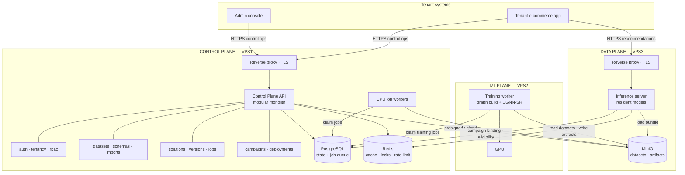

**Read it as three lanes.** VPS1 owns *truth* — every state transition is a Postgres write. VPS2 owns *compute* — it holds no authoritative state and can vanish without data loss. VPS3 owns *bytes and speed* — object storage and the hot inference path, co-located so model loading is a local disk read rather than a network transfer.

---

## 9. Three-VPS Physical Architecture

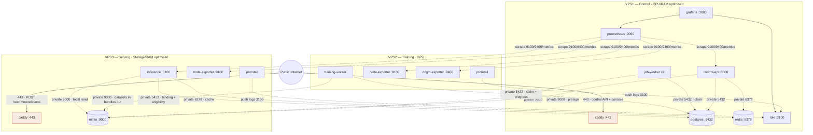

**Public surface: two ports.** `:443` on VPS1 and `:443` on VPS3. Nothing else is reachable from the internet — Postgres, Redis, MinIO, the training worker and the whole monitoring stack listen only on the private interface, enforced by both the firewall and bind addresses.

**VPS2 is the only host that can disappear without user-visible breakage** beyond "training is unavailable". It holds no state, serves no traffic, and stores nothing that isn't already in MinIO or Postgres.

---

## 10. Logical Service Architecture

Three deployable units. Within the control plane, modules are packages with enforced boundaries, not services.

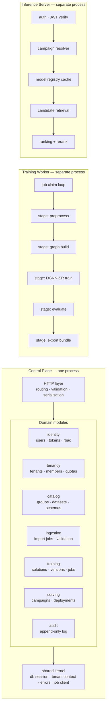

**Why these three and not more.** A separate process is justified only by a resource or lifecycle difference that co-location would harm:

- **Training worker** — needs CUDA, allocates tens of GB, runs for hours, and crashes in ways that must not take down the API. Separate process, separate host.
- **Inference server** — must hold model weights resident and respond in milliseconds. Co-locating it with the API would let a slow control-plane query or a GC pause bleed into P99 recommendation latency.
- **Everything else** — auth, tenancy, datasets, campaigns — is CRUD over one database inside one transaction boundary. Splitting them into services would convert local function calls into network calls, introduce distributed transactions where none are needed, and multiply deployment units by six for no capability gain.

**Answering "which components must be isolated because of resource requirements?"** — exactly two: GPU training, and warm inference. That is the whole list.

---

## 11. VPS Resource Allocation

| VPS | Role | Minimum | Recommended |
|---|---|---|---|
| **VPS1** | Control plane, DB, queue, monitoring | 4 vCPU · 16 GB · 100 GB NVMe | 8 vCPU · 32 GB · 250 GB NVMe |
| **VPS2** | Training | 4 vCPU · 32 GB · 200 GB SSD · GPU 12 GB VRAM | 8 vCPU · 64 GB · 500 GB NVMe · GPU 24 GB VRAM |
| **VPS3** | Inference + object storage | 4 vCPU · 16 GB · 500 GB SSD | 8 vCPU · 32 GB · 1 TB NVMe |

**Where the bottleneck actually is.** Not CPU. Two things bind first:

1. **VRAM on VPS2** caps graph batch size, which caps how large a tenant's interaction history can be before neighbourhood sampling must be tightened. 24 GB comfortably handles 10M interactions with 2-hop bounded sampling; 12 GB requires smaller fanout.
2. **RAM on VPS3** caps how many tenant models stay resident. A model bundle is roughly `n_items × embedding_dim × 4 bytes` plus GNN weights — about 200 MB for 500K items at 96 dimensions. Thirty resident models ≈ 6 GB. This is the wall the architecture hits first as tenant count grows (§43).

Disk on VPS3 is sized for MinIO: raw datasets, processed parquet, graph files and every retained model bundle across all tenants.

---

## 12. Network Architecture

| Zone | Members | Reachability |
|---|---|---|
| Public | Caddy on VPS1:443, Caddy on VPS3:443 | Internet |
| Private | Everything else | VPS↔VPS on the provider's private network only |
| Host-local | Postgres, Redis | Bound to private IP, firewalled to the two peer IPs |

All inter-VPS traffic uses the private interface. Where the provider does not offer an isolated private network, a **WireGuard mesh** replaces it — three peers, static keys, `10.10.0.0/24` — and all services bind to the WireGuard address instead. This is the safer default and is assumed below.

Service discovery is static: three hosts, addresses in an env file. There is no service registry, because with three fixed hosts there is nothing to discover.

---

## 13. Service Communication Matrix

| Source | Destination | Port | Scope | Purpose |
|---|---|---:|---|---|
| Internet | VPS1 Caddy | 443 | Public | Control API, console |
| Internet | VPS3 Caddy | 443 | Public | `POST /recommendations` |
| Caddy V1 | control-api | 8000 | Host-local | Reverse proxy |
| Caddy V3 | inference | 8100 | Host-local | Reverse proxy |
| control-api | postgres | 5432 | Host-local | State |
| control-api | redis | 6379 | Host-local | Cache, locks, rate limits |
| control-api | minio | 9000 | Private | Presigned URL issuance |
| job-worker | postgres | 5432 | Host-local | Claim jobs, report progress |
| job-worker | minio | 9000 | Private | Read uploads, write processed data |
| training-worker | postgres | 5432 | Private | Claim jobs, heartbeat, write metrics |
| training-worker | minio | 9000 | Private | Read datasets, write checkpoints and bundles |
| inference | minio | 9000 | Private | Download bundle on activation |
| inference | postgres | 5432 | Private | Campaign binding, item eligibility |
| inference | redis | 6379 | Private | Binding cache, session context |
| prometheus | all exporters | 9100/9400/app | Private | Scrape |
| promtail | loki | 3100 | Private | Log shipping |
| admin | all hosts | 22 | Restricted | SSH, key-only, IP-allowlisted |

**Client traffic never crosses between VPS1 and VPS3.** The only inter-host paths are service-to-service on the private network.

---

## 14. Technology Stack

| Layer | Choice | Why this and not the obvious alternative |
|---|---|---|
| Language | Python 3.11 | Same language as the ML stack; one toolchain for a small team |
| API framework | FastAPI + Pydantic v2 | Async I/O, schema validation that doubles as the API contract |
| ORM | SQLAlchemy 2.0 | Explicit session control, needed for RLS `SET LOCAL` per transaction |
| Migrations | Alembic | Standard, reversible, CI-verifiable |
| Database | PostgreSQL 16 | RLS, `SKIP LOCKED`, JSONB, partitioning — all four are load-bearing here |
| Cache | Redis 7 | Cache, locks, rate limiting. **Not** the queue, **not** a datastore |
| Object storage | MinIO | S3 API, so migration to real S3 is a config change |
| ML | PyTorch 2.x + PyTorch Geometric | PyG has the sampling and message-passing primitives DGNN-SR needs |
| ANN | numpy matmul → hnswlib | In-process; no server, no port, no isolation surface |
| Reverse proxy | Caddy | Automatic ACME certificates; one line of config per site |
| Containers | Docker + Compose | Three hosts do not justify an orchestrator |
| Process supervision | systemd | Starts Compose projects at boot, restarts on failure |
| Metrics | Prometheus + Grafana | Pull-based, single binary each |
| Logs | Loki + Promtail | Indexes labels not content — an order of magnitude lighter than Elasticsearch |
| CI | GitHub Actions | Free tier is sufficient at this scale |

---

## 15. Multi-Tenant Architecture

### Option comparison

| Criterion | A: shared schema + `tenant_id` | B: schema per tenant | C: database per tenant |
|---|---|---|---|
| Cost at 100 tenants | One DB, one connection pool | One DB, 100 schemas | 100 DBs — infeasible on 3 VPSs |
| Migration complexity | One `alembic upgrade` | 100 migrations per release | 100 migrations + 100 backups |
| Connection pressure | One pool | One pool | Pool per tenant — exhausts Postgres |
| Isolation strength | Logical; needs RLS | Stronger, still one server | Strongest |
| Blast radius of a bug | All tenants | One tenant | One tenant |
| Backup granularity | Whole cluster | Per schema, awkward | Per tenant, clean |
| Cross-tenant analytics | Trivial | Painful | Very painful |

### Decision: Option A, hardened with Row-Level Security

Option C is eliminated by C-1 — a hundred databases on one Postgres instance exhausts connections and memory long before it exhausts disk. Option B trades a real migration burden for isolation that RLS already provides at the row level.

Option A's genuine weakness is that it depends on application correctness — one missing `WHERE tenant_id = …` leaks data. **RLS removes that dependency**, which is what makes A acceptable rather than merely cheap:

```sql
ALTER TABLE datasets ENABLE ROW LEVEL SECURITY;
ALTER TABLE datasets FORCE ROW LEVEL SECURITY;

CREATE POLICY tenant_isolation ON datasets
  USING (tenant_id = current_setting('app.tenant_id')::uuid);
```

The application connects as a **non-superuser role** — superusers and table owners bypass RLS, so `FORCE` plus a restricted role is essential, not decorative. Every request opens a transaction and issues `SET LOCAL app.tenant_id = …` from the *verified JWT claim*, never from a request parameter. `SET LOCAL` scopes to the transaction, so a pooled connection cannot leak context between requests.

### Isolation across every component

| Component | Mechanism | Failure mode it prevents |
|---|---|---|
| PostgreSQL | RLS + `SET LOCAL` from JWT | Missing `WHERE` clause leaks rows |
| MinIO | Path prefix `tenants/{tenant_id}/…`; presigned URLs scoped to one key, ≤15 min | Path traversal; URL sharing |
| Redis | Key prefix `t:{tenant_id}:…`; no `KEYS`/`SCAN` in app code | Cache-key collision across tenants |
| Jobs | `jobs.tenant_id` under RLS; workers set tenant context before executing | Worker processing a foreign job |
| Models | Bundle manifest embeds `tenant_id`; inference verifies it matches the campaign's tenant before loading | Serving tenant B's model to tenant A |
| Logs | `tenant_id` as a Loki label; Grafana views filtered per tenant | Log-based data leakage |
| Inference | Campaign resolved from JWT tenant claim; item eligibility filtered under RLS | Cross-tenant recommendation |
| API | Tenant derived from token, **never** from path or body | Parameter tampering |

### How a malicious tenant is stopped

| Attack | Defence |
|---|---|
| Passes another tenant's `dataset_id` | RLS returns zero rows → 404, indistinguishable from "does not exist" |
| Forges `tenant_id` in the request body | Body value is ignored; tenant comes from the signed token |
| Replays a presigned upload URL | 15-minute expiry, single object key, tenant-prefixed path |
| Requests recommendations from another campaign | Campaign lookup is RLS-scoped; unknown campaign → 404 |
| Uploads a pickle bomb as a dataset | Only CSV/JSONL/Parquet accepted; **no `pickle.load` anywhere in the ingest path**; parsing is sandboxed in the worker with a memory cap |
| Floods training to starve the GPU | Per-tenant concurrent-job quota + fair-share dispatch (§31) |
| Enumerates resource IDs | UUIDv7 identifiers; 404 on every non-owned resource |

**A 404 rather than a 403 for foreign resources is deliberate.** A 403 confirms the resource exists, which is itself a cross-tenant information leak.

---

## 16. Database Architecture

One PostgreSQL instance on VPS1. Every table that holds tenant data carries `tenant_id uuid NOT NULL` and an RLS policy.

**Conventions applied throughout:**

- **Primary keys** — UUIDv7. Time-ordered, so index locality is close to a bigserial without exposing a guessable sequence.
- **Foreign keys** — always to `(tenant_id, id)` composite where the child is tenant-owned, which makes a cross-tenant reference structurally impossible rather than merely policy-prevented.
- **Timestamps** — `created_at`, `updated_at` as `timestamptz`, never naive.
- **Soft deletion** — `deleted_at timestamptz NULL` on user-visible resources only. Jobs and audit rows are never soft-deleted. Partial indexes exclude deleted rows.
- **Unique constraints** — scoped to the tenant: `UNIQUE (tenant_id, name)`, never global.
- **Job state** — a single `jobs` table serving every async operation, discriminated by `job_type`.

### Entity–relationship diagram

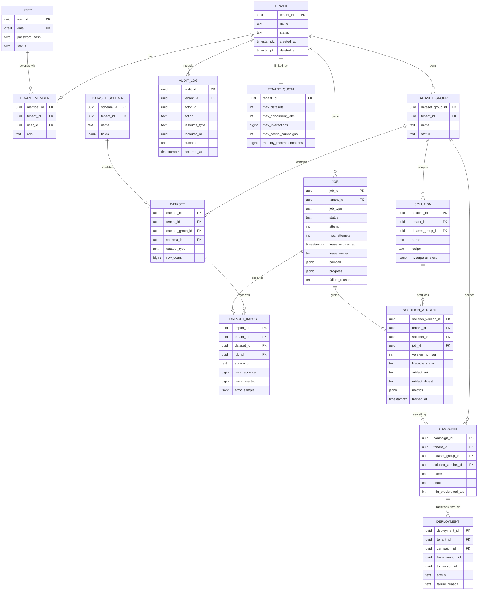

### Indexing

| Index | Purpose |
|---|---|
| `jobs (status, job_type, lease_expires_at)` partial `WHERE status IN ('QUEUED','RUNNING')` | The claim query. Partial keeps it tiny regardless of history size |
| `jobs (tenant_id, created_at DESC)` | Job history listing |
| `solution_versions (tenant_id, solution_id, version_number)` UNIQUE | Version sequencing per solution |
| `campaigns (tenant_id, dataset_group_id) WHERE status='ACTIVE'` | Campaign resolution on the hot path |
| `interactions (tenant_id, user_external_id, occurred_at DESC)` | Sequence retrieval for training and inference |
| `interactions (tenant_id, occurred_at)` BRIN | Snapshot cutoff scans — BRIN because the table is append-ordered |
| `items (tenant_id, external_id)` UNIQUE | Eligibility lookup |
| `audit_log (tenant_id, occurred_at DESC)` | Audit queries |

**Interactions are partitioned monthly** by `occurred_at`. At 10M rows per tenant this is what keeps snapshot extraction from degrading into full scans, and it makes retention a `DROP PARTITION` instead of a long-running `DELETE`.

---

## 17. Data Storage Architecture

| Data | Store | Why not elsewhere |
|---|---|---|
| Tenants, users, datasets, solutions, campaigns | Postgres | Relational, transactional, queried by the API |
| Job state and history | Postgres | Must be transactional with the resource that spawned it |
| Interaction events | Postgres, partitioned | Needs indexed temporal range queries; parquet-only would prevent eligibility joins |
| Item and user attributes | Postgres | Read on the inference hot path for filtering |
| Model metrics | Postgres JSONB | Small, queryable, part of the API response |
| Raw uploads | MinIO | Opaque bytes, potentially GB, never queried |
| Processed parquet | MinIO | Columnar bulk read by the trainer |
| Graph tensors | MinIO | Large binary intermediates |
| Checkpoints | MinIO | Large, write-once |
| Model bundles | MinIO | Versioned immutable artifacts |
| Session context | Redis, 30-min TTL | Ephemeral by definition; losing it degrades personalisation for one session |
| Campaign binding cache | Redis, 60-s TTL | Hot-path read that would otherwise hit Postgres per request |
| Rate-limit counters | Redis | Naturally expiring counters |
| Distributed locks | Redis | Single-holder locks with TTL |
| Metrics | Prometheus TSDB, 30 d | Purpose-built |
| Logs | Loki, 14 d | Label-indexed |

**Redis holds nothing whose loss requires recovery.** Flushing it entirely costs a cold cache and some in-flight session context — never a data-consistency problem. This is the discipline that keeps Redis from silently becoming a second database.

---

## 18. Object Storage

**MinIO on VPS3**, single-node, single-drive mode, private network only.

Why MinIO over the alternatives: the local filesystem cannot be shared across three hosts without NFS (which adds a failure mode and no benefit); external S3 adds egress cost and latency on every checkpoint write. MinIO speaks the S3 API, so if the system later outgrows one node, the migration is a credential and endpoint change.

**Why VPS3 and not VPS1:** MinIO's I/O would contend with Postgres's WAL fsyncs on the same disk — the worst possible neighbour for database latency. On VPS3 it instead sits beside inference, where bundle loading becomes a *local* read.

### Bucket layout

```
graphrec/
└── tenants/{tenant_id}/
    ├── uploads/{import_id}/{filename}          raw, immutable, 30-day lifecycle
    ├── processed/{dataset_id}/{snapshot_id}/   parquet
    ├── graphs/{snapshot_id}/                   edge_index.pt, mappings.json
    ├── checkpoints/{job_id}/epoch_{n}.pt       transient, deleted on success
    └── models/{solution_version_id}/
        ├── manifest.json                       tenant_id, digests, schema version
        ├── weights.safetensors
        ├── item_embeddings.safetensors
        └── item_index.hnsw                     present only above the ANN threshold
```

Two buckets total: `graphrec` and `graphrec-backups`. Versioning on for `models/`, off elsewhere.

**MinIO is never exposed publicly.** Uploads use presigned PUT URLs generated by the control plane — scoped to one key, expiring in 15 minutes, resolving to a hostname that maps to the private address. The client uploads through VPS1's proxy, which forwards to MinIO; the storage service itself has no public route.

**`safetensors`, not `pickle`.** A PyTorch `.pt` checkpoint is a pickle and executes arbitrary code on load. Model bundles that cross a trust boundary — worker writes, inference loads — use safetensors, which cannot execute. Only internal training checkpoints, never loaded outside the trainer, use `.pt`.

---

## 19. Data Ingestion Pipeline

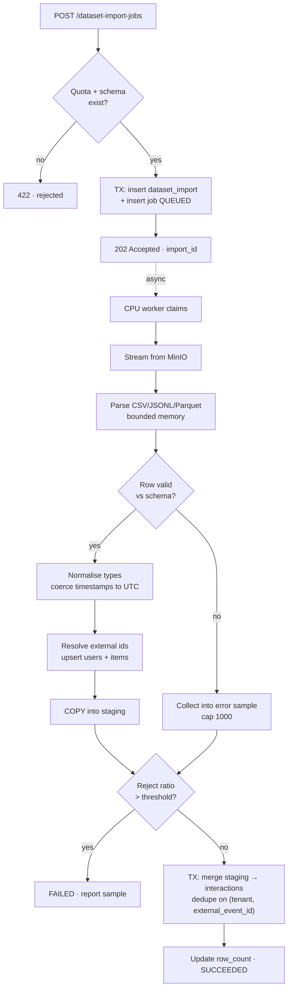

**The single transaction at the end matters.** Rows land in a staging table first; the merge into the partitioned `interactions` table is one transaction. A worker crash mid-import leaves staging rows that a janitor sweeps — it never leaves a half-imported dataset visible to training.

**Deduplication** is on `(tenant_id, external_event_id)` with `ON CONFLICT DO NOTHING`, making re-submitting the same file idempotent — the same import can be retried safely after any failure.

**Validation is streaming and bounded.** Files are read in chunks with a hard memory cap; a 5 GB upload does not become a 5 GB resident allocation. Reject reasons are sampled, not accumulated, so a fully malformed file does not itself become an out-of-memory event.

---

## 20. DGNN-SR Architecture

### Data representation

| Element | Definition |
|---|---|
| User node | One per `(tenant_id, external_user_id)`, embedding `d = 96` |
| Item node | One per `(tenant_id, external_item_id)`, embedding `d = 96`, optionally initialised from content features |
| Interaction edge | `(u, i, t, type)` — directed both ways for message passing |
| Edge type | view · click · cart · purchase · rating, learned type embedding |
| Temporal feature | `Δt` from event to snapshot cutoff, encoded with sinusoidal time encoding |
| Sequence | `S_u` = last `N = 20` interactions of user `u`, time-ordered |

The graph is **bipartite and per-tenant**. There is no shared node space across tenants — a tenant's graph is built from its own rows only, which makes cross-tenant leakage impossible at the representation level rather than by policy.

### Model

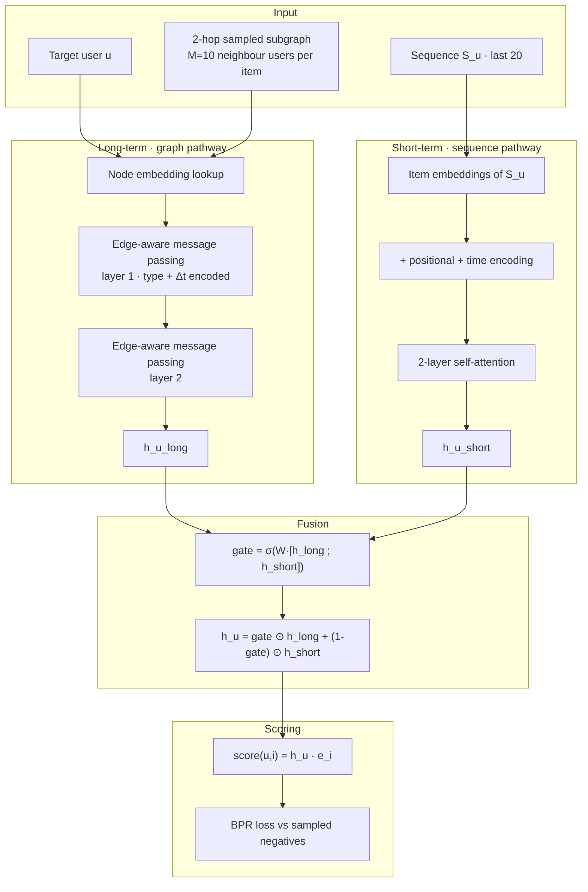

**The gated fusion is the design's centre.** A pure GNN captures durable preference but reacts slowly to the current session; a pure sequence model captures the session but ignores collaborative signal. The learned gate lets the model lean on the session for an active user and on the graph for a sparse one — which is also what makes the same architecture serve both cold and warm users without a separate code path.

### Dynamic graph — what actually changes, and when

This deserves precision, because "dynamic" is used loosely in the literature.

| Question | Answer |
|---|---|
| Is the graph rebuilt or updated incrementally? | **Rebuilt** per training run, from a snapshot with a declared cutoff |
| Why not incremental? | Incremental graph maintenance requires consistent online index updates and gives reproducibility problems. At sub-hourly training cadence it buys nothing |
| Then what is dynamic at serving time? | **The sequence pathway.** New interactions enter `S_u` immediately via Redis session context and change the recommendation *without retraining* |
| So how fresh are recommendations? | Session-level changes are reflected within one request. Graph-structural changes require a retrain |
| When does the graph go stale? | When a tenant's item catalog or user base shifts materially — detected by a coverage drop in evaluation, triggering retraining |

This is an honest and deliberate trade: **structural freshness costs a training run; behavioural freshness is free.** The alternative — a truly online-updated graph — would require streaming infrastructure that three VPSs cannot justify.

### Training

| Aspect | Choice |
|---|---|
| Batch | 1024 `(u, i⁺)` pairs with their sampled subgraphs |
| Negatives | 1 in-batch + 4 popularity-corrected uniform, sampled per positive |
| Loss | BPR: `−log σ(score(u,i⁺) − score(u,i⁻))` |
| Optimiser | AdamW, lr 1e-3, cosine decay, weight decay 1e-5 |
| Regularisation | Dropout 0.2 on attention and message passing; early stop on validation NDCG@10, patience 3 |
| Split | **Temporal leave-last-out** — last interaction to test, second-to-last to validation |
| Metrics | Recall@10, NDCG@10, HR@10, Coverage@10, plus catalog coverage |

**The split must be temporal, not random.** A random split lets the model see a user's future interactions while predicting their past, inflating offline metrics dramatically and producing a model that underperforms in serving. This is the single most common way a recommender evaluation lies.

### Inference

Detailed in §28.

---

## 21. Training Pipeline

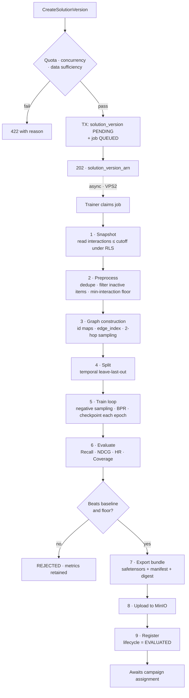

**Every stage writes progress to `jobs.progress`**, which is what the API surfaces as import/training status. Checkpoints are written per epoch so that a crash at epoch 40 of 50 resumes rather than restarts.

**Stage 2 is where most failures should occur** — insufficient data, degenerate catalogs, all-single-interaction users. Failing there costs seconds; failing at stage 5 costs an hour of GPU time. The validation is deliberately front-loaded.

**The API never blocks.** `CreateSolutionVersion` returns in the time it takes to write two rows.

---

## 22. Training Job Lifecycle

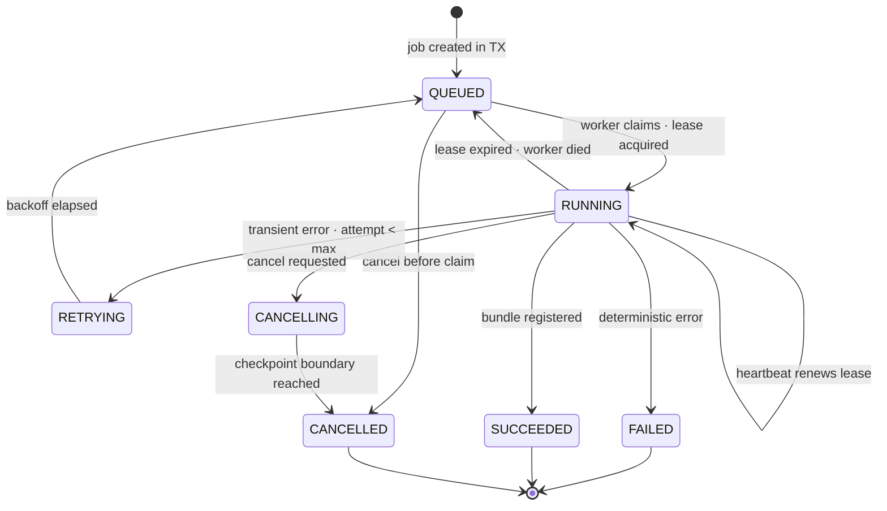

**`RUNNING → QUEUED` on lease expiry is the crash-recovery mechanism.** A worker that dies without cleanup simply stops renewing; a sweeper returns the job to the queue after the lease lapses. There is no separate liveness protocol.

**Cancellation is cooperative.** The trainer checks a cancellation flag at each epoch boundary. A hard kill is available but leaves the lease to expire naturally, which reaches the same end state more slowly.

---

## 23. Job System Architecture

### Comparison

| Option | Verdict |
|---|---|
| RabbitMQ | Real broker, real durability — and a second stateful service to run, back up and monitor. Job state would live in both the broker and Postgres, requiring an outbox to keep them consistent |
| Redis Streams | Fast, consumer groups built in — but Redis is our *cache*, and making it durable (AOF fsync) undermines that role. Losing Redis would mean losing jobs |
| NATS JetStream | Excellent and light, but still a third stateful service for a workload of dozens of jobs per day |
| Celery | Familiar, but drags in a broker plus a result backend, and its state model does not map cleanly onto API-visible job resources |
| **PostgreSQL `SKIP LOCKED`** | **Chosen** |

### Why Postgres wins here

The decisive argument is not performance — it is **transactional coherence**. `CreateSolutionVersion` must atomically create a `solution_version` row and enqueue its training job. With any external broker those are two systems, so a crash between them either loses the job or orphans the row, and the standard remedy is a transactional outbox plus a relay process.

With the queue *inside* Postgres, both writes are one `BEGIN … COMMIT`. **The outbox pattern becomes unnecessary**, which removes a table, a background relay, and an entire class of consistency bug.

The second argument: **job state is already an API resource.** AWS Personalize exposes `DescribeDatasetImportJob` and `DescribeSolutionVersion` with live status. That status has to be queryable, filterable and joinable to its parent — which means it has to be in the database regardless. Adding a broker means storing it twice.

Volume settles it: tens of jobs per day, minutes-to-hours in duration. Postgres queues degrade around thousands of messages per second. We are five orders of magnitude below that.

### The claim query

```sql
UPDATE jobs SET
    status = 'RUNNING',
    lease_owner = $worker_id,
    lease_expires_at = now() + interval '90 seconds',
    started_at = COALESCE(started_at, now()),
    attempt = attempt + 1
WHERE job_id = (
    SELECT job_id FROM jobs
    WHERE status = 'QUEUED'
      AND job_type = ANY($accepted_types)
      AND run_after <= now()
    ORDER BY priority DESC, created_at
    FOR UPDATE SKIP LOCKED
    LIMIT 1
)
RETURNING *;
```

`SKIP LOCKED` lets concurrent workers claim different rows without blocking. The subquery-plus-update keeps claim and state transition atomic.

### Semantics

| Concern | Implementation |
|---|---|
| Ownership | `lease_owner` = worker id; only the owner may report progress |
| Visibility timeout | `lease_expires_at`, renewed by heartbeat every 30 s |
| Crash recovery | Sweeper resets `RUNNING` jobs with expired leases to `QUEUED` |
| Retry | Exponential backoff via `run_after = now() + 2^attempt · 30 s`, capped |
| Retry policy | **Transient errors only** — network, OOM, GPU busy. Validation errors go straight to `FAILED` without burning attempts |
| Idempotency | Client `idempotency_key` unique per tenant; a repeat returns the original job |
| Dead letter | `attempt >= max_attempts` → `FAILED` with `failure_reason`; the row *is* the DLQ, queryable via the API |
| Cancellation | `cancel_requested_at` set; worker checks it at stage boundaries |
| Progress | `jobs.progress` JSONB — `{stage, epoch, total_epochs, percent}` |
| Fair share | Dispatch orders by `(tenant_running_jobs ASC, priority DESC, created_at)` so one tenant cannot monopolise the GPU |

### Two worker pools

| Pool | Host | Handles | Concurrency |
|---|---|---|---|
| CPU workers | VPS1 | Imports, validation, exports, deployment tasks | 2–4 |
| Training worker | VPS2 | Preprocess, graph build, train, evaluate | **1** |

Training concurrency is **1** because one GPU cannot usefully run two graph-training jobs — they would contend for VRAM and both would run slower than sequential execution.

---

## 24. Ray Evaluation

| Component | Value here | Verdict |
|---|---|---|
| Ray Core | Distributed task/actor scheduling across nodes | **No** — we have one training node |
| Ray Train | Multi-GPU/multi-node data-parallel training | **No** — one GPU; `DistributedDataParallel` has nothing to distribute |
| Ray Tune | Parallel hyperparameter search | **Not for MVP** — parallel trials need parallel GPUs. Sequential Optuna gives the same search quality, just slower |
| Ray Data | Distributed data loading | **No** — PyG's `NeighborLoader` with worker processes saturates one GPU already |

### The questions, answered directly

**Does the project need distributed training?** No. A DGNN-SR model over ≤10M interactions with bounded 2-hop sampling fits in 24 GB of VRAM and trains in tens of minutes.

**Is a single GPU sufficient for MVP?** Yes, comfortably. The constraint is job *serialisation* across tenants, not the speed of any single job — and Ray does not fix that, because more scheduling does not create more GPU.

**When does Ray become useful?** At the point where a second GPU host exists, or where HPO across many trials becomes a routine workflow. Both are post-3-VPS.

**Should Ray run only on VPS2? Should VPS1 join the cluster?** Moot given the above — but if it were adopted, VPS1 must *not* join. A Ray worker on the control-plane host would let a training memory spike contend with Postgres, which is precisely the coupling the topology exists to prevent.

**What happens with only one GPU on VPS2?** Ray adds a head node, a Redis-like GCS, an object store consuming shared memory, and a second scheduler competing with our job system for the same resource — all to schedule one task at a time.

**Operational cost:** version pinning against PyTorch and CUDA, opaque object-store OOMs, a dashboard to secure, and a distinct failure mode where the head is up but workers are unreachable.

### Recommendation

**Do not use Ray.** Use plain PyTorch + PyTorch Geometric, invoked directly by the training worker.

The migration path is clean: the trainer's entry point is a single `train(config) → artifacts` function. Wrapping it in a `@ray.remote` actor later is a small change, precisely because we did not build the pipeline around Ray's abstractions now.

---

## 25. Model Registry

### Is MLflow necessary?

MLflow provides three things. Evaluated separately:

| Capability | Needed? | Reasoning |
|---|---|---|
| Model Registry | **No** | `solutions` + `solution_versions` + `campaigns` *is* a model registry, and it is mandated by the external API contract. MLflow's Staging/Production stages would be a parallel, conflicting lifecycle — two sources of truth for which model is live |
| Artifact store | **No** | MinIO already holds artifacts with a defined layout |
| Experiment tracking | **Genuinely useful** | Loss curves, per-epoch metrics, hyperparameter comparison |

Only the third has real value, and it is satisfiable with two Postgres tables.

### Decision: Postgres-backed registry, no MLflow server

```
solution_versions   — one row per trained model: status, artifact URI, digest, metrics
training_metrics    — (solution_version_id, epoch, metric_name, value)
```

This gives queryable training curves, comparison across versions of the same solution, and a single lifecycle authority — for the cost of one extra table and no extra service.

**MLflow Tracking remains an option later** and is not architecturally excluded: it can be added pointing at the same Postgres and MinIO. The registry component should stay unused even then, because the API contract owns model lifecycle.

### Bundle manifest

```json
{
  "solution_version_id": "…",
  "tenant_id": "…",
  "recipe": "dgnn-sr-v1",
  "schema_version": 1,
  "embedding_dim": 96,
  "n_items": 48213,
  "artifact_digest": "sha256:…",
  "metrics": { "ndcg@10": 0.187, "recall@10": 0.243, "coverage@10": 0.61 },
  "created_at": "…"
}
```

`tenant_id` in the manifest is a **hard safety check**: inference refuses to load a bundle whose tenant does not match the campaign's tenant. Combined with the digest verification, this makes serving a foreign model a detected error rather than a silent breach.

---

## 26. Model Lifecycle

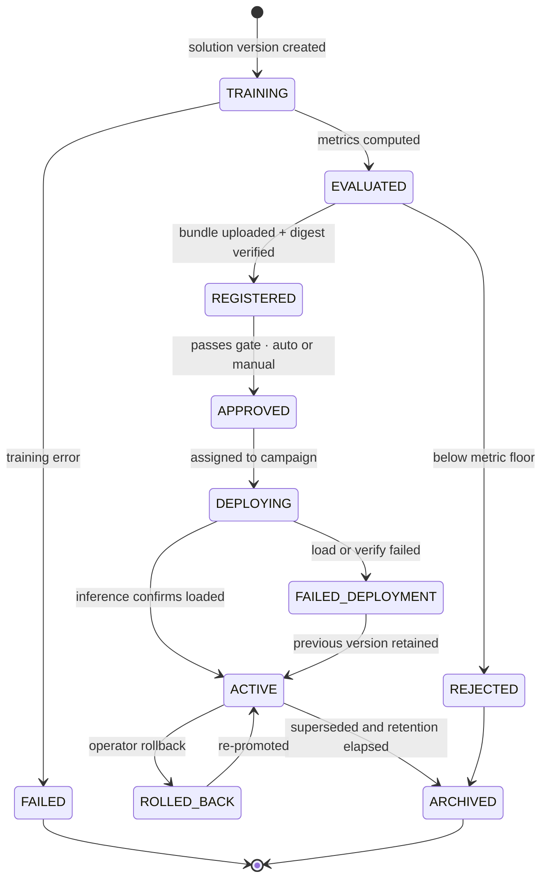

**`FAILED_DEPLOYMENT → ACTIVE` is the critical edge.** A failed activation must never leave a campaign unserved. The inference server loads and verifies the new bundle *before* swapping the pointer; if any step fails, the previous model keeps serving and the deployment row records why.

**Archiving deletes the bundle** from MinIO once retention passes, but the `solution_versions` row and its metrics persist — history stays queryable after the bytes are gone.

---

## 27. Model Distribution

How the inference server learns which model is active:

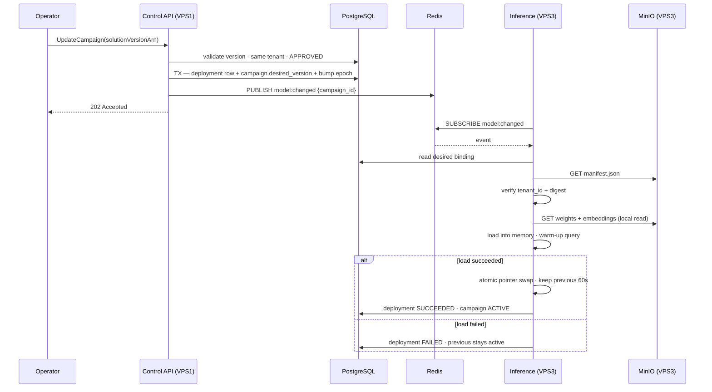

**Redis pub/sub is an optimisation, not the mechanism.** The inference server also polls the `campaign_epoch` counter every 15 seconds. If Redis is down or a message is missed, activation is merely slower — never lost. Pub/sub with a polling fallback gives fast propagation without depending on at-least-once delivery from a cache.

**Keeping the previous model in memory for 60 seconds** makes rollback instantaneous within that window and lets in-flight requests finish against a consistent model.

---

## 28. Inference Architecture

The inference server is a long-lived process holding an LRU cache of loaded models.

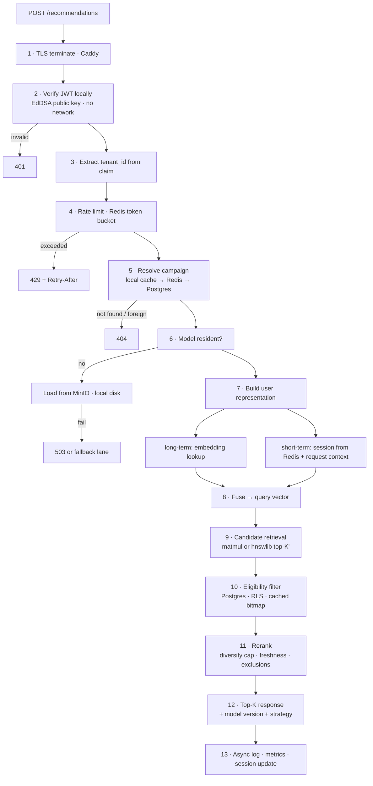

### Candidate retrieval — why no vector database

| Catalog size | Method | Latency |
|---|---|---|
| ≤ 200K items | Exact `numpy`/`torch` matmul over the resident embedding matrix | 2–8 ms |
| > 200K items | In-process `hnswlib` index, loaded from the bundle | 1–3 ms |

A 100K × 96 float32 matrix is 38 MB and multiplies against one query vector in single-digit milliseconds. A network round-trip to Qdrant costs 1–3 ms *before* it does any work, plus a service to run, a port to secure, per-tenant collection management, and a new way for tenant isolation to fail.

**A vector database earns its place when the index exceeds host memory or must be shared across many serving nodes.** Neither is true here. Revisit above roughly 1M items per tenant, or when resident models exceed VPS3's RAM.

### Cold start

When a user has no history, the graph pathway has nothing to contribute. The gate naturally weights toward the sequence pathway; if the session is also empty, the request falls to a **popularity + category lane** computed at training time and shipped in the bundle. This is a lane inside the same request path, not a separate service.

### Caching

| Layer | Contents | TTL | On miss |
|---|---|---|---|
| Process memory | Loaded models, item eligibility bitmap | LRU / 60 s | Load from MinIO / Postgres |
| Redis | Campaign binding, session sequences | 60 s / 30 min | Postgres / treat as new session |
| None | Recommendation responses | — | Deliberately uncached |

**Recommendation responses are not cached.** They depend on session state that changes per request; a cache would serve stale personalisation and mask the very behaviour the product exists to provide.

---

## 29. Recommendation Request Flow

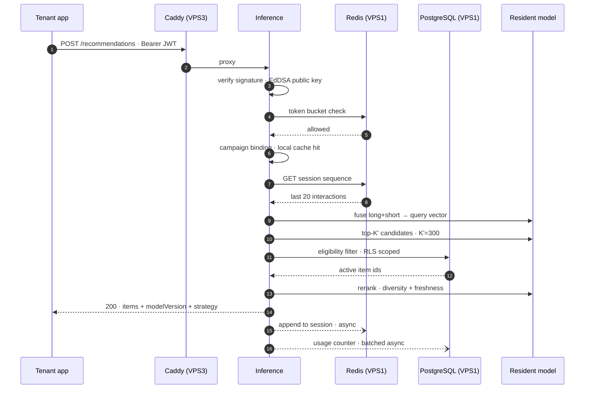

### Latency budget at P95

| Step | Budget |
|---|---|
| TLS + proxy | 3 ms |
| JWT verification (local, no I/O) | 1 ms |
| Rate limit (Redis round trip) | 2 ms |
| Campaign resolution (in-process cache) | < 1 ms |
| Session fetch (Redis) | 2 ms |
| Fusion + forward pass | 15 ms |
| Candidate retrieval | 8 ms |
| Eligibility filter (Postgres, cached bitmap) | 10 ms |
| Rerank | 5 ms |
| Serialisation | 2 ms |
| **Total** | **~50 ms**, leaving headroom to a 150 ms P95 target |

Steps 13 onward — session append, usage counting, request logging — happen **after** the response is written. They never appear in user-visible latency.

---

## 30. API Architecture and Routing

### The routing question

| Option | Latency | Availability | Security | Complexity |
|---|---|---|---|---|
| Client → VPS1 → VPS3 | +2–4 ms hop | Inference dies when VPS1 dies | One public surface, central auth | Extra proxy config |
| **Client → VPS3 direct** | Direct | **Inference survives VPS1 outage** | Two surfaces; auth must be local | Duplicated TLS + rate limiting |

### Decision: direct to VPS3 for recommendations

The deciding argument is **availability, not latency**. Routing the data plane through the control plane makes VPS1 a single point of failure for the product's primary function. Under the 3-VPS constraint — where VPS1 also hosts Postgres, Redis, the API and monitoring, and is therefore the busiest and most failure-prone host — that coupling is the worst available choice.

The usual objection is that this duplicates authentication. **Asymmetric JWTs remove that objection.** VPS1 signs tokens with an EdDSA private key; VPS3 verifies with the public key. No shared secret, no introspection call, no network dependency on the control plane for auth. Verification is a local signature check in well under a millisecond.

What the inference host still needs from VPS1 is Postgres for eligibility filtering. That dependency is real, and §34 covers how it degrades: cached eligibility bitmaps let inference keep serving through a short Postgres outage.

**Split of responsibility:**

| Surface | Host | Endpoints |
|---|---|---|
| Control plane | VPS1:443 | Everything: tenants, datasets, imports, solutions, versions, campaigns, jobs |
| Data plane | VPS3:443 | `POST /recommendations` only |

Rate limiting runs in both, sharing counters through Redis so a tenant's aggregate budget is enforced across both surfaces.

---

## 31. Background Job Architecture

Covered in §23. Two additional operational concerns:

**Fair-share dispatch.** Ordering by `created_at` alone lets one tenant queuing twenty training jobs block everyone else for a day. The claim query orders by running-jobs-per-tenant first, so tenants round-robin through the single GPU slot.

**Quota enforcement at enqueue, not dequeue.** Rejecting a job when it is claimed wastes the queue delay and confuses the user, who saw a 202. Concurrency and monthly quotas are checked inside the creating transaction, so rejection is immediate and synchronous.

---

## 32. Security Architecture

| Layer | Control |
|---|---|
| Transport | TLS 1.3 everywhere public; Caddy handles ACME automatically |
| User auth | Argon2id password hashing; short-lived access token (15 min) + rotating refresh token (30 d) |
| Token format | JWT, **EdDSA (Ed25519)**. Claims: `sub`, `tenant_id`, `role`, `scope`, `exp`, `jti` |
| Machine auth | API keys — random 32 bytes, stored as SHA-256, shown once at creation, prefix retained for identification |
| Authorization | RBAC — `OWNER`, `ADMIN`, `DEVELOPER`, `VIEWER` — checked in a decorator per endpoint, never only in the UI |
| Tenant isolation | Postgres RLS + `SET LOCAL` from the verified claim (§15) |
| Internal auth | Private network + per-service credentials. Workers use a distinct Postgres role from the API |
| Secrets | Docker secrets from root-owned `0400` files; never in images, never in Compose literals |
| Encryption at rest | LUKS full-disk on all three hosts; MinIO SSE-S3 for model bundles |
| Firewall | Default deny; only 443 public, only peer IPs on private ports |
| Audit | Append-only `audit_log`; no `UPDATE`/`DELETE` grant on it for the application role |

### Threat analysis

| Threat | Vector | Mitigation | Residual risk |
|---|---|---|---|
| Cross-tenant read | Forged or guessed IDs | RLS + composite FKs + tenant from token only | Low. Requires a Postgres RLS bypass |
| Credential theft | Leaked API key | Hashed at rest, shown once, revocable, scoped, `last_used_at` monitored | Medium — a valid key works until revoked. Mitigate with rotation and anomaly alerts |
| Malicious dataset | Pickle bomb, zip bomb, CSV injection | No `pickle.load` in ingest; format allowlist; decompression size cap; memory-capped sandboxed worker | Low |
| Unauthorized model access | Requesting another tenant's version | Manifest `tenant_id` check + digest verification at load | Very low |
| API abuse | Request flooding | Redis token bucket per tenant and per key; 429 with `Retry-After` | Low |
| Resource exhaustion | Queue flooding to starve the GPU | Per-tenant concurrency quota + fair-share dispatch | Low |
| Job manipulation | Cancelling or claiming a foreign job | `jobs` under RLS; lease ownership verified on every mutation | Low |
| Privilege escalation | Member self-promoting to owner | Role changes require `OWNER`; the last owner cannot be demoted | Low |
| Token replay | Stolen access token | 15-minute expiry; `jti` denylist in Redis on logout | Medium within the token window |

---

## 33. Network Security

| Source | Destination | Port | Exposure | Purpose |
|---|---|---:|---|---|
| Internet | VPS1 | 443 | **Public** | Control API |
| Internet | VPS3 | 443 | **Public** | Recommendations |
| Admin IPs | All | 22 | Restricted | SSH, key-only |
| VPS1 | VPS3 | 9000 | Private | MinIO |
| VPS2 | VPS1 | 5432 | Private | Job claim, progress |
| VPS2 | VPS3 | 9000 | Private | Datasets in, bundles out |
| VPS3 | VPS1 | 5432 | Private | Eligibility, bindings |
| VPS3 | VPS1 | 6379 | Private | Cache, session |
| VPS1 | VPS2/VPS3 | 9100, 9400 | Private | Metric scraping |
| VPS2/VPS3 | VPS1 | 3100 | Private | Log shipping |

**Firewall posture:** `ufw default deny incoming`, explicit allows by source IP. Postgres, Redis and MinIO bind to the WireGuard address only — never `0.0.0.0`.

**SSH:** key-only, no root login, no password auth, non-standard port, `fail2ban`. Ideally reachable only over WireGuard, with the provider console as break-glass.

**Internal TLS** is deliberately *not* used. On a WireGuard mesh, service-to-service traffic is already encrypted and authenticated at the network layer. Adding a second TLS layer with an internal CA would mean certificate rotation for three hosts and a new outage mode when they expire, for negligible additional protection. Revisit if the private network becomes untrusted.

---

## 34. Failure Handling

With three hosts and no redundancy, **no single-node failure is transparent**. Each is documented with its real impact.

### VPS1 down — control plane, DB, cache

| | |
|---|---|
| **Detection** | Prometheus down (it lives here), external uptime check on `:443` |
| **Impact** | All control operations fail. Training halts — workers cannot claim. **Recommendations continue in degraded mode**: cached campaign bindings and eligibility bitmaps serve until TTL, then requests fall to the popularity lane |
| **Recovery** | Restart host → Compose auto-starts → workers resume claiming; expired leases requeue automatically |
| **Data consistency** | Preserved. In-flight transactions roll back; jobs return to `QUEUED` |
| **User impact** | Console unavailable; recommendations degraded but served |
| **RTO** | 5–15 min restart; 2–4 h if rebuild from backup |

This is the worst failure, and the honest reason is that VPS1 carries too much. On a fourth host, Postgres would move off it first.

### VPS2 down — GPU training

| | |
|---|---|
| **Detection** | Missing scrape; job lease expiry |
| **Impact** | Training only. Everything else unaffected — this is C-5 satisfied by design |
| **Recovery** | Leases expire → jobs requeue → resume from last checkpoint on restart |
| **Data consistency** | Full. VPS2 holds no authoritative state |
| **User impact** | New training jobs queue; existing models keep serving |
| **RTO** | Hours to days tolerable |

### VPS3 down — inference and object storage

| | |
|---|---|
| **Detection** | External check on `:443`; MinIO scrape failure |
| **Impact** | **All recommendations fail** — the product's core function. Control plane keeps working but uploads fail and training cannot read datasets or write bundles |
| **Recovery** | Restart → inference reloads bundles from local MinIO → warm in 1–3 min |
| **Data consistency** | MinIO objects survive on disk; a torn multipart upload is retried by its job |
| **User impact** | Total recommendation outage |
| **RTO** | 5–15 min restart; **restore from backup is hours** and loses artifacts written since the last sync |

### Component failures

| Failure | Detection | Impact | Recovery |
|---|---|---|---|
| Postgres crash | Health check, connection errors | Control ops fail; inference degrades to cache | `restart: always`; WAL replay. If corrupt, restore from base backup + WAL |
| Redis crash | Health check | Cold cache, lost sessions, rate limits reset | Restart. **No data loss by design** — nothing authoritative lives there |
| MinIO failure | Health check | No uploads, no model loads, training blocked at I/O stages | Restart; if disk-level, restore from off-site |
| Training crash | Lease expiry | One job | Requeue, resume from last epoch checkpoint |
| GPU failure | `dcgm-exporter` gone; CUDA init errors | Training unavailable | Job stays `QUEUED`; alert. Optional CPU fallback for tiny datasets only |
| Model corruption | Digest mismatch at load | Activation refused | Previous model retained; deployment marked `FAILED_DEPLOYMENT` |
| Network partition | Cross-host scrape failures | Workers cannot claim; inference degrades | WireGuard reconnects; leases requeue |
| Disk exhaustion | `node-exporter` < 15% free | Writes fail; Postgres may halt | Alert at 80%; MinIO lifecycle rules purge old checkpoints; partition drops for old interactions |

**Disk exhaustion deserves emphasis** — it is the most likely real-world outage, because checkpoints and raw uploads accumulate silently. Lifecycle rules on `uploads/` (30 d) and `checkpoints/` (deleted on job success) are not housekeeping; they are the primary defence.

---

## 35. Backup Strategy

Backups go to **off-site object storage** outside the three VPSs (A-6). A backup on the host it protects is not a backup.

| Asset | Method | Frequency | Retention | RPO |
|---|---|---|---|---|
| Postgres | `pg_basebackup` + WAL archiving to off-site | Base weekly, WAL continuous | 30 d | **≤ 5 min** |
| Postgres logical | `pg_dump` per database | Daily | 14 d | 24 h |
| MinIO models | `mc mirror` to off-site bucket | Hourly | 90 d | 1 h |
| MinIO processed data | `mc mirror` | Daily | 30 d | 24 h |
| MinIO raw uploads | **Not backed up** | — | — | Re-uploadable by the tenant |
| Configuration | Git repository | On commit | Full history | 0 |
| Secrets | Encrypted vault file, off-site | On change | 10 versions | 0 |

**Restore drill quarterly.** An untested backup is a hypothesis. The drill restores Postgres to a scratch host and verifies row counts against production.

| Scenario | RTO | RPO |
|---|---|---|
| Single container | 2 min | 0 |
| VPS restart | 15 min | 0 |
| Postgres restore | 2–4 h | 5 min |
| Full VPS rebuild | 4–8 h | 1 h |
| Total loss, all three | 1–2 days | 1 h |

---

## 36. Disaster Recovery

Priority order for a total-loss rebuild:

1. Provision hosts, restore WireGuard config and secrets
2. Restore Postgres — **without it nothing else is meaningful**, since it holds every resource's identity
3. Restore MinIO `models/` — brings serving back
4. Start control plane and inference; verify a recommendation end-to-end
5. Restore `processed/` — restores training capability
6. Raw uploads are not restored; tenants re-upload if needed

**Deliberately accepted:** no warm standby, no cross-region replication, no automatic failover. All three require a fourth machine. The recovery plan is documented, scripted and rehearsed instead — which is the correct trade at this scale, and should be stated to stakeholders rather than obscured.

---

## 37. Observability

| Tool | Role | Why not the alternative |
|---|---|---|
| Prometheus | Metrics, 30 d | Single binary, pull-based, no agent fleet |
| Grafana | Dashboards, alerts | Reads both Prometheus and Loki |
| Loki | Logs, 14 d | Indexes labels not content — roughly a tenth of Elasticsearch's footprint |
| Promtail | Log shipping | Native Docker discovery |
| node/dcgm exporter | Host and GPU metrics | Standard |

**OpenTelemetry is deliberately omitted.** Distributed tracing solves the problem of following a request across many services. We have at most two hops. Structured logs with a correlation ID give the same answer without a collector to run.

### What is monitored

| Domain | Signals | Alert |
|---|---|---|
| Host | CPU, RAM, disk, network | Disk > 80%, RAM > 90% for 5 min |
| GPU | Utilisation, VRAM, temperature | VRAM > 95%, temp > 85 °C |
| API | Request rate, P50/P95/P99, 4xx/5xx, auth failures | P95 > 500 ms, 5xx > 1%, auth failure spike |
| Jobs | Queue depth, wait time, duration, failures, retries | Depth > 20, any job `QUEUED` > 1 h, failure rate > 10% |
| Training | Loss curve, validation metrics, epoch time | Job > 4 h, loss `NaN` |
| Inference | P50/P95/P99, RPS, model load time, cache hit rate, fallback rate | **P95 > 150 ms**, fallback > 5%, error > 1% |
| Business | Recommendations per tenant, quota utilisation | Tenant at 90% of quota |

**Fallback rate is the most informative single metric.** It rises whenever models fail to load, Postgres is unreachable, or a tenant has no active campaign — a leading indicator for several distinct failures at once.

---

## 38. Container Architecture

```text
VPS1 — control
├── caddy                 :443 public
├── control-api           :8000 internal
├── job-worker            ×2, no ports
├── postgres              :5432 private
├── redis                 :6379 private
├── prometheus            :9090 private
├── grafana               :3000 private
├── loki                  :3100 private
└── node-exporter         :9100 private

VPS2 — training
├── training-worker       no ports, GPU passthrough
├── node-exporter         :9100 private
├── dcgm-exporter         :9400 private
└── promtail              no ports

VPS3 — serving
├── caddy                 :443 public
├── inference             :8100 internal
├── minio                 :9000 private
├── node-exporter         :9100 private
└── promtail              no ports
```

**Eleven services plus exporters.** Every one answers "what breaks without it?" concretely: remove Caddy and there is no TLS; remove Redis and every request hits Postgres; remove Loki and post-incident debugging becomes SSH and `grep`.

`postgres` and `minio` use named volumes on the host, never bind mounts into the container filesystem, so an image rebuild cannot destroy data.

---

## 39. Deployment Architecture

| Option | Verdict |
|---|---|
| Kubernetes / K3s | **Rejected.** Control plane consumes roughly 1–2 GB and a core per node — on three nodes that is a meaningful fraction of total capacity spent on orchestration. It provides rescheduling, which requires spare capacity we do not have, and demands operational expertise a small team should not be spending on |
| systemd units alone | Rejected. Workable, but hand-rolls dependency ordering, health checks and log capture that Compose provides |
| **Docker Compose + systemd** | **Chosen** |

One `docker-compose.yml` per VPS, each wrapped in a systemd unit for boot ordering and restart.

| Concern | Implementation |
|---|---|
| Startup | `depends_on` with `condition: service_healthy` |
| Restart | `restart: unless-stopped`; systemd restarts the whole project on host boot |
| Health checks | `pg_isready`, `redis-cli ping`, `/healthz` on API and inference, MinIO `/minio/health/live` |
| Configuration | `.env` per host, root-owned `0400`, never committed |
| Secrets | Docker secrets from files; rotation is file replace + restart |
| Migrations | A one-shot `migrate` service runs `alembic upgrade head` before the API starts. **Migrations must be backward-compatible for one release** so a rollback does not strand the schema |
| Image updates | `docker compose pull && docker compose up -d` — rolls one service at a time |
| Rollback | Images tagged by commit SHA; roll back by pinning the previous tag |

---

## 40. CI/CD

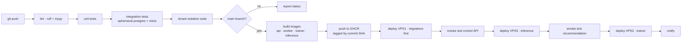

**Deployment order is not arbitrary.** VPS1 first because it owns migrations; VPS3 next because it is user-facing and must be verified before training resumes; VPS2 last because it is the most tolerant of delay.

Deployment is SSH plus `docker compose up -d` per host, driven by GitHub Actions with a deploy key. Each host pulls only the images it runs, so the trainer's multi-gigabyte CUDA image is never fetched to VPS1 or VPS3.

**The tenant-isolation suite is a required gate.** A change that lets tenant A see tenant B's data must not be deployable, and that check belongs in CI rather than in review.

---

## 41. Repository Structure

```
graphrec/
├── apps/
│   ├── control_api/          FastAPI app · routers · dependencies · main
│   ├── worker/               CPU job worker · import · export · deploy handlers
│   ├── trainer/              GPU worker · pipeline stages
│   └── inference/            serving process · retrieval · ranking
│
├── graphrec/                 shared library, imported by all apps
│   ├── domain/               modules: identity, tenancy, catalog, ingestion,
│   │                         training, serving, audit
│   ├── db/                   models · session · RLS tenant context · repositories
│   ├── jobs/                 queue client · claim · lease · retry
│   ├── storage/              MinIO client · bucket layout · presigning
│   ├── ml/
│   │   ├── graph/            construction · sampling
│   │   ├── model/            DGNN-SR modules · fusion · loss
│   │   ├── train/            loop · negative sampling · checkpointing
│   │   ├── eval/             metrics
│   │   └── bundle/           export · manifest · verification
│   └── common/               config · logging · errors · types
│
├── migrations/               alembic
├── deploy/
│   ├── vps1/                 compose · caddy · env template
│   ├── vps2/
│   ├── vps3/
│   └── systemd/
├── tests/
│   ├── unit/ integration/ api/ isolation/ ml/ load/
├── scripts/                  backup · restore · seed · smoke
└── docs/                     this document · runbooks · ADRs
```

**One shared library, four thin applications.** Domain logic lives in `graphrec/domain/`; the apps are entry points that wire transport to it. This is what makes the modular monolith genuinely modular — extracting `training` into its own service later means moving a package, not untangling a codebase.

---

## 42. Performance Targets

| Area | Metric | Target | Rationale |
|---|---|---|---|
| Auth | Token verification | < 2 ms | Local EdDSA verify, no I/O |
| Auth | Login | P95 < 250 ms | Argon2id is intentionally slow |
| Control API | Metadata read | P95 < 100 ms | Indexed single-table read |
| Control API | Metadata write | P95 < 200 ms | One transaction |
| Control API | Job creation | P95 < 150 ms | Two inserts |
| Import | Throughput | 20–50K rows/s | `COPY` bound by parse + validate |
| Import | 1M rows end-to-end | < 3 min | |
| Training | Queue → running | < 30 s | One poll interval plus setup |
| Training | 1M interactions | 15–40 min | 24 GB VRAM, bounded sampling |
| Training | 10M interactions | 2–5 h | |
| Inference | P50 | < 40 ms | §29 budget |
| Inference | **P95** | **< 150 ms** | NFR-1 |
| Inference | P99 | < 300 ms | Includes occasional model load |
| Inference | Throughput | 150 RPS sustained | 8 vCPU, batched forward passes |
| Inference | Model load | < 3 s | Local disk read on VPS3 |

Realistic for a 3-VPS MVP. The inference numbers assume the model is resident; a cold load pushes that request into the P99 bucket, which is why LRU capacity is sized so eviction is rare.

---

## 43. Scalability Analysis

### By tenant count

| Tenants | Status | Binding constraint |
|---|---|---|
| 10 | Comfortable | None |
| 100 | Workable with tuning | **Resident model memory on VPS3.** 100 × 200 MB = 20 GB. Needs 32 GB and LRU eviction, accepting cold-load latency for inactive tenants |
| 1,000 | **Architecture breaks** | Models cannot be resident; every request risks a 3 s load. Training queue with one GPU becomes weeks deep. Requires a serving fleet |

### By interaction volume

| Interactions | Status | Constraint |
|---|---|---|
| 100K | Trivial | — |
| 1M | Comfortable | — |
| 10M | Workable | Training 2–5 h; partitioning essential |
| 100M | **Breaks** | Single-node Postgres write-bound; snapshot extraction hours; VRAM insufficient for meaningful sampling |

### By request rate

| RPS | Status | Constraint |
|---|---|---|
| 10 | Trivial | — |
| 100 | **Design target** | — |
| 1,000 | **Breaks** | One inference process cannot serve 1,000 forward passes/s. Needs horizontal serving |

### Improving capacity within three VPSs

Ordered by return on effort:

1. **Batch inference requests** — micro-batch concurrent forward passes into one GPU/CPU call. Largest single win, roughly 3–5× throughput
2. **Quantise embeddings** — float32 → int8 cuts resident model memory ~4×, directly relieving the primary wall, at 1–2% NDCG cost
3. **Cache eligibility bitmaps** — removes a Postgres round trip from the hot path
4. **Connection pooling** — PgBouncer in transaction mode; more concurrency without more Postgres memory
5. **Vertical scaling** — RAM on VPS3 first, then VRAM on VPS2
6. **Partition and BRIN-index interactions** — keeps snapshot extraction sub-linear
7. **Async everything post-response** — logging, usage counting, session updates

**The wall is model residency, not compute.** GraphRec becomes impractical on three VPSs at roughly **150 active tenants, 20M interactions per tenant, or 300 RPS** — whichever arrives first. Past that, the correct move is a fourth host running inference only, which the architecture already accommodates because inference is a separate process with no local state.

---

## 44. Cost Analysis

Illustrative monthly figures; provider-dependent.

| Item | Minimum | Recommended |
|---|---|---|
| VPS1 — 8 vCPU / 32 GB | €25 | €45 |
| VPS2 — GPU, 24 GB VRAM | €120 | €250 |
| VPS3 — 8 vCPU / 32 GB / 1 TB | €30 | €60 |
| Off-site backup, 500 GB | €5 | €10 |
| Domain + TLS | €1 | €1 (Caddy/ACME is free) |
| Container registry | €0 | €0 (GHCR free tier) |
| **Total** | **≈ €181/mo** | **≈ €366/mo** |

**The GPU is 65–70% of the bill.** Three cost strategies follow directly:

1. **Rent the GPU hourly.** Training is bursty; an on-demand GPU host started per job and destroyed after costs a fraction of a month's reservation. This does violate "at most 3 VPSs" only if counted as permanent — a transient host is arguably not a fourth VPS, but flag the interpretation rather than assume it.
2. **Start CPU-only.** DGNN-SR on 1M interactions trains on CPU in a few hours. For an MVP with a handful of tenants, that is acceptable and removes the largest cost entirely until it hurts.
3. **Consumer GPU hosting.** An RTX 4000 Ada or L4 costs far less than an A100 and is more than sufficient at these data volumes.

No managed cloud services are used. Everything self-hosts, which is what makes the total achievable at this figure.

---

## 45. MVP Architecture

Ship in this order; each phase is independently useful.

| Included in MVP | Deferred |
|---|---|
| Control API, auth, RBAC, tenancy | Ray, MLflow |
| Postgres with RLS | Vector database |
| Postgres job queue | Kubernetes |
| MinIO | Multi-GPU training |
| DGNN-SR training, single GPU | Automated retraining triggers |
| Inference with in-process retrieval | A/B testing between versions |
| Campaigns, activation, rollback | Horizontal serving |
| Prometheus + Grafana + Loki | Distributed tracing |

**Simplification allowed for MVP only:** skip Loki initially and read container logs directly. It is the one component whose absence costs debugging convenience rather than capability.

---

## 46. Future Architecture

How each component migrates when the 3-VPS cap lifts:

| Component | Today | Next | Migration |
|---|---|---|---|
| Control API | One process, VPS1 | 2–3 replicas behind a load balancer | Already stateless — add replicas |
| Postgres | Single node | Primary + streaming replica; reads to replica | Config change; app needs a read/write split |
| Job queue | Postgres `SKIP LOCKED` | Same, until thousands/s | Only then adopt NATS JetStream |
| Object storage | MinIO single node | MinIO distributed, or S3 | S3 API-compatible — endpoint change |
| Training | One GPU worker | Multi-GPU, Ray Train | Wrap the existing `train()` in a Ray actor |
| Inference | One process, VPS3 | N replicas, sharded by tenant | Already stateless — add replicas and a consistent-hash router |
| Vector search | In-process | Qdrant, if indexes exceed host RAM | New retrieval backend behind the existing interface |
| Model registry | Postgres | Unchanged | The API contract owns lifecycle permanently |
| Orchestration | Compose + systemd | Kubernetes, **only when ≥ 6 nodes** | Compose files translate to manifests |
| Observability | Single Prometheus | Thanos or Mimir for long retention | Add remote-write |

**The extraction order, when it comes:** inference first (stateless, resource-hungry, user-facing), then training (already separate), then ingestion. Auth, tenancy and catalog should remain in one process indefinitely — they are transactionally coupled and splitting them would introduce distributed transactions to solve a problem nobody has.

---

## 47. Architecture Trade-offs

### Modular monolith vs microservices

```
Decision:        Modular monolith control plane + 2 specialised processes
Reason:          Three hosts cannot run a service fleet without spending most
                 capacity on inter-service overhead. Domain modules here are
                 transactionally coupled — a dataset import touches catalog,
                 jobs and audit in one transaction.
Alternatives:    Microservices per domain; single process for everything
Advantages:      One deploy, one debug session, ACID across modules, no
                 network failure modes between domains
Disadvantages:   Whole app redeploys for any change; one memory leak affects
                 all modules; discipline required to keep boundaries real
MVP impact:      Substantially faster to build
Scaling impact:  Control plane scales vertically then by replicas
Migration path:  Domain packages extract to services; boundaries already exist
```

### PostgreSQL tenancy model

```
Decision:        Shared database, shared schema, tenant_id + RLS
Reason:          Only model that scales to hundreds of tenants on one instance
                 without connection or migration explosion. RLS closes the
                 correctness gap that makes shared-schema risky.
Alternatives:    Schema per tenant; database per tenant
Advantages:      One migration, one backup, one pool, cross-tenant analytics
Disadvantages:   Logical isolation only; a Postgres RLS bug is total; noisy
                 neighbours share resources
MVP impact:      Simplest to build and operate
Scaling impact:  Partitioning handles volume; sharding by tenant if ever needed
Migration path:  Shard by tenant_id range — the column is already everywhere
```

### Job queue: Postgres vs a broker

```
Decision:        PostgreSQL SELECT … FOR UPDATE SKIP LOCKED
Reason:          Transactional enqueue with resource creation eliminates the
                 outbox pattern. Job state is already an API resource that
                 must live in the database regardless.
Alternatives:    RabbitMQ, Redis Streams, NATS JetStream, Celery
Advantages:      No extra service; atomic with business writes; jobs queryable
                 with SQL; retries, DLQ and history are just columns
Disadvantages:   Polling not push (mitigated by LISTEN/NOTIFY); adds load to
                 the primary; caps around thousands/s
MVP impact:      Removes an entire stateful component
Scaling impact:  Sufficient well past projected volume
Migration path:  Adopt NATS only if sustained throughput exceeds ~1000/s
```

### Ray vs plain PyTorch

```
Decision:        Plain PyTorch + PyTorch Geometric
Reason:          One GPU. Ray's value is scheduling across many; here it adds
                 a head node, an object store and a second scheduler
                 competing for the same single resource.
Alternatives:    Ray Core / Train / Tune
Advantages:      No cluster to operate; direct debugging; no version coupling
                 between Ray, PyTorch and CUDA
Disadvantages:   No parallel HPO; manual multi-GPU work later
MVP impact:      Significantly simpler
Scaling impact:  Single-GPU ceiling
Migration path:  train() is already a pure function — wrap in @ray.remote
```

### MLflow vs Postgres registry

```
Decision:        Postgres tables; no MLflow server
Reason:          The AWS Personalize contract already defines model lifecycle.
                 MLflow's registry would be a second, conflicting authority
                 over which model is live.
Alternatives:    Full MLflow; MLflow Tracking only
Advantages:      One lifecycle authority; no extra service; metrics joinable
                 to tenant and campaign data
Disadvantages:   No experiment UI; comparison must be built
MVP impact:      One fewer service
Scaling impact:  None — model counts stay small
Migration path:  Add MLflow Tracking on the same Postgres/MinIO if wanted;
                 never adopt its Registry
```

### Vector database vs in-process retrieval

```
Decision:        In-process matmul, then hnswlib above ~200K items
Reason:          A network hop costs 1–3 ms before doing any work; an in-
                 process matmul over 100K × 96 floats completes in single-
                 digit ms. Below ~1M items a vector DB is pure overhead.
Alternatives:    Qdrant, Milvus, pgvector
Advantages:      No service, no port, no per-tenant collection management,
                 no additional tenant-isolation surface
Disadvantages:   Index must fit in the serving process; rebuilt per model
MVP impact:      Removes a stateful service
Scaling impact:  Bounded by VPS3 RAM — the architecture's primary wall
Migration path:  Retrieval sits behind an interface; swap in Qdrant when
                 indexes exceed host memory
```

### Compose vs Kubernetes

```
Decision:        Docker Compose + systemd
Reason:          K8s control plane costs 1–2 GB and a core per node. On three
                 nodes that is a large fraction of capacity, buying
                 rescheduling that requires spare capacity we do not have.
Alternatives:    K3s, full Kubernetes, Nomad
Advantages:      Readable config, trivial debugging, no cluster to maintain
Disadvantages:   No auto-rescheduling, no rolling deploys, manual scaling
MVP impact:      Days rather than weeks of setup
Scaling impact:  Manageable to roughly 5 hosts
Migration path:  Adopt Kubernetes at ≥ 6 nodes; Compose translates directly
```

### Inference routing

```
Decision:        Client → VPS3 directly
Reason:          Routing through VPS1 makes the busiest, most failure-prone
                 host a single point of failure for the product's core
                 function. Asymmetric JWTs remove the usual objection by
                 making local verification possible without a shared secret.
Alternatives:    Client → VPS1 → VPS3
Advantages:      Inference survives control-plane outage; one hop fewer
Disadvantages:   Two public surfaces; TLS and rate limiting duplicated
MVP impact:      Slightly more config
Scaling impact:  Serving scales independently
Migration path:  Put a load balancer in front of N inference nodes
```

### Synchronous vs asynchronous jobs

```
Decision:        All long-running work asynchronous, 202 + job resource
Reason:          Training takes hours. Any synchronous variant would hold
                 connections and time out at every proxy in the path.
Alternatives:    Synchronous with long timeouts; server-sent progress
Advantages:      API stays responsive; jobs survive client disconnect;
                 progress is queryable; retries are free
Disadvantages:   Clients must poll; more states to model
MVP impact:      Necessary regardless
Scaling impact:  Workers scale independently of the API
Migration path:  Add webhooks or SSE for push notification
```

---

## 48. Testing Strategy

| Layer | Scope | Tooling |
|---|---|---|
| Unit | Domain logic, graph construction, sampling, metrics | pytest |
| Integration | Repositories, job claim/lease/retry, storage | pytest + testcontainers |
| API | Every endpoint, auth paths, validation, error shapes | httpx |
| Database | Migrations up *and down*, constraints, RLS policies | pytest |
| **Isolation** | **Cross-tenant access, exhaustively** | Dedicated suite, CI gate |
| Security | Authz matrix, token expiry, rate limits, upload safety | pytest + bandit |
| ML pipeline | End-to-end on a fixture dataset, deterministic seed | pytest, marked slow |
| Model | Metric floors, no data leakage across the temporal split | pytest |
| Inference | Latency budget, cold load, fallback lanes | pytest + locust |
| Load | 100 RPS sustained, 300 RPS burst | locust |
| Failure | Kill Postgres/Redis/MinIO mid-flight; expire a lease | Compose-based chaos scripts |

### The isolation suite

This suite is the one that must never be skipped, and it is a required merge gate.

```python
@pytest.mark.isolation
class TestTenantIsolation:
    """Tenant A must never reach Tenant B's resources."""

    def test_cannot_read_foreign_dataset(self, tenant_a, tenant_b_dataset):
        r = client.get(f"/datasets/{tenant_b_dataset.id}", auth=tenant_a)
        assert r.status_code == 404          # not 403 — existence must not leak

    def test_rls_blocks_raw_query_without_context(self, db, tenant_b_dataset):
        db.execute("SET LOCAL app.tenant_id = :t", {"t": TENANT_A})
        rows = db.execute("SELECT * FROM datasets").fetchall()
        assert tenant_b_dataset.id not in {r.id for r in rows}

    def test_cannot_cancel_foreign_job(self, tenant_a, tenant_b_job): ...
    def test_cannot_assign_foreign_model_to_campaign(self, ...): ...
    def test_presigned_url_scoped_to_own_prefix(self, ...): ...
    def test_recommendations_never_return_foreign_items(self, ...): ...
    def test_inference_refuses_bundle_with_mismatched_tenant(self, ...): ...
    def test_redis_keys_are_tenant_prefixed(self, ...): ...
```

**Every new tenant-owned table requires a corresponding isolation test.** Enforce with a CI check that compares tables carrying `tenant_id` against the tests that reference them — a missing test fails the build.

---

## 49. Implementation Roadmap

| Phase | Components | Depends on | Deliverable | Tests required |
|---|---|---|---|---|
| **1 · Foundation** | Repo, Compose, Postgres, migrations, config, logging, CI | — | `docker compose up` runs a healthy skeleton | Unit, migration up/down |
| **2 · Auth & tenancy** | Users, tenants, members, RBAC, EdDSA JWT, RLS policies | 1 | A tenant can be created and its user authenticated | **Isolation suite v1**, authz matrix |
| **3 · Datasets** | Groups, schemas, datasets, MinIO, presigned upload | 2 | A tenant can upload a file | API, storage integration |
| **4 · Job system** | `jobs` table, claim/lease/retry, CPU worker, import pipeline | 3 | An import job runs to `SUCCEEDED` | Claim concurrency, lease expiry, retry |
| **5 · Data processing** | Validation, normalisation, dedupe, interactions partitioning | 4 | 1M rows import in < 3 min | Throughput, malformed input |
| **6 · DGNN-SR** | Graph construction, model, training loop, evaluation — offline first | 5 | A model trains on a fixture dataset | ML pipeline, no temporal leakage |
| **7 · Training jobs** | Trainer on VPS2, solutions, versions, checkpointing, progress | 4, 6 | `CreateSolutionVersion` produces a registered model | End-to-end, crash/resume |
| **8 · Model registry** | Bundle export, manifest, digest, lifecycle states | 7 | Bundles land in MinIO with verified digests | Corruption detection |
| **9 · Inference** | Inference server, campaigns, activation, retrieval, ranking | 8 | `POST /recommendations` returns Top-K | Latency, isolation, fallback |
| **10 · Model distribution** | Pub/sub + polling, atomic swap, rollback | 9 | Activation propagates in < 30 s | Failed activation retains previous |
| **11 · Observability** | Prometheus, Grafana, Loki, dashboards, alerts | 1–10 | Dashboards for all five domains | Alert firing |
| **12 · Security hardening** | Firewall, WireGuard, secrets, audit log, rate limits | 1–11 | Passes threat checklist (§32) | Security suite, penetration checklist |
| **13 · Deployment** | Per-host Compose, systemd, CI/CD, backup + restore drill | 1–12 | One-command deploy; verified restore | Load test, failure drills |

**Phases 1–2 are non-negotiable prerequisites.** Building datasets or training before tenant isolation exists means retrofitting `tenant_id` and RLS across a live schema — the most expensive possible ordering mistake.

Phase 6 is deliberately **offline-first**: prove DGNN-SR trains and evaluates correctly in a notebook or script before wiring it to jobs and storage. Debugging a model and a distributed job system simultaneously is how ML projects stall.

---

## 50. Final Recommended Architecture

Unambiguous summary.

### VPS1 — Control plane
Caddy (443, public) · control-api · 2× CPU job workers · PostgreSQL 16 · Redis 7 · Prometheus · Grafana · Loki · node-exporter

### VPS2 — Training
training-worker (GPU) · node-exporter · dcgm-exporter · promtail. **No state, no public port.**

### VPS3 — Serving and storage
Caddy (443, public) · inference server · MinIO · node-exporter · promtail

### Network
Two public ports: VPS1:443 (control) and VPS3:443 (recommendations). All inter-host traffic over a WireGuard mesh. Default-deny firewall; databases and object storage bound to private addresses only.

### Database
Single PostgreSQL 16 on VPS1. Shared schema, `tenant_id` on every tenant-owned table, Row-Level Security with `FORCE`, application connecting as a non-superuser role, `SET LOCAL app.tenant_id` per transaction from the verified JWT claim. Interactions partitioned monthly.

### Storage
MinIO on VPS3, single node, private only. Layout `tenants/{tenant_id}/{uploads|processed|graphs|checkpoints|models}/`. Presigned URLs, 15-minute expiry, single-key scope. Model bundles in safetensors with a SHA-256 digest and `tenant_id` in the manifest.

### Queue
PostgreSQL `jobs` table with `SELECT … FOR UPDATE SKIP LOCKED`. Leases with heartbeat, expiry-based crash recovery, exponential backoff on transient errors only, failed rows as the dead-letter queue, fair-share dispatch across tenants. Two pools: CPU workers on VPS1, one training worker on VPS2.

### Training
Plain PyTorch + PyTorch Geometric on one GPU. No Ray. Nine stages from snapshot to registration, per-epoch checkpointing, temporal leave-last-out split, BPR loss with popularity-corrected negatives, gated fusion of a 2-layer edge-aware GNN pathway and a 2-layer self-attention sequence pathway.

### Inference
Long-lived process with an LRU cache of resident models. Local EdDSA JWT verification. Candidate retrieval by in-process matmul below 200K items, hnswlib above. Eligibility filtering against Postgres under RLS with cached bitmaps. Diversity and freshness reranking. Popularity fallback lane. P95 target 150 ms.

### Deployment
Docker Compose per host, supervised by systemd. Images tagged by commit SHA in GHCR. GitHub Actions deploys VPS1 → VPS3 → VPS2, migrations first, smoke tests between stages. Rollback by pinning the previous tag.

### Monitoring
Prometheus (30 d) + Grafana + Loki (14 d) on VPS1. Exporters on all three hosts, DCGM on VPS2. Alerts on inference P95, fallback rate, queue depth, job failure rate, disk usage and GPU health.

---

### The one thing to be honest about

This architecture has **no high availability**. Every VPS is a single point of failure for what it owns, and a VPS3 outage takes recommendations down completely. That is not an oversight — it is the unavoidable consequence of three machines with no redundancy, and the correct response is to say so, keep tested backups, and know that the first additional host should run a Postgres replica and a second inference process.

Everything else here is designed so that adding that fourth machine is a deployment change, not a rewrite.
